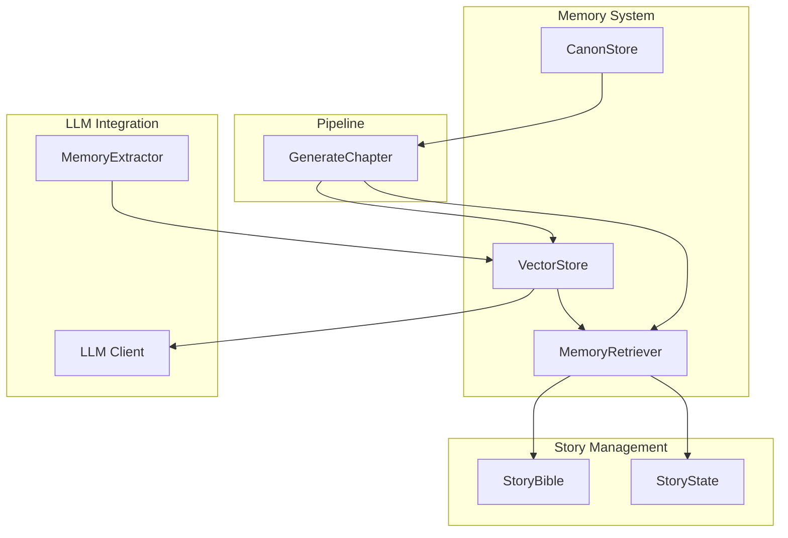
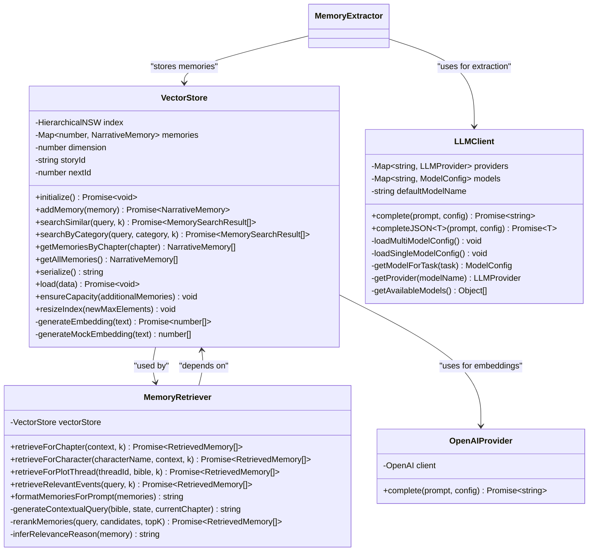
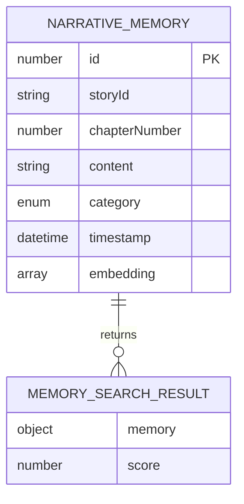
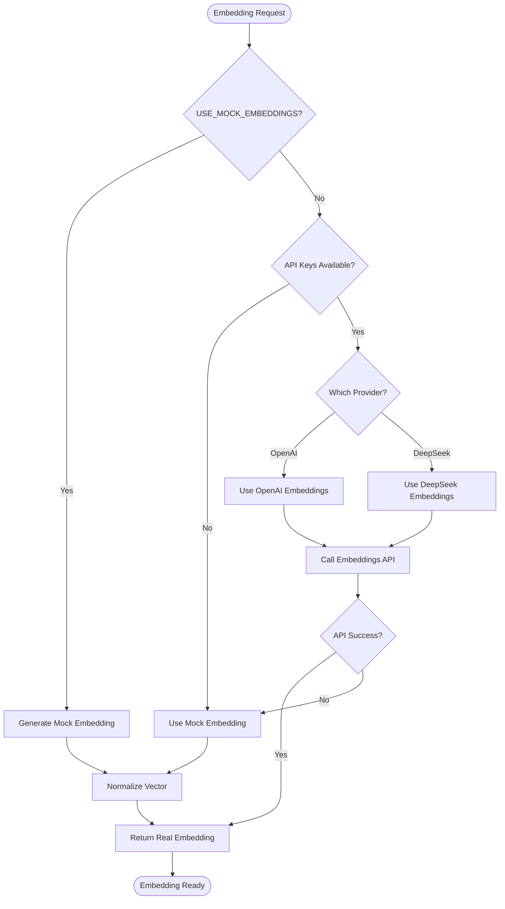
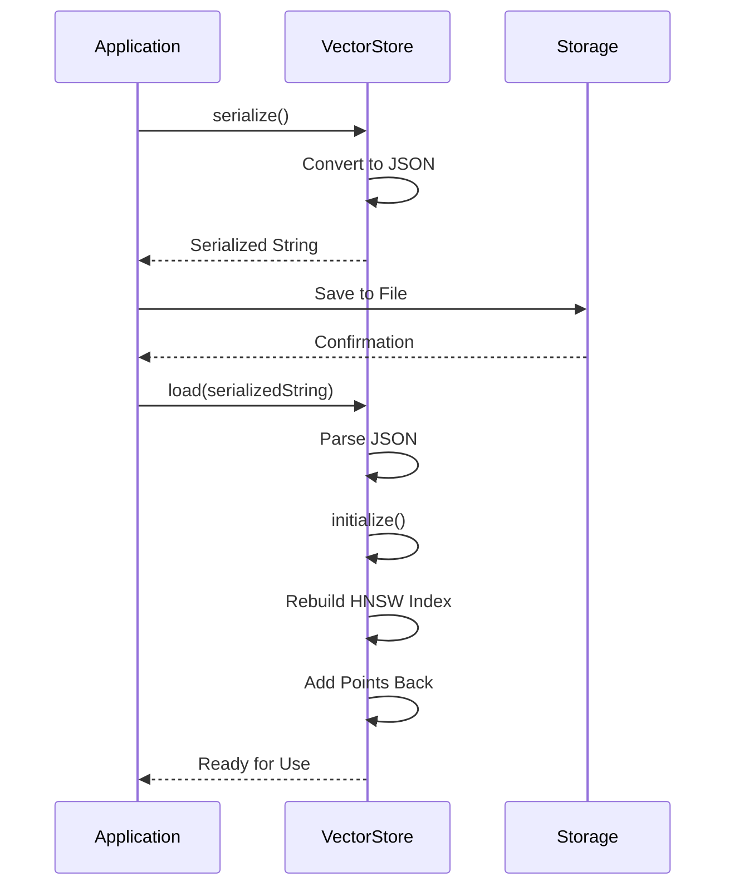
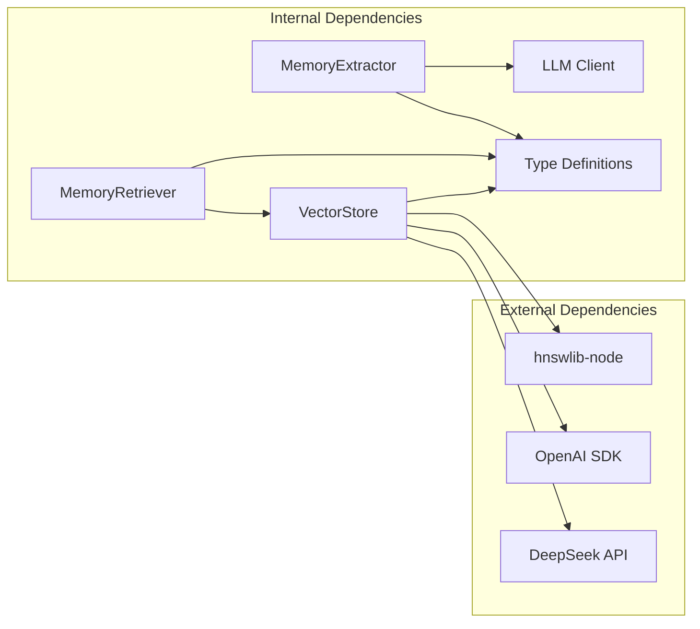
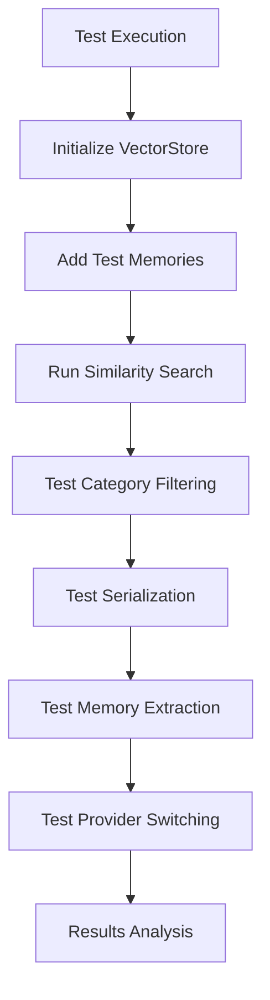

# Vector Store Class

<cite>
**Referenced Files in This Document**
- [vectorStore.ts](file://packages/engine/src/memory/vectorStore.ts)
- [memoryRetriever.ts](file://packages/engine/src/memory/memoryRetriever.ts)
- [canonStore.ts](file://packages/engine/src/memory/canonStore.ts)
- [client.ts](file://packages/engine/src/llm/client.ts)
- [index.ts](file://packages/engine/src/index.ts)
- [vector-memory.test.ts](file://packages/engine/src/test/vector-memory.test.ts)
- [generateChapter.ts](file://packages/engine/src/pipeline/generateChapter.ts)
- [memoryExtractor.ts](file://packages/engine/src/agents/memoryExtractor.ts)
- [bible.ts](file://packages/engine/src/story/bible.ts)
- [state.ts](file://packages/engine/src/story/state.ts)
</cite>

## Update Summary
**Changes Made**
- Enhanced embedding generation system documentation with dual-provider support
- Added comprehensive API key detection logic coverage
- Updated provider switching mechanisms documentation
- Improved error handling and fallback strategy documentation
- Added mock embedding fallback system details
- Updated architecture diagrams to reflect new embedding generation flow

## Table of Contents
1. [Introduction](#introduction)
2. [Project Structure](#project-structure)
3. [Core Components](#core-components)
4. [Architecture Overview](#architecture-overview)
5. [Detailed Component Analysis](#detailed-component-analysis)
6. [Dependency Analysis](#dependency-analysis)
7. [Performance Considerations](#performance-considerations)
8. [Troubleshooting Guide](#troubleshooting-guide)
9. [Conclusion](#conclusion)

## Introduction

The Vector Store Class is a core component of the Narrative Operating System's memory management system. It provides semantic memory storage and retrieval capabilities using vector embeddings, enabling the AI story generation system to maintain narrative continuity and context across chapters. The Vector Store integrates with the HNSW (Hierarchical Navigable Small World) algorithm for efficient similarity search and supports multiple memory categories including events, characters, world details, and plot elements.

**Updated** Enhanced with dual-provider embedding generation system supporting both OpenAI and DeepSeek APIs with automatic fallback mechanisms.

## Project Structure

The Vector Store is part of a larger memory management ecosystem within the Narrative Operating System:

**Diagram sources**
- [vectorStore.ts:1-221](file://packages/engine/src/memory/vectorStore.ts#L1-L221)
- [memoryRetriever.ts:1-174](file://packages/engine/src/memory/memoryRetriever.ts#L1-L174)
- [client.ts:1-200](file://packages/engine/src/llm/client.ts#L1-L200)

**Section sources**
- [index.ts:115-118](file://packages/engine/src/index.ts#L115-L118)
- [vectorStore.ts:1-221](file://packages/engine/src/memory/vectorStore.ts#L1-L221)

## Core Components

The Vector Store system consists of several interconnected components that work together to provide intelligent memory management:

### VectorStore Class
The primary component responsible for storing narrative memories as vector embeddings and providing similarity search capabilities.

### MemoryRetriever Class  
Handles context-aware memory retrieval with filtering by category and temporal constraints.

### CanonStore System
Maintains story canon facts that serve as ground truth for narrative consistency validation.

### MemoryExtractor Agent
Extracts meaningful narrative elements from generated content for persistent storage.

**Updated** Enhanced embedding generation now supports dual-provider architecture with automatic fallback.

**Section sources**
- [vectorStore.ts:19-221](file://packages/engine/src/memory/vectorStore.ts#L19-L221)
- [memoryRetriever.ts:18-174](file://packages/engine/src/memory/memoryRetriever.ts#L18-L174)
- [canonStore.ts:1-134](file://packages/engine/src/memory/canonStore.ts#L1-L134)

## Architecture Overview

The Vector Store architecture follows a layered approach with clear separation of concerns and enhanced embedding generation capabilities:

**Diagram sources**
- [vectorStore.ts:19-221](file://packages/engine/src/memory/vectorStore.ts#L19-L221)
- [memoryRetriever.ts:18-174](file://packages/engine/src/memory/memoryRetriever.ts#L18-L174)
- [client.ts:49-190](file://packages/engine/src/llm/client.ts#L49-L190)
- [memoryExtractor.ts:52-97](file://packages/engine/src/agents/memoryExtractor.ts#L52-L97)

## Detailed Component Analysis

### VectorStore Implementation

The VectorStore class provides a comprehensive memory management solution with the following key features:

#### Data Model Design

**Diagram sources**
- [vectorStore.ts:4-17](file://packages/engine/src/memory/vectorStore.ts#L4-L17)

#### Core Operations

The VectorStore supports six primary operations:

1. **Initialization**: Sets up the HNSW index with configurable parameters
2. **Memory Addition**: Generates embeddings and stores narrative content
3. **Similarity Search**: Finds semantically similar memories using cosine distance
4. **Category Filtering**: Retrieves memories filtered by narrative categories
5. **Capacity Management**: Ensures adequate index capacity with automatic resizing
6. **Persistence**: Serializes and deserializes memory state

#### Enhanced Embedding Generation Strategy

The system implements a sophisticated dual-provider embedding generation system with automatic fallback:

**Updated** New dual-provider architecture with comprehensive API key detection and automatic fallback mechanisms.

**Diagram sources**
- [vectorStore.ts:125-161](file://packages/engine/src/memory/vectorStore.ts#L125-L161)

**Section sources**
- [vectorStore.ts:19-221](file://packages/engine/src/memory/vectorStore.ts#L19-L221)

### MemoryRetriever Integration

The MemoryRetriever class provides context-aware memory retrieval with sophisticated filtering capabilities:

#### Retrieval Strategies

1. **Chapter-based Retrieval**: Contextual queries based on story progress and active plot threads
2. **Character-focused Retrieval**: Filters memories containing specific character references
3. **Plot Thread Retrieval**: Retrieves memories relevant to specific narrative threads
4. **Event-focused Retrieval**: Direct event-based memory search

#### Context Generation

The retriever generates contextual queries that incorporate:
- Current chapter progression
- Active plot thread status
- Story genre and setting
- Premise and theme elements

**Section sources**
- [memoryRetriever.ts:18-174](file://packages/engine/src/memory/memoryRetriever.ts#L18-L174)

### Enhanced Persistence and Serialization

The Vector Store implements a complete persistence system with capacity management:

**Updated** Enhanced with automatic capacity management during loading and index rebuilding.

**Diagram sources**
- [vectorStore.ts:183-205](file://packages/engine/src/memory/vectorStore.ts#L183-L205)

**Section sources**
- [vectorStore.ts:183-205](file://packages/engine/src/memory/vectorStore.ts#L183-L205)

## Dependency Analysis

The Vector Store system has carefully managed dependencies to ensure modularity and maintainability:

**Updated** Added DeepSeek API support alongside OpenAI for dual-provider embedding generation.

**Diagram sources**
- [vectorStore.ts:1-2](file://packages/engine/src/memory/vectorStore.ts#L1-L2)
- [memoryRetriever.ts:1-3](file://packages/engine/src/memory/memoryRetriever.ts#L1-L3)
- [client.ts:1-2](file://packages/engine/src/llm/client.ts#L1-L2)

### Internal Module Relationships

The Vector Store integrates with several key internal modules:

1. **LLM Client Integration**: Uses the shared LLM client for embedding generation
2. **Memory Extraction Pipeline**: Works with the MemoryExtractor agent for content processing
3. **Story Management**: Interfaces with StoryBible and StoryState for context
4. **Pipeline Integration**: Supports the chapter generation pipeline

**Section sources**
- [index.ts:115-118](file://packages/engine/src/index.ts#L115-L118)
- [generateChapter.ts:26-103](file://packages/engine/src/pipeline/generateChapter.ts#L26-L103)

## Performance Considerations

### Index Configuration

The VectorStore uses HNSW with optimized parameters:
- **Distance Metric**: Cosine similarity for semantic search
- **Index Size**: Configurable capacity for large-scale memory storage
- **M Parameter**: 16 connections per node for balanced performance
- **efConstruction**: 200 for quality index construction

### Enhanced Memory Management

1. **Embedding Caching**: Embeddings are computed once and stored with memories
2. **Lazy Loading**: VectorStore instances are created on-demand via factory pattern
3. **Automatic Capacity Management**: Dynamic index resizing with 50% growth factor
4. **Cleanup Mechanism**: Story-specific stores can be cleared when no longer needed

### Search Optimization

1. **KNN Search**: Efficient nearest neighbor search with configurable result limits
2. **Category Filtering**: Pre-filtering reduces search space for specialized queries
3. **Temporal Constraints**: Automatic filtering prevents accessing future chapter content

**Updated** Added automatic capacity management and enhanced error handling for improved performance.

**Section sources**
- [vectorStore.ts:30-35](file://packages/engine/src/memory/vectorStore.ts#L30-L35)
- [vectorStore.ts:55-75](file://packages/engine/src/memory/vectorStore.ts#L55-L75)

## Troubleshooting Guide

### Common Issues and Solutions

#### VectorStore Not Initialized
**Problem**: Attempting to use VectorStore before initialization
**Solution**: Always call `initialize()` before adding or searching memories

#### Embedding API Failures
**Problem**: OpenAI API unavailability or rate limiting
**Solution**: The system automatically falls back to mock embeddings when configured

#### Memory Corruption
**Problem**: Corrupted serialized data
**Solution**: Clear the VectorStore instance and rebuild from scratch

#### Performance Degradation
**Problem**: Slow search performance with large memory sets
**Solution**: Optimize KNN parameters and consider index rebuilding

#### Provider Switching Issues
**Problem**: Incorrect provider selection or API key detection
**Solution**: Verify environment variables and check provider availability

**Updated** Added troubleshooting guidance for new dual-provider embedding system.

### Debugging Tools

The system provides comprehensive logging and testing capabilities:

**Updated** Enhanced testing workflow to include provider switching and embedding generation verification.

**Diagram sources**
- [vector-memory.test.ts:31-244](file://packages/engine/src/test/vector-memory.test.ts#L31-L244)

**Section sources**
- [vector-memory.test.ts:1-244](file://packages/engine/src/test/vector-memory.test.ts#L1-L244)

## Conclusion

The Vector Store Class represents a sophisticated approach to narrative memory management in AI-powered story generation systems. Its design balances performance, flexibility, and reliability through careful architectural decisions:

1. **Robust Embedding Strategy**: Dual-path embedding generation with automatic fallback to both OpenAI and DeepSeek providers
2. **Enhanced Error Handling**: Comprehensive API key detection and provider switching mechanisms
3. **Efficient Indexing**: HNSW-based similarity search for scalable performance
4. **Flexible Retrieval**: Multi-dimensional search capabilities with temporal and categorical constraints
5. **Intelligent Capacity Management**: Automatic index resizing and memory optimization
6. **Persistent Architecture**: Complete serialization/deserialization for long-term memory retention
7. **Integration-Friendly**: Clean APIs that integrate seamlessly with the broader narrative system

**Updated** The enhanced embedding generation system now provides enterprise-grade reliability with automatic provider failover and comprehensive error handling.

The implementation demonstrates best practices in memory management for AI applications, providing a solid foundation for advanced narrative generation capabilities while maintaining extensibility for future enhancements and seamless integration with modern AI service providers.