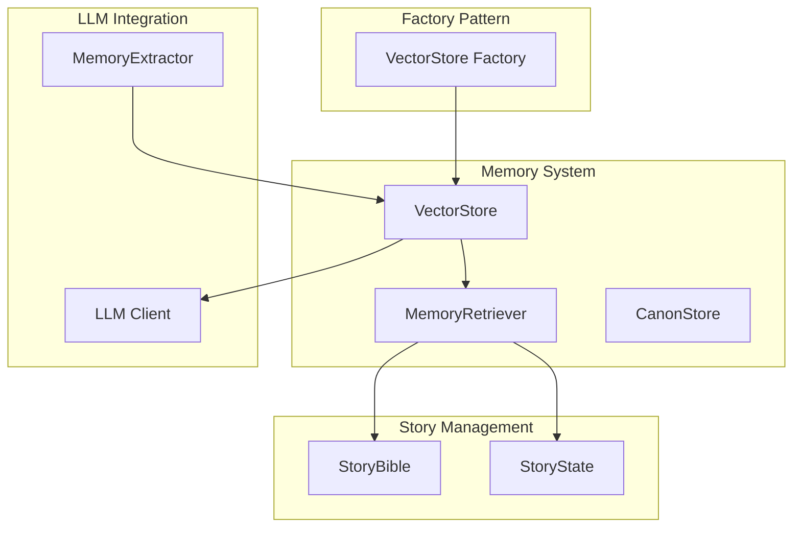
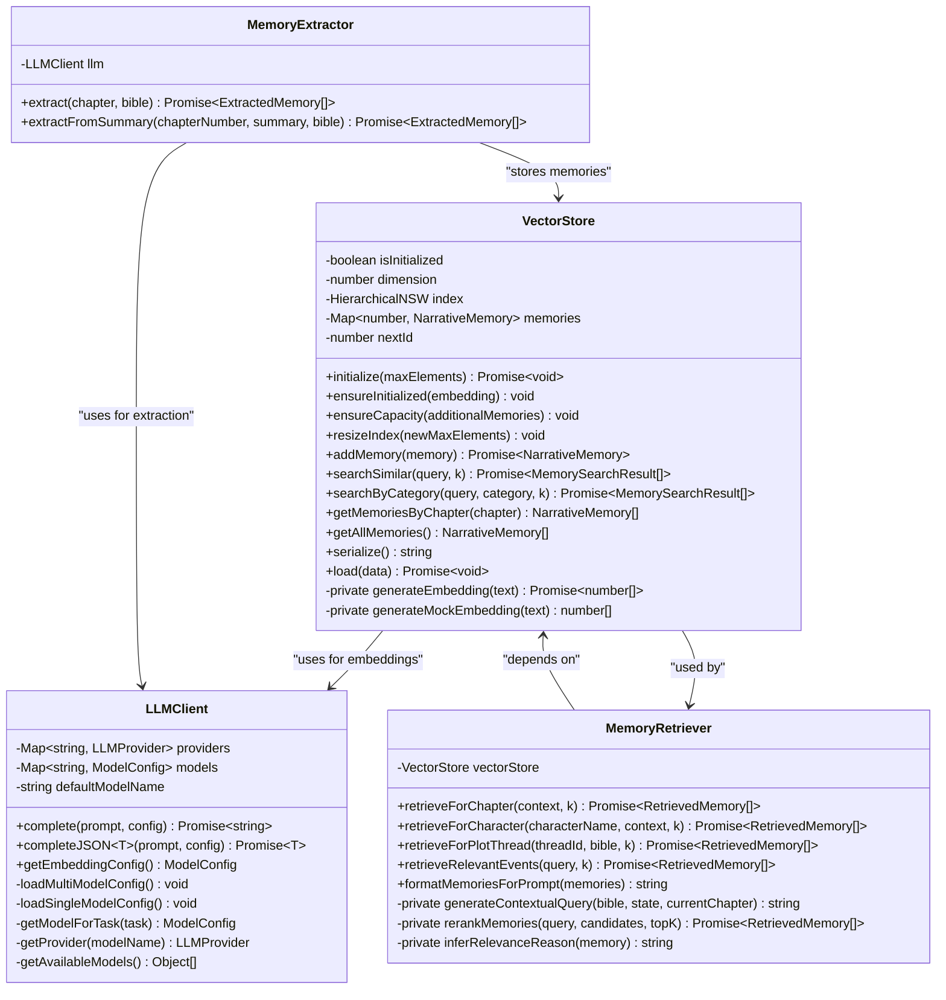
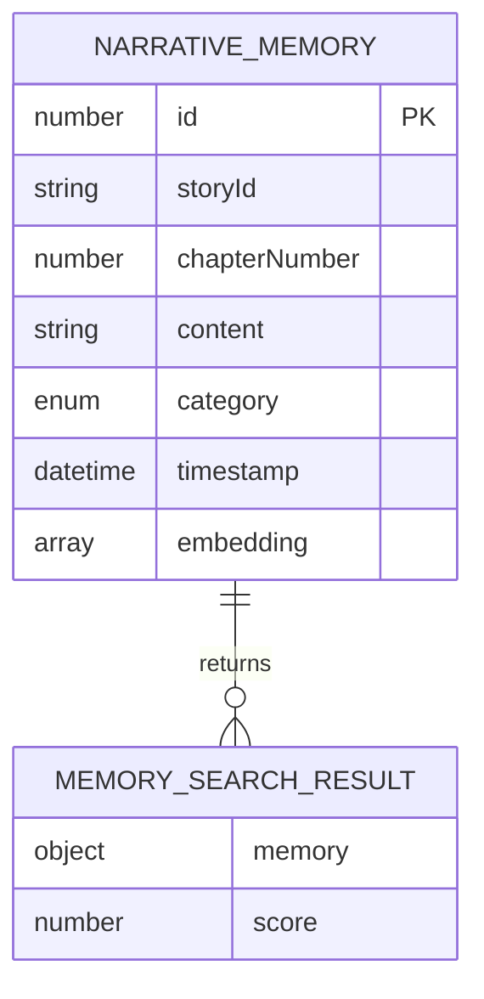
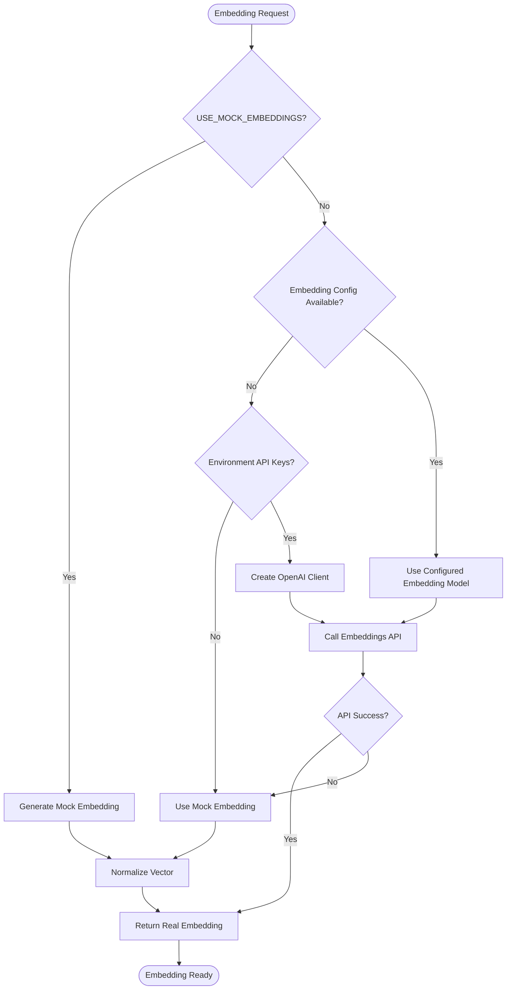
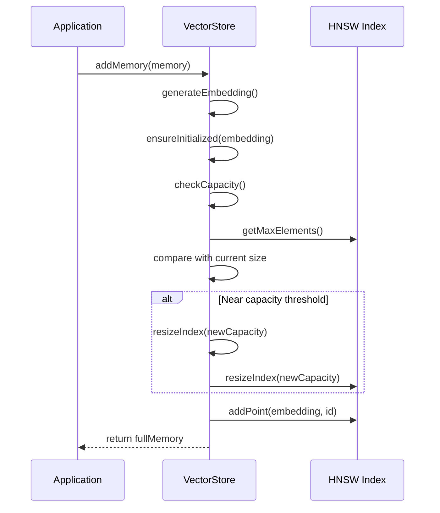
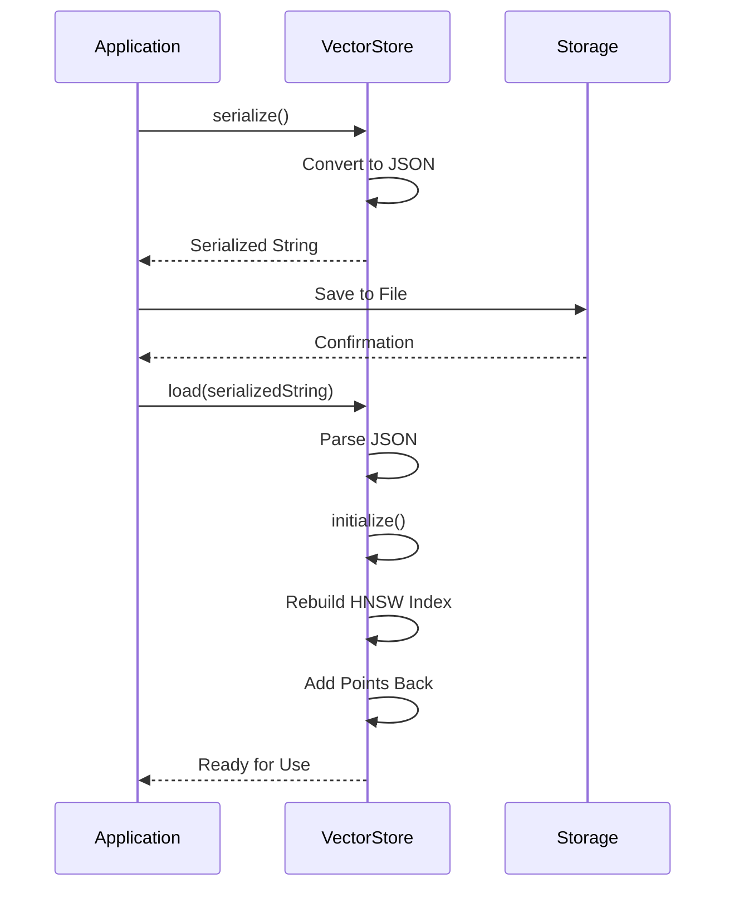
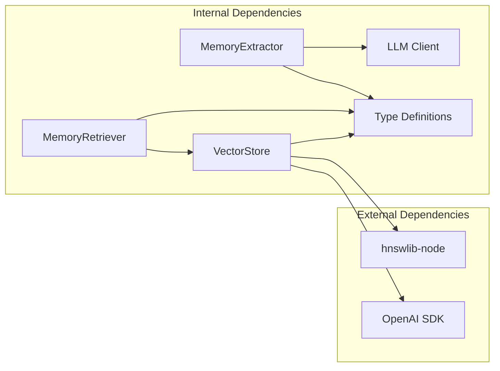
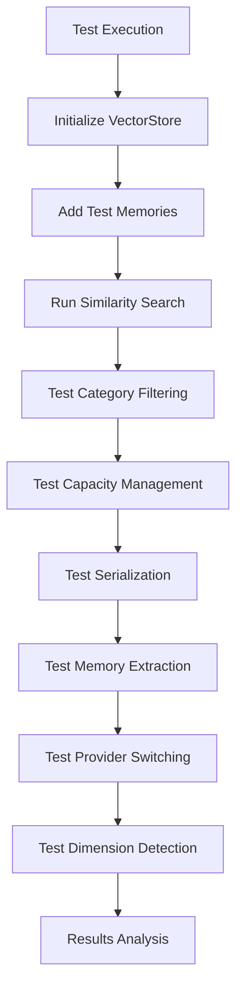

# Vector Store Class

<cite>
**Referenced Files in This Document**
- [vectorStore.ts](file://packages/engine/src/memory/vectorStore.ts)
- [memoryRetriever.ts](file://packages/engine/src/memory/memoryRetriever.ts)
- [canonStore.ts](file://packages/engine/src/memory/canonStore.ts)
- [client.ts](file://packages/engine/src/llm/client.ts)
- [index.ts](file://packages/engine/src/index.ts)
- [vector-memory.test.ts](file://packages/engine/src/test/vector-memory.test.ts)
- [memoryExtractor.ts](file://packages/engine/src/agents/memoryExtractor.ts)
- [types/index.ts](file://packages/engine/src/types/index.ts)
</cite>

## Update Summary
**Changes Made**
- Enhanced embedding generation system with dynamic dimension detection and automatic index initialization
- Added comprehensive capacity management with automatic resizing and 50% growth factor
- Improved dual-provider embedding support with LLM client integration
- Updated error handling and fallback mechanisms for robust operation
- Enhanced persistence system with automatic index rebuilding
- Added factory pattern for story-specific VectorStore instances

## Table of Contents
1. [Introduction](#introduction)
2. [Project Structure](#project-structure)
3. [Core Components](#core-components)
4. [Architecture Overview](#architecture-overview)
5. [Detailed Component Analysis](#detailed-component-analysis)
6. [Dependency Analysis](#dependency-analysis)
7. [Performance Considerations](#performance-considerations)
8. [Troubleshooting Guide](#troubleshooting-guide)
9. [Conclusion](#conclusion)

## Introduction

The Vector Store Class is a core component of the Narrative Operating System's memory management system. It provides semantic memory storage and retrieval capabilities using vector embeddings, enabling the AI story generation system to maintain narrative continuity and context across chapters. The Vector Store integrates with the HNSW (Hierarchical Navigable Small World) algorithm for efficient similarity search and supports multiple memory categories including events, characters, world details, and plot elements.

**Updated** Enhanced with dynamic embedding dimension detection, automatic index initialization, and comprehensive capacity management for multi-provider embedding scenarios.

## Project Structure

The Vector Store is part of a larger memory management ecosystem within the Narrative Operating System:

**Diagram sources**
- [vectorStore.ts:245-258](file://packages/engine/src/memory/vectorStore.ts#L245-L258)
- [memoryRetriever.ts:1-174](file://packages/engine/src/memory/memoryRetriever.ts#L1-L174)
- [client.ts:1-211](file://packages/engine/src/llm/client.ts#L1-L211)

**Section sources**
- [index.ts:115-119](file://packages/engine/src/index.ts#L115-L119)
- [vectorStore.ts:19-258](file://packages/engine/src/memory/vectorStore.ts#L19-L258)

## Core Components

The Vector Store system consists of several interconnected components that work together to provide intelligent memory management:

### VectorStore Class
The primary component responsible for storing narrative memories as vector embeddings and providing similarity search capabilities with automatic dimension detection and capacity management.

### MemoryRetriever Class  
Handles context-aware memory retrieval with filtering by category and temporal constraints, utilizing the VectorStore's enhanced search capabilities.

### CanonStore System
Maintains story canon facts that serve as ground truth for narrative consistency validation.

### MemoryExtractor Agent
Extracts meaningful narrative elements from generated content for persistent storage using the LLM client's embedding capabilities.

**Updated** Enhanced with automatic dimension detection, capacity management, and dual-provider embedding support.

**Section sources**
- [vectorStore.ts:19-258](file://packages/engine/src/memory/vectorStore.ts#L19-L258)
- [memoryRetriever.ts:18-174](file://packages/engine/src/memory/memoryRetriever.ts#L18-L174)
- [canonStore.ts:1-134](file://packages/engine/src/memory/canonStore.ts#L1-L134)
- [memoryExtractor.ts:52-99](file://packages/engine/src/agents/memoryExtractor.ts#L52-L99)

## Architecture Overview

The Vector Store architecture follows a layered approach with clear separation of concerns and enhanced embedding generation capabilities:

**Diagram sources**
- [vectorStore.ts:19-258](file://packages/engine/src/memory/vectorStore.ts#L19-L258)
- [memoryRetriever.ts:18-174](file://packages/engine/src/memory/memoryRetriever.ts#L18-L174)
- [client.ts:50-201](file://packages/engine/src/llm/client.ts#L50-L201)
- [memoryExtractor.ts:52-99](file://packages/engine/src/agents/memoryExtractor.ts#L52-L99)

## Detailed Component Analysis

### VectorStore Implementation

The VectorStore class provides a comprehensive memory management solution with the following key features:

#### Data Model Design

**Diagram sources**
- [vectorStore.ts:4-17](file://packages/engine/src/memory/vectorStore.ts#L4-L17)

#### Core Operations

The VectorStore supports seven primary operations with enhanced capabilities:

1. **Lazy Initialization**: Sets up the HNSW index with configurable parameters only when needed
2. **Dynamic Dimension Detection**: Automatically detects embedding dimensions from the first embedding
3. **Memory Addition**: Generates embeddings and stores narrative content with automatic capacity management
4. **Similarity Search**: Finds semantically similar memories using cosine distance with dimension validation
5. **Category Filtering**: Retrieves memories filtered by narrative categories
6. **Capacity Management**: Ensures adequate index capacity with automatic resizing using 50% growth factor
7. **Persistence**: Serializes and deserializes memory state with automatic index rebuilding

#### Enhanced Embedding Generation Strategy

The system implements a sophisticated dual-provider embedding generation system with automatic fallback:

**Updated** New dual-provider architecture with comprehensive API key detection, automatic dimension detection, and enhanced error handling.

**Diagram sources**
- [vectorStore.ts:145-198](file://packages/engine/src/memory/vectorStore.ts#L145-L198)

**Section sources**
- [vectorStore.ts:19-258](file://packages/engine/src/memory/vectorStore.ts#L19-L258)

### Enhanced Capacity Management System

The VectorStore implements a comprehensive capacity management system with automatic resizing:

**Updated** Enhanced with automatic capacity management during memory addition and index resizing with 50% growth factor.

**Diagram sources**
- [vectorStore.ts:77-105](file://packages/engine/src/memory/vectorStore.ts#L77-L105)
- [vectorStore.ts:66-75](file://packages/engine/src/memory/vectorStore.ts#L66-L75)

**Section sources**
- [vectorStore.ts:66-105](file://packages/engine/src/memory/vectorStore.ts#L66-L105)

### MemoryRetriever Integration

The MemoryRetriever class provides context-aware memory retrieval with sophisticated filtering capabilities:

#### Retrieval Strategies

1. **Chapter-based Retrieval**: Contextual queries based on story progress and active plot threads
2. **Character-focused Retrieval**: Filters memories containing specific character references
3. **Plot Thread Retrieval**: Retrieves memories relevant to specific narrative threads
4. **Event-focused Retrieval**: Direct event-based memory search

#### Context Generation

The retriever generates contextual queries that incorporate:
- Current chapter progression
- Active plot thread status
- Story genre and setting
- Premise and theme elements

**Section sources**
- [memoryRetriever.ts:18-174](file://packages/engine/src/memory/memoryRetriever.ts#L18-L174)

### Enhanced Persistence and Serialization

The Vector Store implements a complete persistence system with automatic index rebuilding:

**Updated** Enhanced with automatic capacity management during loading and comprehensive index rebuilding.

**Diagram sources**
- [vectorStore.ts:230-242](file://packages/engine/src/memory/vectorStore.ts#L230-L242)

**Section sources**
- [vectorStore.ts:230-242](file://packages/engine/src/memory/vectorStore.ts#L230-L242)

## Dependency Analysis

The Vector Store system has carefully managed dependencies to ensure modularity and maintainability:

**Updated** Enhanced with LLM client integration for embedding generation and dual-provider support.

**Diagram sources**
- [vectorStore.ts:1-2](file://packages/engine/src/memory/vectorStore.ts#L1-L2)
- [memoryRetriever.ts:1-3](file://packages/engine/src/memory/memoryRetriever.ts#L1-L3)
- [client.ts:1-2](file://packages/engine/src/llm/client.ts#L1-L2)

### Internal Module Relationships

The Vector Store integrates with several key internal modules:

1. **LLM Client Integration**: Uses the shared LLM client for embedding generation with dual-provider support
2. **Memory Extraction Pipeline**: Works with the MemoryExtractor agent for content processing
3. **Story Management**: Interfaces with StoryBible and StoryState for context
4. **Factory Pattern**: Utilizes story-specific VectorStore instances for isolation

**Section sources**
- [index.ts:115-119](file://packages/engine/src/index.ts#L115-L119)
- [vectorStore.ts:245-258](file://packages/engine/src/memory/vectorStore.ts#L245-L258)

## Performance Considerations

### Index Configuration

The VectorStore uses HNSW with optimized parameters:
- **Distance Metric**: Cosine similarity for semantic search
- **Index Size**: Configurable capacity with automatic resizing
- **M Parameter**: 16 connections per node for balanced performance
- **efConstruction**: 200 for quality index construction

### Enhanced Memory Management

1. **Lazy Initialization**: VectorStore instances are created on-demand via factory pattern
2. **Dynamic Dimension Detection**: Embedding dimensions are detected automatically from the first embedding
3. **Automatic Capacity Management**: Dynamic index resizing with 50% growth factor
4. **Dimension Validation**: Query embeddings are validated against index dimensions
5. **Cleanup Mechanism**: Story-specific stores can be cleared when no longer needed

### Search Optimization

1. **KNN Search**: Efficient nearest neighbor search with configurable result limits
2. **Category Filtering**: Pre-filtering reduces search space for specialized queries
3. **Temporal Constraints**: Automatic filtering prevents accessing future chapter content
4. **Dimension Matching**: Ensures query and index embeddings have compatible dimensions

**Updated** Added automatic capacity management, dimension detection, and enhanced error handling for improved performance.

**Section sources**
- [vectorStore.ts:31-46](file://packages/engine/src/memory/vectorStore.ts#L31-L46)
- [vectorStore.ts:77-105](file://packages/engine/src/memory/vectorStore.ts#L77-L105)

## Troubleshooting Guide

### Common Issues and Solutions

#### VectorStore Not Initialized
**Problem**: Attempting to use VectorStore before initialization
**Solution**: Always call `initialize()` before adding or searching memories

#### Embedding Dimension Mismatch
**Problem**: Query embedding dimension doesn't match index dimension
**Solution**: Ensure consistent embedding models across the application

#### Memory Corruption
**Problem**: Corrupted serialized data
**Solution**: Clear the VectorStore instance and rebuild from scratch

#### Performance Degradation
**Problem**: Slow search performance with large memory sets
**Solution**: Monitor capacity usage and consider index rebuilding

#### Provider Switching Issues
**Problem**: Incorrect provider selection or API key detection
**Solution**: Verify environment variables and check provider availability

**Updated** Added troubleshooting guidance for new dimension detection and capacity management features.

### Debugging Tools

The system provides comprehensive logging and testing capabilities:

**Updated** Enhanced testing workflow to include dimension detection, capacity management, and provider switching verification.

**Diagram sources**
- [vector-memory.test.ts:54-266](file://packages/engine/src/test/vector-memory.test.ts#L54-L266)

**Section sources**
- [vector-memory.test.ts:1-266](file://packages/engine/src/test/vector-memory.test.ts#L1-L266)

## Conclusion

The Vector Store Class represents a sophisticated approach to narrative memory management in AI-powered story generation systems. Its design balances performance, flexibility, and reliability through careful architectural decisions:

1. **Robust Embedding Strategy**: Dynamic dimension detection with automatic index initialization and comprehensive capacity management
2. **Enhanced Error Handling**: Automatic fallback mechanisms and dimension validation for reliable operation
3. **Efficient Indexing**: HNSW-based similarity search with automatic resizing and memory optimization
4. **Flexible Retrieval**: Multi-dimensional search capabilities with temporal and categorical constraints
5. **Intelligent Capacity Management**: Automatic index resizing with 50% growth factor for scalable performance
6. **Persistent Architecture**: Complete serialization/deserialization with automatic index rebuilding
7. **Integration-Friendly**: Clean APIs that integrate seamlessly with the broader narrative system
8. **Factory Pattern**: Story-specific VectorStore instances for isolation and scalability

**Updated** The enhanced VectorStore now provides enterprise-grade reliability with automatic dimension detection, comprehensive capacity management, and seamless integration with multi-provider embedding scenarios.

The implementation demonstrates best practices in memory management for AI applications, providing a solid foundation for advanced narrative generation capabilities while maintaining extensibility for future enhancements and seamless integration with modern AI service providers.