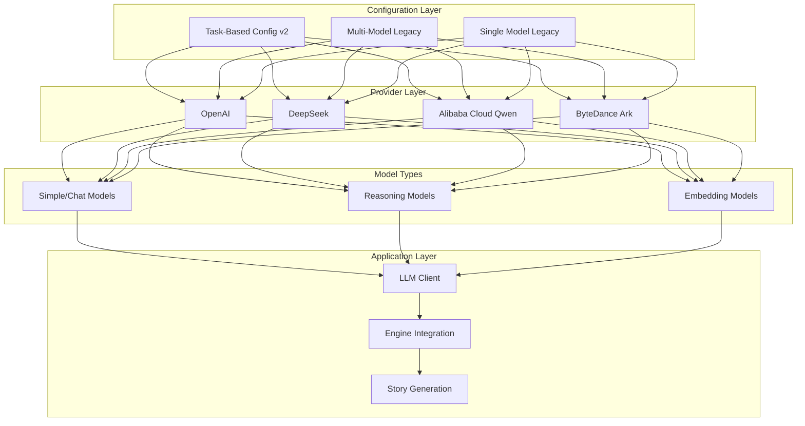
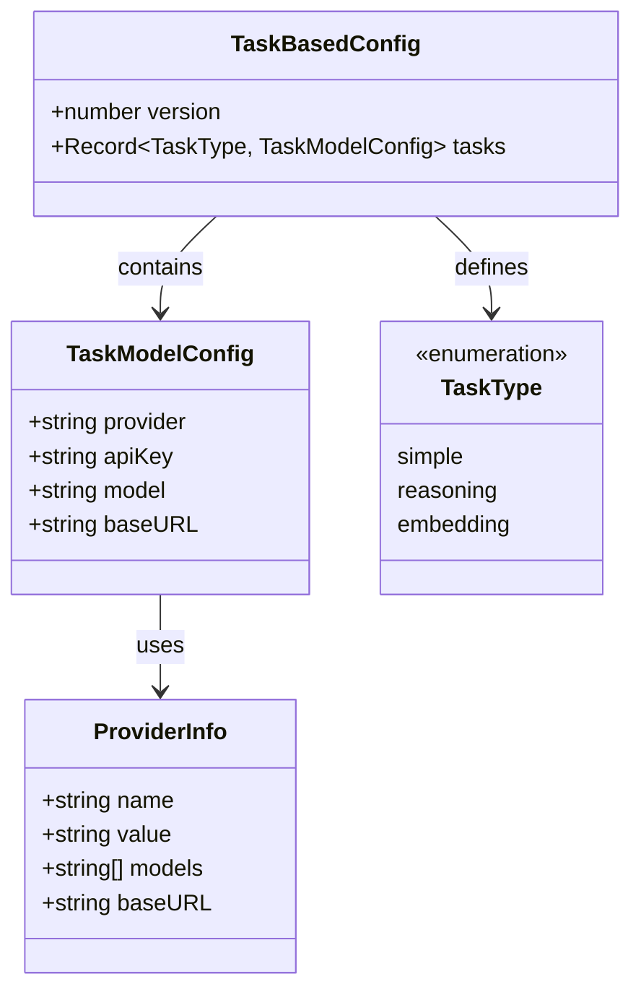
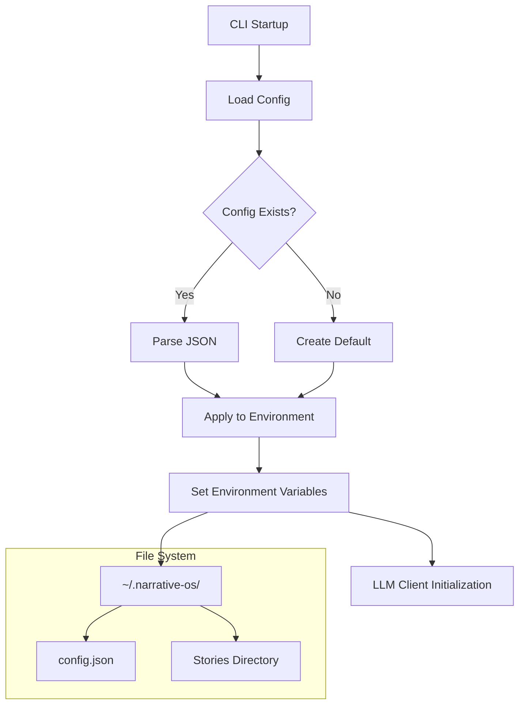
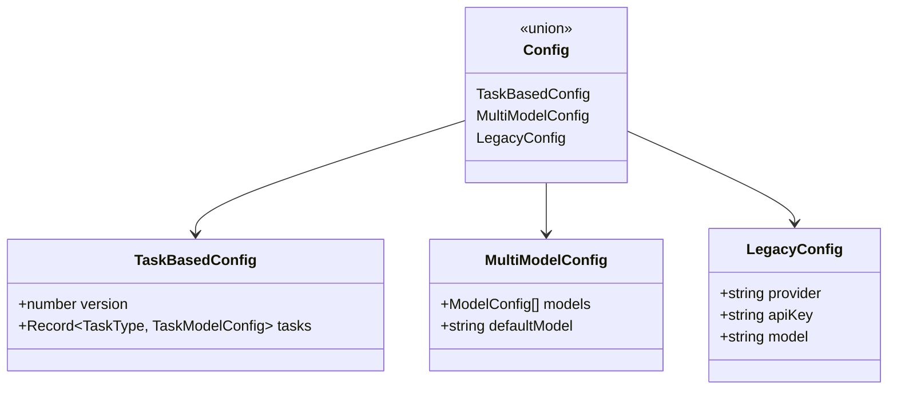
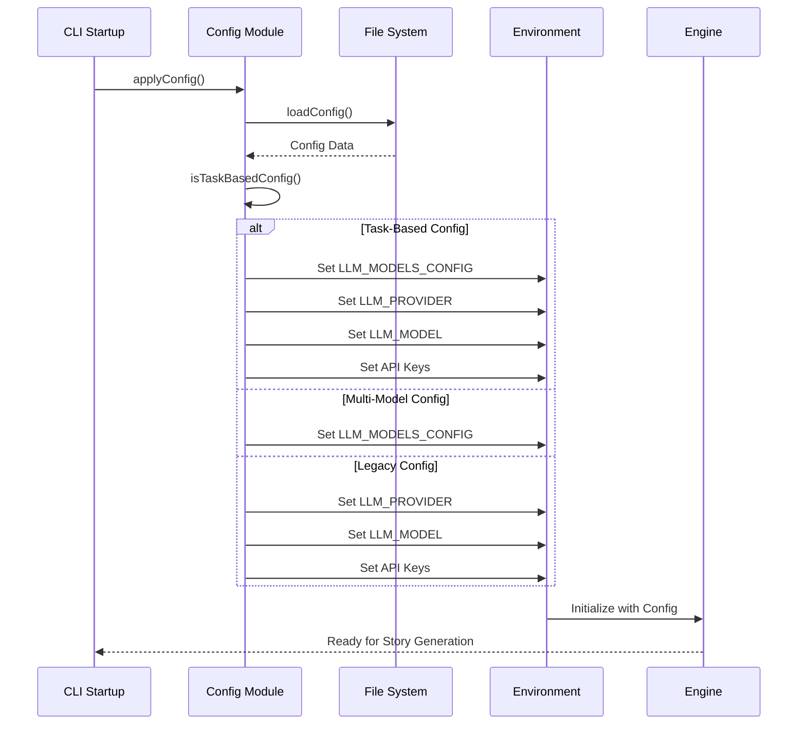
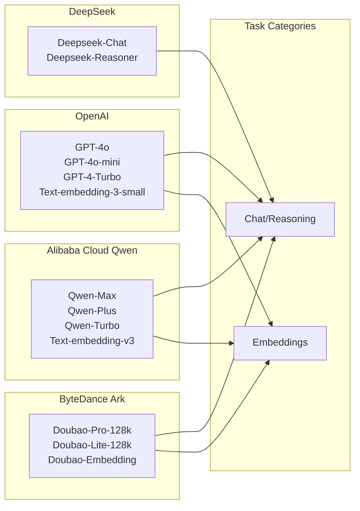
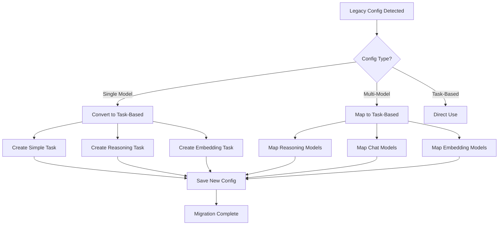
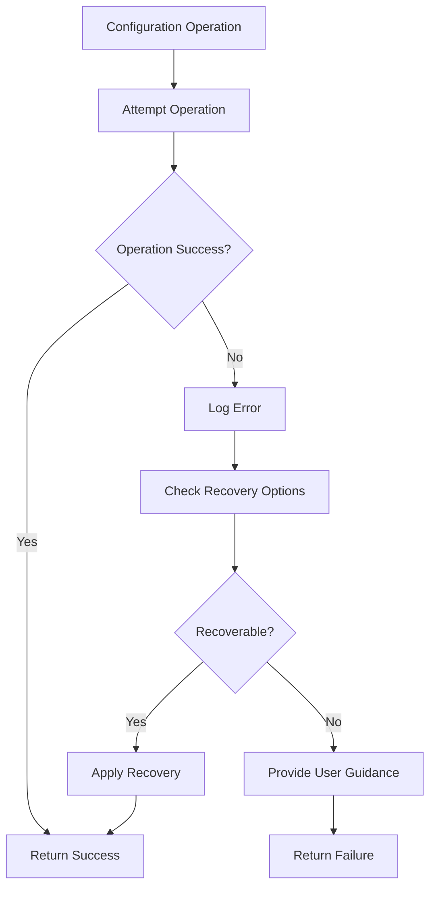

# Multi-Model Configuration

<cite>
**Referenced Files in This Document**
- [config.ts](file://apps/cli/src/commands/config.ts)
- [store.ts](file://apps/cli/src/config/store.ts)
- [index.ts](file://apps/cli/src/index.ts)
- [init.ts](file://apps/cli/src/commands/init.ts)
- [state.ts](file://apps/cli/src/commands/state.ts)
- [package.json](file://apps/cli/package.json)
- [engine package.json](file://packages/engine/package.json)
- [root package.json](file://package.json)
</cite>

## Table of Contents
1. [Introduction](#introduction)
2. [Configuration Architecture](#configuration-architecture)
3. [Task-Based Configuration System](#task-based-configuration-system)
4. [Multi-Model Persistence](#multi-model-persistence)
5. [Configuration Application Flow](#configuration-application-flow)
6. [Provider Support Matrix](#provider-support-matrix)
7. [Configuration Migration](#configuration-migration)
8. [Implementation Details](#implementation-details)
9. [Best Practices](#best-practices)
10. [Troubleshooting Guide](#troubleshooting-guide)

## Introduction

The Multi-Model Configuration system in Narrative OS provides a sophisticated approach to managing Large Language Model (LLM) providers and configurations for AI-powered story generation. This system supports three distinct model types optimized for different narrative tasks: simple/chat operations, complex reasoning tasks, and vector embedding operations for memory management.

The configuration system evolved from a simple single-provider setup to a comprehensive task-based model management system, supporting multiple providers including OpenAI, DeepSeek, Alibaba Cloud Qwen, and ByteDance Ark. This allows writers to optimize their AI storytelling experience by selecting the most appropriate model for each specific narrative task.

## Configuration Architecture

The configuration system follows a hierarchical architecture designed to support flexible model selection and deployment across different narrative scenarios.

**Diagram sources**
- [config.ts:1-377](file://apps/cli/src/commands/config.ts#L1-L377)
- [config.ts:46-71](file://apps/cli/src/commands/config.ts#L46-L71)

The architecture supports three distinct configuration modes:

1. **Task-Based Configuration (v2)**: Modern approach with separate models for different task types
2. **Multi-Model Legacy**: Previous format supporting multiple named models
3. **Single Model Legacy**: Original simple configuration format

## Task-Based Configuration System

The task-based configuration system represents the most advanced approach to model management, allowing different models to be assigned to specific narrative tasks based on their capabilities and performance characteristics.

### Task Type Definitions

| Task Type | Purpose | Model Requirements | Example Providers |
|-----------|---------|-------------------|-------------------|
| `simple` | Fast, lightweight operations | Chat/Reasoning models | GPT-4o, Qwen-Turbo, Doubao Lite |
| `reasoning` | Complex generation and planning | High-capability reasoning | GPT-4o, Qwen-Plus, Doubao Pro |
| `embedding` | Vector embeddings for memory | Embedding-specific models | Text-embedding-3-small, Qwen-Embedding |

### Configuration Schema

**Diagram sources**
- [config.ts:8-21](file://apps/cli/src/commands/config.ts#L8-L21)
- [config.ts:11-16](file://apps/cli/src/commands/config.ts#L11-L16)
- [config.ts:46-71](file://apps/cli/src/commands/config.ts#L46-L71)

### Provider Support Matrix

The system supports four major providers, each with specific model offerings optimized for different tasks:

| Provider | Models Available | Base URL | Special Features |
|----------|------------------|----------|------------------|
| OpenAI | GPT-4o, GPT-4o-mini, GPT-4-Turbo, Text-embedding-3-small | - | Industry standard, broad capabilities |
| DeepSeek | Deepseek-Chat, Deepseek-Reasoner | https://api.deepseek.com | Strong Chinese support, cost-effective |
| Alibaba Cloud Qwen | Qwen-Max, Qwen-Plus, Qwen-Turbo, Text-embedding-v3 | https://dashscope.aliyuncs.com/compatible-mode/v1 | Excellent Chinese language, cloud integration |
| ByteDance Ark | Doubao-Pro-128k, Doubao-Lite-128k, Doubao-Embedding | https://ark.cn-beijing.volces.com/api/v3 | Advanced multimodal, strong Asian market focus |

**Section sources**
- [config.ts:46-71](file://apps/cli/src/commands/config.ts#L46-L71)
- [config.ts:185-227](file://apps/cli/src/commands/config.ts#L185-L227)

## Multi-Model Persistence

The configuration system implements robust persistence mechanisms to ensure configuration reliability and cross-platform compatibility. Configuration data is stored in the user's home directory under `.narrative-os/config.json`.

### Storage Architecture

**Diagram sources**
- [config.ts:91-103](file://apps/cli/src/commands/config.ts#L91-L103)
- [config.ts:233-319](file://apps/cli/src/commands/config.ts#L233-L319)

### Configuration File Structure

The configuration system maintains backward compatibility through a flexible type system that supports multiple configuration formats:

**Diagram sources**
- [config.ts:44](file://apps/cli/src/commands/config.ts#L44)
- [config.ts:105-111](file://apps/cli/src/commands/config.ts#L105-L111)

**Section sources**
- [config.ts:91-103](file://apps/cli/src/commands/config.ts#L91-L103)
- [config.ts:105-111](file://apps/cli/src/commands/config.ts#L105-L111)

## Configuration Application Flow

The configuration application process ensures seamless integration between the CLI configuration system and the underlying engine components. This flow occurs during CLI startup and involves environment variable manipulation for engine compatibility.

### Application Sequence

**Diagram sources**
- [config.ts:233-319](file://apps/cli/src/commands/config.ts#L233-L319)
- [index.ts:19](file://apps/cli/src/index.ts#L19)

### Environment Variable Mapping

The system creates a bridge between the configuration format and the engine's expectations through strategic environment variable manipulation:

| Configuration Source | Environment Variables Set | Purpose |
|---------------------|---------------------------|---------|
| Task-Based Config | `LLM_MODELS_CONFIG`, `LLM_PROVIDER`, `LLM_MODEL`, provider-specific API keys | Engine compatibility and model selection |
| Multi-Model Config | `LLM_MODELS_CONFIG` | Legacy engine support |
| Legacy Config | `LLM_PROVIDER`, `LLM_MODEL`, provider-specific API keys | Backward compatibility |

**Section sources**
- [config.ts:233-319](file://apps/cli/src/commands/config.ts#L233-L319)
- [index.ts:19](file://apps/cli/src/index.ts#L19)

## Provider Support Matrix

The system provides comprehensive support for multiple AI providers, each offering specialized models optimized for different aspects of narrative generation.

### Provider Capabilities

**Diagram sources**
- [config.ts:46-71](file://apps/cli/src/commands/config.ts#L46-L71)

### Model Selection Guidelines

| Provider | Best For | Recommended Models | Cost Considerations |
|----------|----------|-------------------|-------------------|
| OpenAI | General purpose, highest quality | GPT-4o, GPT-4o-mini | Higher cost, excellent performance |
| DeepSeek | Cost-effective Chinese content | Deepseek-Chat, Deepseek-Reasoner | Lower cost, good Chinese support |
| Alibaba Cloud Qwen | Chinese language excellence | Qwen-Max, Qwen-Plus | Competitive pricing, cloud integration |
| ByteDance Ark | Multimodal content | Doubao-Pro-128k | Premium features, regional focus |

**Section sources**
- [config.ts:46-71](file://apps/cli/src/commands/config.ts#L46-L71)

## Configuration Migration

The system includes robust migration capabilities to support users transitioning from older configuration formats to the modern task-based system. This ensures continuity of user workflows while enabling new features.

### Migration Process

**Diagram sources**
- [config.ts:105-111](file://apps/cli/src/commands/config.ts#L105-L111)

### Migration Benefits

The migration system provides several advantages:

1. **Seamless Transition**: Users can continue working without manual reconfiguration
2. **Enhanced Capabilities**: Access to task-specific model optimization
3. **Future-Proofing**: Alignment with evolving narrative AI requirements
4. **Backward Compatibility**: Continued support for legacy configurations

**Section sources**
- [config.ts:105-111](file://apps/cli/src/commands/config.ts#L105-L111)

## Implementation Details

The configuration system leverages TypeScript's type system and Node.js file system APIs to create a robust, type-safe configuration management solution.

### Core Components

| Component | Responsibility | Key Features |
|-----------|---------------|--------------|
| `config.ts` | Configuration management | Interactive setup, validation, migration |
| `store.ts` | Persistence layer | File-based storage, backup creation |
| `index.ts` | CLI integration | Command registration, startup sequence |
| `init.ts` | Story initialization | Configuration-aware story creation |
| `state.ts` | State visualization | Structured state display |

### Error Handling Strategy

The system implements comprehensive error handling to ensure graceful degradation and user feedback:

**Diagram sources**
- [config.ts:91-103](file://apps/cli/src/commands/config.ts#L91-L103)

**Section sources**
- [config.ts:1-377](file://apps/cli/src/commands/config.ts#L1-L377)
- [store.ts:1-208](file://apps/cli/src/config/store.ts#L1-L208)

## Best Practices

### Configuration Management

1. **Provider Selection**: Choose providers based on content language and geographic focus
2. **Model Optimization**: Assign higher-capability models to reasoning tasks
3. **Cost Management**: Monitor API usage and consider cost-effective alternatives
4. **Backup Strategy**: Regularly backup configuration files
5. **Testing Approach**: Test configurations with small story iterations before major projects

### Security Considerations

1. **API Key Protection**: Use masked displays and secure storage
2. **Environment Isolation**: Keep development and production configurations separate
3. **Access Control**: Restrict access to configuration files
4. **Regular Rotation**: Periodically rotate API keys

### Performance Optimization

1. **Model Matching**: Align model capabilities with task requirements
2. **Rate Limiting**: Respect provider rate limits and quotas
3. **Caching Strategy**: Implement intelligent caching for repeated operations
4. **Resource Monitoring**: Track resource usage and costs

## Troubleshooting Guide

### Common Configuration Issues

| Issue | Symptoms | Solution |
|-------|----------|----------|
| Configuration Not Found | Empty configuration prompt | Run `nos config` to set up |
| API Key Errors | Authentication failures | Verify API key validity and provider |
| Model Selection Problems | Incompatible model errors | Check model availability for provider |
| Migration Failures | Configuration corruption | Restore from backup or recreate |
| Environment Issues | Engine not recognizing config | Restart CLI session |

### Debug Procedures

1. **Configuration Validation**: Use `nos config --show` to verify current settings
2. **File Inspection**: Check `~/.narrative-os/config.json` for corruption
3. **Environment Verification**: Confirm environment variables are set
4. **Provider Testing**: Test individual provider connectivity
5. **Fallback Resolution**: Revert to legacy configuration if needed

### Recovery Options

The system provides multiple recovery mechanisms:

1. **Automatic Migration**: Seamless upgrade from legacy formats
2. **Manual Backup**: Restore from previous configuration versions
3. **Fresh Setup**: Complete reinitialization of configuration
4. **Provider Switching**: Quick change between different providers

**Section sources**
- [config.ts:118-159](file://apps/cli/src/commands/config.ts#L118-L159)
- [config.ts:321-377](file://apps/cli/src/commands/config.ts#L321-L377)