# Progress Documentation

<cite>
**Referenced Files in This Document**
- [PROGRESS.md](file://PROGRESS.md)
- [implementation-plan.md](file://implementation-plan.md)
- [packages/engine/src/index.ts](file://packages/engine/src/index.ts)
- [packages/engine/src/pipeline/generateChapter.ts](file://packages/engine/src/pipeline/generateChapter.ts)
- [packages/engine/src/agents/writer.ts](file://packages/engine/src/agents/writer.ts)
- [packages/engine/src/memory/canonStore.ts](file://packages/engine/src/memory/canonStore.ts)
- [packages/engine/src/memory/vectorStore.ts](file://packages/engine/src/memory/vectorStore.ts)
- [packages/engine/src/story/structuredState.ts](file://packages/engine/src/story/structuredState.ts)
- [packages/engine/src/agents/storyDirector.ts](file://packages/engine/src/agents/storyDirector.ts)
- [packages/engine/src/agents/chapterPlanner.ts](file://packages/engine/src/agents/chapterPlanner.ts)
- [packages/engine/src/constraints/constraintGraph.ts](file://packages/engine/src/constraints/constraintGraph.ts)
- [packages/engine/src/world/worldState.ts](file://packages/engine/src/world/worldState.ts)
- [packages/engine/src/memory/stateUpdater.ts](file://packages/engine/src/memory/stateUpdater.ts)
- [apps/cli/src/index.ts](file://apps/cli/src/index.ts)
- [apps/cli/src/commands/generate.ts](file://apps/cli/src/commands/generate.ts)
- [apps/cli/src/commands/continue.ts](file://apps/cli/src/commands/continue.ts)
- [package.json](file://package.json)
- [turbo.json](file://turbo.json)
</cite>

## Update Summary
**Changes Made**
- Updated Phase 10 status from "Pending" to "Complete" reflecting the full implementation of the Memory + Graph Updates Pipeline
- Enhanced integration documentation to show how all nine completed phases work together in the unified system
- Added comprehensive coverage of the feedback loop that completes the narrative generation cycle
- Updated architecture diagrams to reflect the complete system integration
- Expanded troubleshooting guide to cover the new integrated components

## Table of Contents
1. [Introduction](#introduction)
2. [Project Structure](#project-structure)
3. [Core Components](#core-components)
4. [Architecture Overview](#architecture-overview)
5. [Detailed Component Analysis](#detailed-component-analysis)
6. [Dependency Analysis](#dependency-analysis)
7. [Performance Considerations](#performance-considerations)
8. [Troubleshooting Guide](#troubleshooting-guide)
9. [Conclusion](#conclusion)

## Introduction
This document provides a comprehensive overview of the Narrative Operating System (Narrative OS) implementation progress, covering the completed phases, current architecture, and integration points. The system has successfully implemented all ten planned phases, delivering a robust, extensible framework for automated story generation with sophisticated narrative constraints, world simulation, and memory management.

## Project Structure
The repository is organized as a monorepo with a shared engine package and a CLI application:
- packages/engine: Core narrative engine with agents, memory, story state, constraints, and world simulation
- apps/cli: Command-line interface for configuring providers, initializing stories, generating chapters, and checking status
- Root configuration: package.json and turbo.json define the monorepo build and development tasks

```mermaid
graph TB
subgraph "Monorepo"
subgraph "packages/engine"
ENGINE_INDEX["index.ts<br/>Unified Exports"]
PIPELINE["pipeline/generateChapter.ts"]
AGENTS["agents/*<br/>10 Completed Agents"]
MEMORY["memory/*<br/>Canons, Vectors, State Updates"]
STORY["story/*<br/>Structured State & Persistence"]
CONSTRAINTS["constraints/*<br/>Graph & Validation"]
WORLD["world/*<br/>Simulation & Events"]
END
subgraph "apps/cli"
CLI_INDEX["src/index.ts<br/>Commands"]
GENERATE_CMD["commands/generate.ts"]
CONTINUE_CMD["commands/continue.ts"]
END
end
CLI_INDEX --> ENGINE_INDEX
GENERATE_CMD --> ENGINE_INDEX
CONTINUE_CMD --> ENGINE_INDEX
ENGINE_INDEX --> PIPELINE
PIPELINE --> AGENTS
PIPELINE --> MEMORY
PIPELINE --> STORY
PIPELINE --> CONSTRAINTS
PIPELINE --> WORLD
```

**Diagram sources**
- [packages/engine/src/index.ts](file://packages/engine/src/index.ts#L1-L116)
- [packages/engine/src/pipeline/generateChapter.ts](file://packages/engine/src/pipeline/generateChapter.ts#L1-L108)
- [apps/cli/src/index.ts](file://apps/cli/src/index.ts#L1-L54)

**Section sources**
- [package.json](file://package.json#L1-L17)
- [turbo.json](file://turbo.json#L1-L19)

## Core Components
The engine exposes a unified export surface for all ten phases of the narrative system. The CLI consumes these exports to orchestrate complete story generation cycles with integrated memory, constraints, and world simulation.

- Engine exports: LLM client, 10 completed agents (writer, completeness checker, summarizer, validators, memory extractor, state updater, tension controller, story director, chapter planner), world simulation (character agents, event resolver, world state), constraints graph, state updater pipeline, and generation pipeline
- CLI commands: config, init, generate, status, continue

**Section sources**
- [packages/engine/src/index.ts](file://packages/engine/src/index.ts#L1-L116)
- [apps/cli/src/index.ts](file://apps/cli/src/index.ts#L1-L54)

## Architecture Overview
The system implements a complete phased narrative engine with integrated feedback loops. The pipeline now encompasses all ten phases, creating a self-improving narrative generation system with sophisticated world simulation and constraint enforcement.

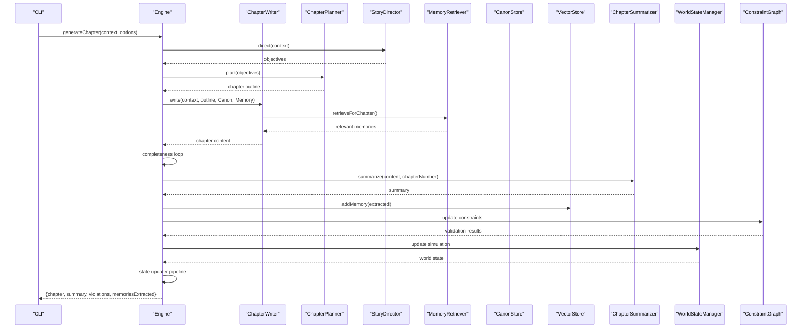

**Diagram sources**
- [packages/engine/src/pipeline/generateChapter.ts](file://packages/engine/src/pipeline/generateChapter.ts#L26-L103)
- [packages/engine/src/agents/writer.ts](file://packages/engine/src/agents/writer.ts#L61-L112)
- [packages/engine/src/agents/chapterPlanner.ts](file://packages/engine/src/agents/chapterPlanner.ts#L110-L326)
- [packages/engine/src/agents/storyDirector.ts](file://packages/engine/src/agents/storyDirector.ts#L100-L276)
- [packages/engine/src/memory/vectorStore.ts](file://packages/engine/src/memory/vectorStore.ts#L37-L58)
- [packages/engine/src/constraints/constraintGraph.ts](file://packages/engine/src/constraints/constraintGraph.ts#L29-L471)
- [packages/engine/src/world/worldState.ts](file://packages/engine/src/world/worldState.ts#L24-L321)

**Section sources**
- [PROGRESS.md](file://PROGRESS.md#L1-L339)

## Detailed Component Analysis

### Phase 1 — Core Chapter Generator ✅ COMPLETE
- Purpose: Establish a robust chapter generation loop with completion checks, summaries, and continuation handling
- Key elements:
  - ChapterWriter: builds prompts with story context, characters, canon, memories, recent summaries, and inferred chapter goals
  - CompletenessChecker: ensures chapters meet minimum structural completeness
  - ChapterSummarizer: produces concise chapter summaries
  - generateChapter pipeline: orchestrates writing, continuation, validation, summarization, and memory extraction

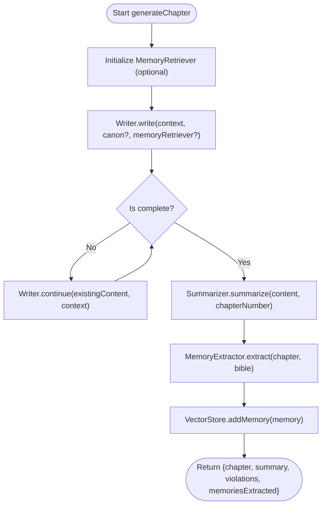

**Diagram sources**
- [packages/engine/src/pipeline/generateChapter.ts](file://packages/engine/src/pipeline/generateChapter.ts#L26-L103)
- [packages/engine/src/agents/writer.ts](file://packages/engine/src/agents/writer.ts#L61-L135)

**Section sources**
- [PROGRESS.md](file://PROGRESS.md#L7-L41)
- [packages/engine/src/agents/writer.ts](file://packages/engine/src/agents/writer.ts#L1-L164)
- [packages/engine/src/pipeline/generateChapter.ts](file://packages/engine/src/pipeline/generateChapter.ts#L1-L108)

### Phase 2 — Canon Memory System ✅ COMPLETE
- Purpose: Prevent fact drift by storing immutable facts and validating chapters against them
- Key elements:
  - CanonStore: stores facts (character, world, plot, timeline) with establishment chapters
  - extractCanonFromBible: auto-extracts initial facts from the story bible
  - CanonValidator: detects contradictions between chapter content and established facts
  - Writer prompt injection: formatted canon section included in prompts

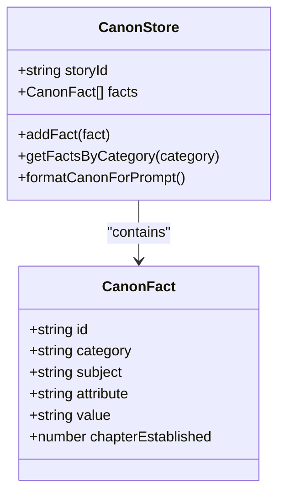

**Diagram sources**
- [packages/engine/src/memory/canonStore.ts](file://packages/engine/src/memory/canonStore.ts#L12-L129)

**Section sources**
- [PROGRESS.md](file://PROGRESS.md#L44-L72)
- [packages/engine/src/memory/canonStore.ts](file://packages/engine/src/memory/canonStore.ts#L1-L134)

### Phase 3 — Vector Narrative Memory ✅ COMPLETE
- Purpose: Enable semantic search over narrative memories to improve coherence across long stories
- Key elements:
  - VectorStore: HNSW-based vector index with OpenAI embeddings and mock fallback
  - MemoryRetriever: queries relevant memories for chapter prompts
  - MemoryExtractor: extracts narrative fragments post-generation
  - Integration: automatic memory extraction and persistence after each chapter

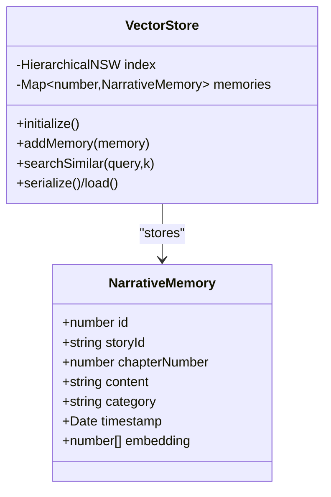

**Diagram sources**
- [packages/engine/src/memory/vectorStore.ts](file://packages/engine/src/memory/vectorStore.ts#L19-L158)

**Section sources**
- [PROGRESS.md](file://PROGRESS.md#L75-L107)
- [packages/engine/src/memory/vectorStore.ts](file://packages/engine/src/memory/vectorStore.ts#L1-L173)

### Phase 4 — Structured Story State ✅ COMPLETE
- Purpose: Track mutable story state (tension, characters, plot threads, unresolved questions, recent events)
- Key elements:
  - StoryStructuredState: central state container with helpers for initialization, updates, and formatting
  - Tension calculation: parabolic curve targeting natural dramatic arc
  - Integration: formatted state injected into prompts for context

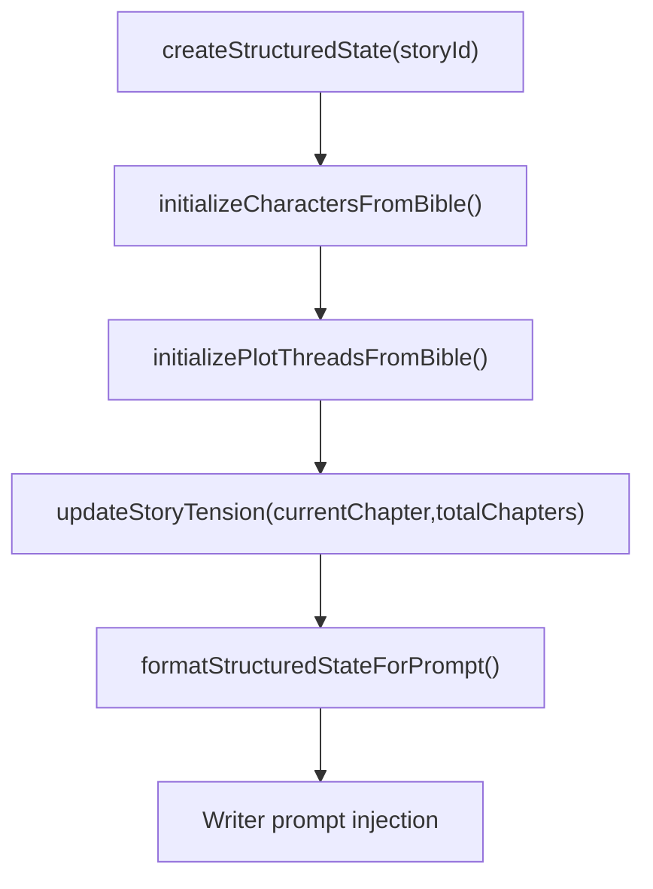

**Diagram sources**
- [packages/engine/src/story/structuredState.ts](file://packages/engine/src/story/structuredState.ts#L33-L179)

**Section sources**
- [PROGRESS.md](file://PROGRESS.md#L110-L137)
- [packages/engine/src/story/structuredState.ts](file://packages/engine/src/story/structuredState.ts#L1-L235)

### Phase 5 — Narrative Tension Controller ✅ COMPLETE
- Purpose: Control pacing by computing target tension and generating guidance
- Key elements:
  - calculateTargetTension: parabolic curve for 10-chapter stories
  - analyzeTension and generateTensionGuidance: categorize and suggest scene types
  - Integration: formatted guidance injected into prompts

**Section sources**
- [PROGRESS.md](file://PROGRESS.md#L140-L163)
- [packages/engine/src/story/structuredState.ts](file://packages/engine/src/story/structuredState.ts#L155-L179)

### Phase 6 — Story Director Agent ✅ COMPLETE
- Purpose: Determine chapter objectives and high-level direction
- Key elements:
  - Analyzes structured state, tension guidance, and recent summaries
  - Produces objectives with priorities and types
  - Fallback mode for testing without LLM

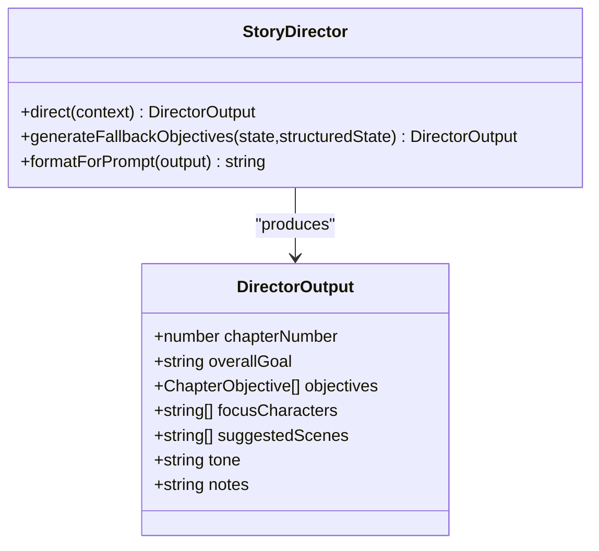

**Diagram sources**
- [packages/engine/src/agents/storyDirector.ts](file://packages/engine/src/agents/storyDirector.ts#L100-L276)

**Section sources**
- [PROGRESS.md](file://PROGRESS.md#L166-L190)
- [packages/engine/src/agents/storyDirector.ts](file://packages/engine/src/agents/storyDirector.ts#L1-L276)

### Phase 7 — Chapter Planner Agent ✅ COMPLETE
- Purpose: Convert objectives into detailed scene outlines with progressive tension
- Key elements:
  - Builds scene-by-scene breakdown with goals, settings, characters, and estimated word counts
  - Validates outline coverage against objectives
  - Fallback outline generation without LLM

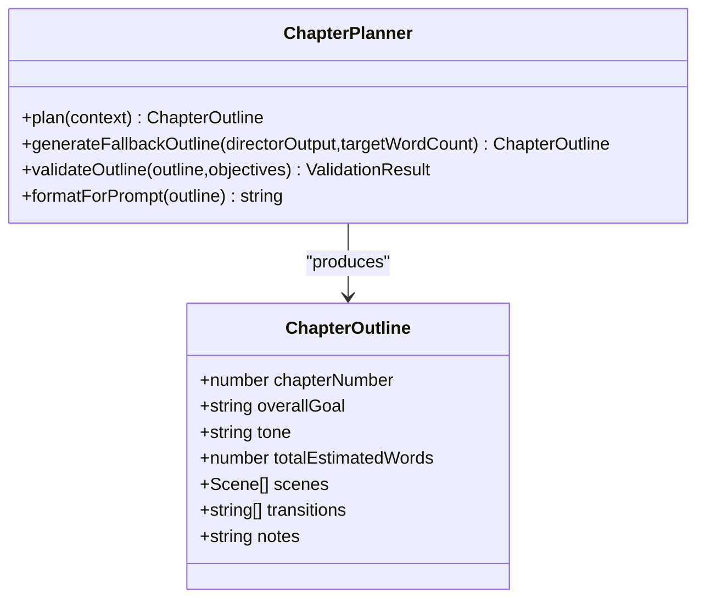

**Diagram sources**
- [packages/engine/src/agents/chapterPlanner.ts](file://packages/engine/src/agents/chapterPlanner.ts#L110-L326)

**Section sources**
- [PROGRESS.md](file://PROGRESS.md#L193-L220)
- [packages/engine/src/agents/chapterPlanner.ts](file://packages/engine/src/agents/chapterPlanner.ts#L1-L326)

### Phase 8 — World Simulation Layer ✅ COMPLETE
- Purpose: Enable autonomous character behavior and emergent plot through turn-based simulation
- Key elements:
  - WorldStateManager: manages locations, characters, events, and history
  - CharacterAgent and EventResolver: model character agendas and resolve interactions
  - Serialization: full world state persistence

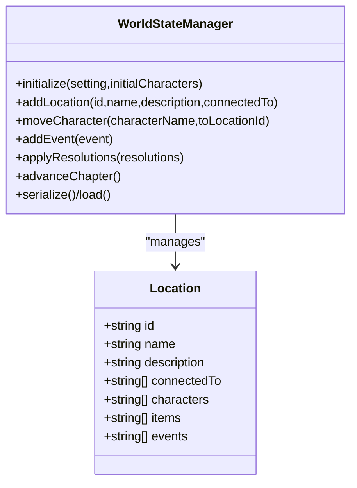

**Diagram sources**
- [packages/engine/src/world/worldState.ts](file://packages/engine/src/world/worldState.ts#L24-L321)

**Section sources**
- [PROGRESS.md](file://PROGRESS.md#L222-L251)
- [packages/engine/src/world/worldState.ts](file://packages/engine/src/world/worldState.ts#L1-L321)

### Phase 9 — Narrative Constraints Graph ✅ COMPLETE
- Purpose: Enforce logical consistency across story world (canon, location, knowledge, timeline, logic)
- Key elements:
  - ConstraintGraph: nodes and edges representing characters, locations, facts, events
  - Validation: location consistency, knowledge leaks, timeline errors, logical inconsistencies
  - Integration: dual validation (fast graph-based + comprehensive LLM-based)

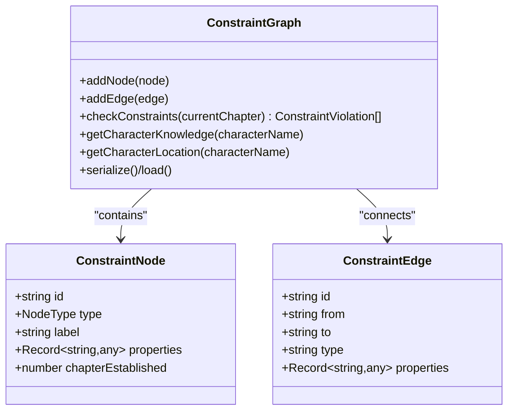

**Diagram sources**
- [packages/engine/src/constraints/constraintGraph.ts](file://packages/engine/src/constraints/constraintGraph.ts#L29-L471)

**Section sources**
- [PROGRESS.md](file://PROGRESS.md#L253-L282)
- [packages/engine/src/constraints/constraintGraph.ts](file://packages/engine/src/constraints/constraintGraph.ts#L1-L471)

### Phase 10 — Memory + Graph Updates ✅ COMPLETE
- Purpose: Complete the feedback loop by updating state, vector store, character states, plot threads, and constraint graph after each chapter
- Key elements:
  - StateUpdaterPipeline: orchestrates the complete post-chapter update process
  - Multi-stage updates: extract → update vector → update state → update graph
  - Support for both quick (no LLM) and full (LLM-powered) update modes
  - Integration with all previous phases for comprehensive story evolution

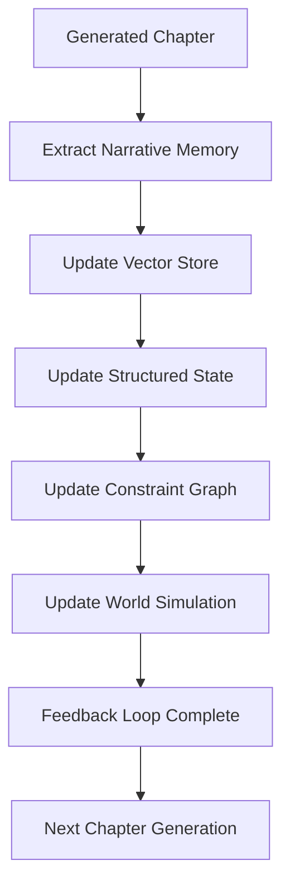

**Diagram sources**
- [packages/engine/src/memory/stateUpdater.ts](file://packages/engine/src/memory/stateUpdater.ts#L1-L232)

**Section sources**
- [PROGRESS.md](file://PROGRESS.md#L284-L311)
- [packages/engine/src/memory/stateUpdater.ts](file://packages/engine/src/memory/stateUpdater.ts#L1-L232)

## Dependency Analysis
The engine exports consolidate all ten major modules behind a single entry point, enabling clean imports from both CLI and potential API/worker applications. The CLI depends on the engine for complete story lifecycle operations with integrated memory, constraints, and world simulation.

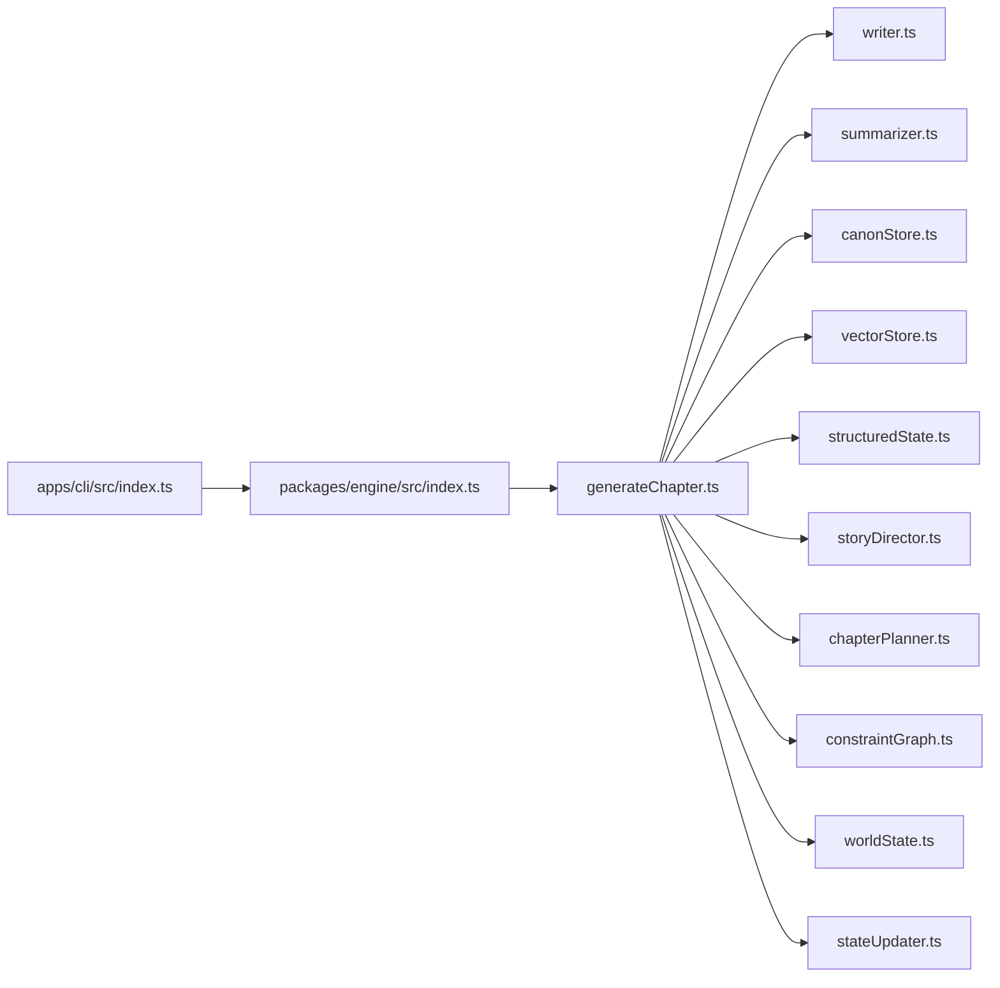

**Diagram sources**
- [packages/engine/src/index.ts](file://packages/engine/src/index.ts#L1-L116)
- [apps/cli/src/index.ts](file://apps/cli/src/index.ts#L1-L54)

**Section sources**
- [packages/engine/src/index.ts](file://packages/engine/src/index.ts#L1-L116)
- [apps/cli/src/index.ts](file://apps/cli/src/index.ts#L1-L54)

## Performance Considerations
- Vector indexing: HNSW provides efficient similarity search; ensure proper initialization and persistence to avoid rebuild costs
- Embedding generation: OpenAI embeddings are used with a mock fallback; configure environment appropriately for production
- Prompt construction: Avoid excessively large prompts by limiting recent summaries and memory sections
- Continuation attempts: Limit max continuation attempts to prevent runaway token usage
- Serialization: Persist state and memories to disk to minimize recomputation across sessions
- Constraint graph validation: Optimized for both quick (graph-based) and comprehensive (LLM-based) validation modes
- World simulation: Turn-based approach prevents excessive computational overhead while maintaining narrative coherence

## Troubleshooting Guide
- Provider configuration: Use the CLI config command to set LLM provider and API keys
- Integration tests: Run the provided integration test to validate provider connectivity and basic pipeline behavior
- Memory persistence: Verify vector store and canon persistence files exist in the expected locations
- Constraint violations: Review reported violations from the CanonValidator and ConstraintGraph to identify and fix inconsistencies
- World simulation issues: Check character locations and event resolutions for logical consistency
- State updater problems: Verify that all three update modes (quick, LLM-powered, multi-chapter) are functioning correctly
- CLI command failures: Use verbose logging to trace through the complete generation pipeline from CLI to engine

**Section sources**
- [PROGRESS.md](file://PROGRESS.md#L314-L339)
- [apps/cli/src/index.ts](file://apps/cli/src/index.ts#L18-L21)

## Conclusion
The Narrative OS has successfully implemented all ten planned phases, delivering a comprehensive, self-improving framework for automated story generation. The system now features sophisticated world simulation, narrative constraints enforcement, integrated memory management, and a complete feedback loop that continuously evolves story state. The modular architecture enables incremental enhancements while maintaining system stability, positioning the platform to produce coherent, consistent, and engaging narratives across extended story arcs with complete narrative integrity and logical consistency.