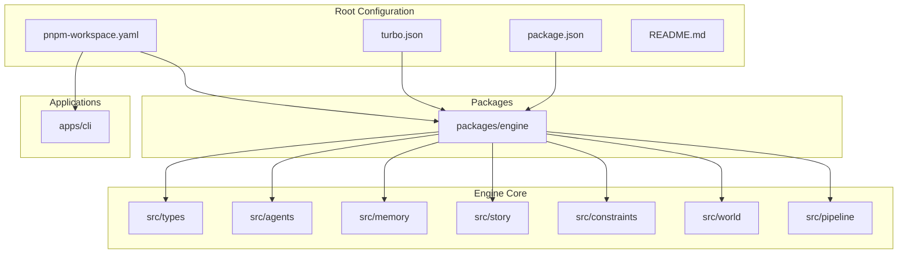
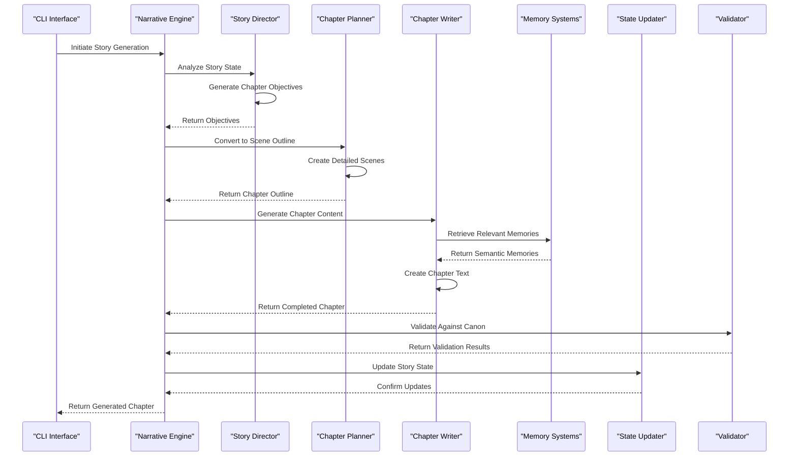
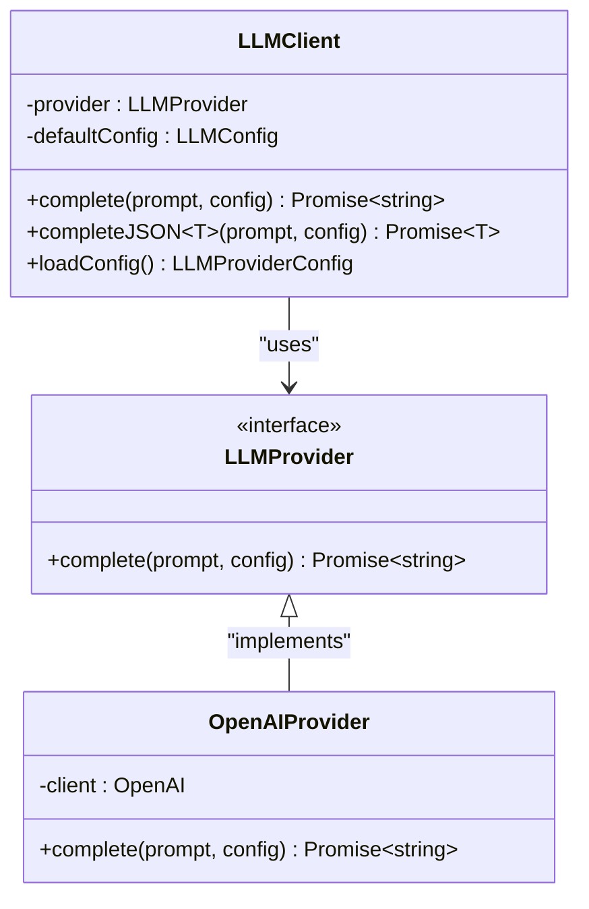
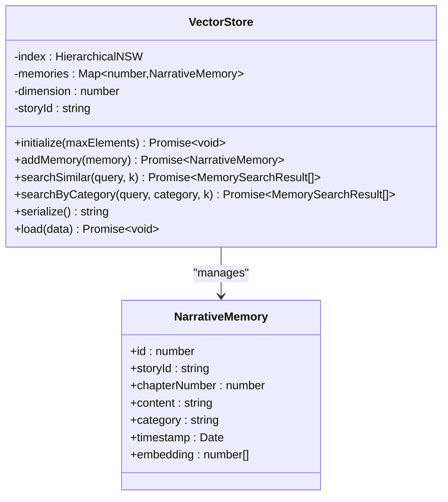
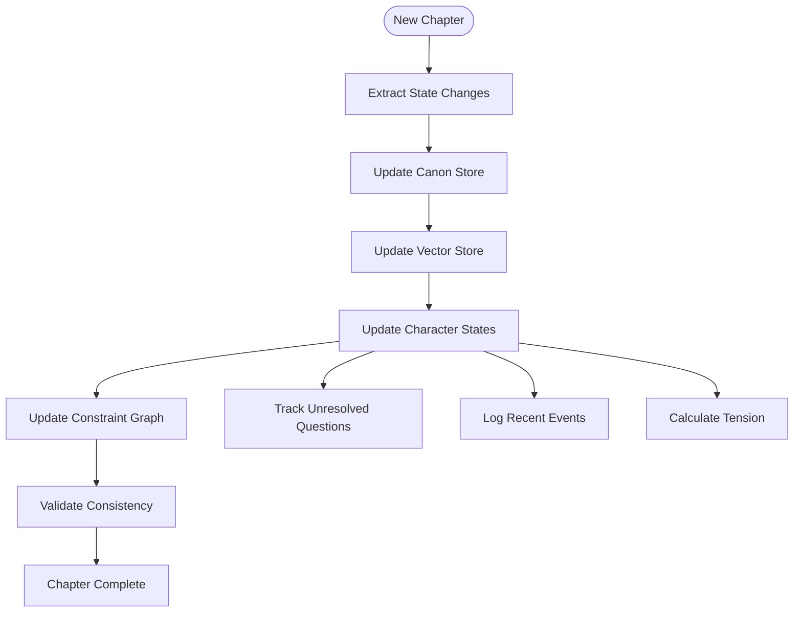
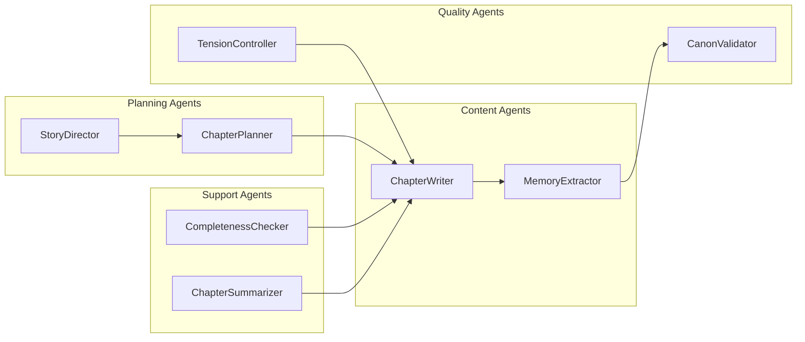
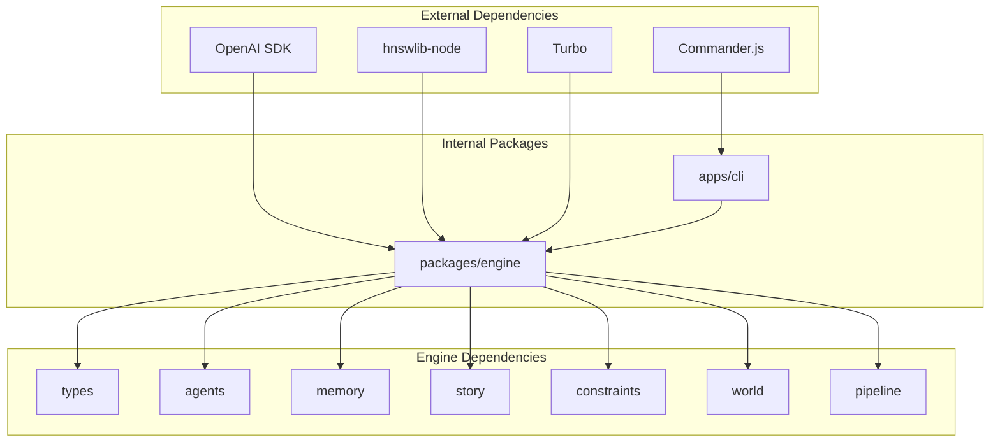

# Project Overview

<cite>
**Referenced Files in This Document**
- [README.md](file://README.md)
- [package.json](file://package.json)
- [pnpm-workspace.yaml](file://pnpm-workspace.yaml)
- [turbo.json](file://turbo.json)
- [PROGRESS.md](file://PROGRESS.md)
- [packages/engine/src/index.ts](file://packages/engine/src/index.ts)
- [packages/engine/src/types/index.ts](file://packages/engine/src/types/index.ts)
- [packages/engine/src/story/bible.ts](file://packages/engine/src/story/bible.ts)
- [packages/engine/src/story/state.ts](file://packages/engine/src/story/state.ts)
- [packages/engine/src/llm/client.ts](file://packages/engine/src/llm/client.ts)
- [packages/engine/src/agents/writer.ts](file://packages/engine/src/agents/writer.ts)
- [packages/engine/src/agents/storyDirector.ts](file://packages/engine/src/agents/storyDirector.ts)
- [packages/engine/src/agents/chapterPlanner.ts](file://packages/engine/src/agents/chapterPlanner.ts)
- [packages/engine/src/memory/canonStore.ts](file://packages/engine/src/memory/canonStore.ts)
- [packages/engine/src/memory/vectorStore.ts](file://packages/engine/src/memory/vectorStore.ts)
</cite>

## Table of Contents
1. [Introduction](#introduction)
2. [Project Structure](#project-structure)
3. [Core Components](#core-components)
4. [Architecture Overview](#architecture-overview)
5. [Detailed Component Analysis](#detailed-component-analysis)
6. [Dependency Analysis](#dependency-analysis)
7. [Performance Considerations](#performance-considerations)
8. [Troubleshooting Guide](#troubleshooting-guide)
9. [Conclusion](#conclusion)

## Introduction
Narrative OS is an AI-native narrative engine designed to generate long-form stories with persistent memory, autonomous world simulation, and logical consistency enforcement. It addresses the common problem of AI writing tools suffering from "goldfish memory" by implementing a hierarchical memory architecture inspired by human storytelling cognition. The system maintains a complete narrative ecosystem including immutable story foundations, searchable memories, real-time character states, constraint graphs, and autonomous world simulations.

The project follows a modular monorepo architecture using TypeScript, pnpm workspaces, and Turbo for build orchestration. It integrates with major LLM providers (OpenAI and DeepSeek) and includes sophisticated memory systems powered by HNSW vector similarity search.

## Project Structure
The repository follows a well-organized monorepo structure with clear separation of concerns:

**Diagram sources**
- [pnpm-workspace.yaml](file://pnpm-workspace.yaml#L1-L4)
- [turbo.json](file://turbo.json#L1-L19)
- [package.json](file://package.json#L1-L17)

The project consists of:
- **apps/cli**: Command-line interface with story management commands
- **packages/engine**: Core narrative engine containing all AI agents, memory systems, and story state management
- **Video Creation Assets**: Documentation for video creation processes

**Section sources**
- [pnpm-workspace.yaml](file://pnpm-workspace.yaml#L1-L4)
- [turbo.json](file://turbo.json#L1-L19)
- [package.json](file://package.json#L1-L17)

## Core Components
The engine provides a comprehensive set of interconnected components that work together to create coherent narratives:

### Memory Hierarchy System
The system implements a six-layer memory architecture:
- **Story Bible**: Immutable foundation with characters, setting, and themes
- **Canon Store**: Immutable facts that must never be contradicted
- **Vector Memory**: HNSW-based semantic search for narrative recall
- **Structured State**: Real-time tracking of character emotions, locations, and knowledge
- **Constraint Graph**: Knowledge graph enforcing logical consistency
- **World Simulation**: Autonomous character agents with goals and agendas

### AI Agent Architecture
The engine employs specialized AI agents for different narrative functions:
- **ChapterWriter**: Creates chapter content with context injection
- **StoryDirector**: Generates chapter objectives based on story state
- **ChapterPlanner**: Converts objectives into scene structures
- **MemoryExtractor**: Automatically extracts narrative memories
- **StateUpdater**: Updates character states and plot threads
- **CanonValidator**: Detects logical inconsistencies
- **TensionController**: Manages narrative tension curves

### Data Types and Interfaces
The system defines comprehensive type definitions for story structures, character profiles, plot threads, and generation contexts. These types ensure type safety across all components and provide clear contracts for data exchange.

**Section sources**
- [packages/engine/src/index.ts](file://packages/engine/src/index.ts#L1-L116)
- [packages/engine/src/types/index.ts](file://packages/engine/src/types/index.ts#L1-L90)
- [README.md](file://README.md#L36-L46)

## Architecture Overview
The narrative generation pipeline follows a sophisticated multi-stage process that ensures consistency and quality:

**Diagram sources**
- [packages/engine/src/agents/storyDirector.ts](file://packages/engine/src/agents/storyDirector.ts#L100-L112)
- [packages/engine/src/agents/chapterPlanner.ts](file://packages/engine/src/agents/chapterPlanner.ts#L110-L122)
- [packages/engine/src/agents/writer.ts](file://packages/engine/src/agents/writer.ts#L61-L112)
- [packages/engine/src/memory/vectorStore.ts](file://packages/engine/src/memory/vectorStore.ts#L95-L107)

The architecture emphasizes:
- **Persistent Memory**: All story data persists across sessions
- **Logical Consistency**: Built-in validation prevents contradictions
- **Autonomous Generation**: AI agents work together without manual intervention
- **Hierarchical Context**: Each stage builds upon previous knowledge

## Detailed Component Analysis

### LLM Integration System
The engine provides a flexible LLM abstraction layer supporting multiple providers:

**Diagram sources**
- [packages/engine/src/llm/client.ts](file://packages/engine/src/llm/client.ts#L38-L88)

The system supports:
- **Multi-provider Architecture**: OpenAI and DeepSeek integration
- **Environment-based Configuration**: Dynamic provider selection
- **JSON Mode**: Specialized mode for structured output
- **Fallback Mechanisms**: Graceful handling of API failures

**Section sources**
- [packages/engine/src/llm/client.ts](file://packages/engine/src/llm/client.ts#L1-L120)

### Memory Management System
The vector memory system implements advanced semantic search capabilities:

**Diagram sources**
- [packages/engine/src/memory/vectorStore.ts](file://packages/engine/src/memory/vectorStore.ts#L19-L93)

Key features include:
- **HNSW Indexing**: Hierarchical navigable small world graph for efficient similarity search
- **Automatic Embedding**: Integration with OpenAI embeddings API
- **Mock Fallback**: Deterministic embeddings for testing environments
- **Dynamic Resizing**: Automatic capacity management

**Section sources**
- [packages/engine/src/memory/vectorStore.ts](file://packages/engine/src/memory/vectorStore.ts#L1-L208)

### Story State Management
The structured state system tracks narrative progression and character development:

**Diagram sources**
- [packages/engine/src/memory/stateUpdater.ts](file://packages/engine/src/memory/stateUpdater.ts#L1-L50)

The system manages:
- **Character State Tracking**: Emotions, locations, relationships, goals
- **Plot Thread Management**: Status, tension, and resolution tracking
- **Tension Calculation**: Parabolic curve for dramatic arc
- **Knowledge Management**: Character-specific knowledge tracking

**Section sources**
- [packages/engine/src/story/structuredState.ts](file://packages/engine/src/story/structuredState.ts#L1-L200)

### AI Agent Coordination
The agent system coordinates multiple specialized components:

**Diagram sources**
- [packages/engine/src/agents/storyDirector.ts](file://packages/engine/src/agents/storyDirector.ts#L100-L112)
- [packages/engine/src/agents/chapterPlanner.ts](file://packages/engine/src/agents/chapterPlanner.ts#L110-L122)
- [packages/engine/src/agents/writer.ts](file://packages/engine/src/agents/writer.ts#L61-L112)

**Section sources**
- [packages/engine/src/agents/storyDirector.ts](file://packages/engine/src/agents/storyDirector.ts#L1-L276)
- [packages/engine/src/agents/chapterPlanner.ts](file://packages/engine/src/agents/chapterPlanner.ts#L1-L326)
- [packages/engine/src/agents/writer.ts](file://packages/engine/src/agents/writer.ts#L1-L164)

## Dependency Analysis
The project demonstrates excellent modularity with clear dependency boundaries:

**Diagram sources**
- [package.json](file://package.json#L1-L17)
- [pnpm-workspace.yaml](file://pnpm-workspace.yaml#L1-L4)

Key dependency characteristics:
- **Minimal External Coupling**: Clear separation between LLM providers and core logic
- **Internal Cohesion**: Well-defined boundaries within the engine package
- **Workspace Management**: Proper pnpm workspace configuration
- **Build Orchestration**: Turbo for efficient incremental builds

**Section sources**
- [package.json](file://package.json#L1-L17)
- [pnpm-workspace.yaml](file://pnpm-workspace.yaml#L1-L4)
- [turbo.json](file://turbo.json#L1-L19)

## Performance Considerations
The system incorporates several performance optimizations:

### Memory Management
- **HNSW Indexing**: Provides O(log n) semantic search performance
- **Automatic Resizing**: Dynamic capacity adjustment prevents performance degradation
- **Mock Embeddings**: Enables testing without external API calls
- **Efficient Serialization**: Compact JSON format for persistence

### Generation Pipeline
- **Parallel Processing**: Independent agents can operate concurrently
- **Incremental Updates**: Only changed data is processed in subsequent chapters
- **Context Optimization**: Strategic memory retrieval reduces token usage
- **Fallback Mechanisms**: Non-LLM modes enable rapid testing and development

### Scalability Features
- **Story Isolation**: Each story maintains separate memory spaces
- **Modular Design**: Components can be scaled independently
- **Persistent State**: Efficient checkpointing prevents data loss
- **Resource Management**: Proper cleanup of vector stores and agent instances

## Troubleshooting Guide
Common issues and solutions:

### LLM Provider Configuration
- **API Key Issues**: Verify environment variables are properly set
- **Model Availability**: Check provider-specific model support
- **Rate Limiting**: Implement retry logic for API throttling
- **Connection Failures**: Test network connectivity and proxy settings

### Memory System Problems
- **Vector Store Corruption**: Use serialization/deserialization for recovery
- **Embedding API Failures**: Enable mock embeddings for testing
- **Index Performance**: Monitor memory usage and adjust capacity
- **Search Quality**: Validate embedding dimensions and normalization

### Generation Pipeline Issues
- **Memory Leaks**: Ensure proper cleanup of agent instances
- **State Inconsistencies**: Verify constraint graph validation
- **Performance Bottlenecks**: Profile memory usage and optimize queries
- **Persistence Failures**: Check file permissions and disk space

### Development Environment
- **Build Issues**: Verify Turbo configuration and workspace setup
- **TypeScript Errors**: Ensure proper type definitions and module resolution
- **Testing Problems**: Use mock embeddings for unit tests
- **Debugging**: Leverage console logging and error tracking

**Section sources**
- [packages/engine/src/llm/client.ts](file://packages/engine/src/llm/client.ts#L53-L73)
- [packages/engine/src/memory/vectorStore.ts](file://packages/engine/src/memory/vectorStore.ts#L125-L148)

## Conclusion
Narrative OS represents a sophisticated approach to AI-powered story generation, combining advanced memory systems with intelligent agent coordination. The project demonstrates excellent architectural decisions including:

- **Hierarchical Memory Design**: Multi-layered persistence ensures narrative coherence
- **Agent-Based Architecture**: Specialized components work together seamlessly
- **Consistency Enforcement**: Built-in validation prevents logical contradictions
- **Modular Design**: Clean separation of concerns enables maintainability
- **Performance Optimization**: Efficient algorithms and resource management

The implementation showcases modern software engineering practices with comprehensive testing, type safety, and extensible architecture. The project successfully addresses the fundamental challenges of AI narrative generation while maintaining flexibility for future enhancements.

The completion of all ten implementation phases demonstrates a well-executed development roadmap that delivers a production-ready system for long-form story generation with persistent memory and autonomous world simulation.