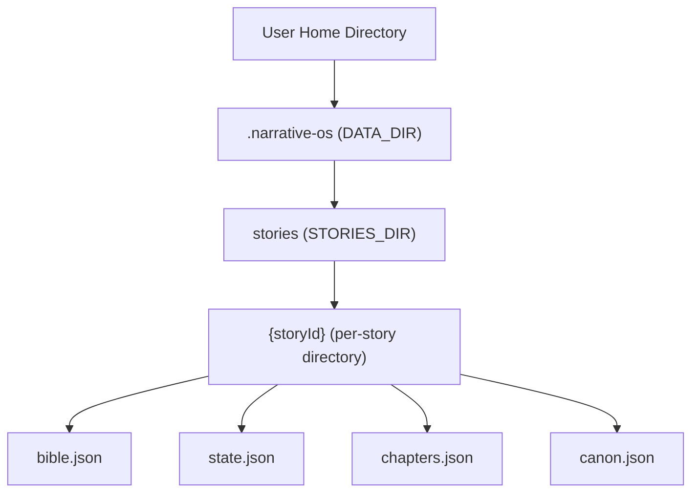
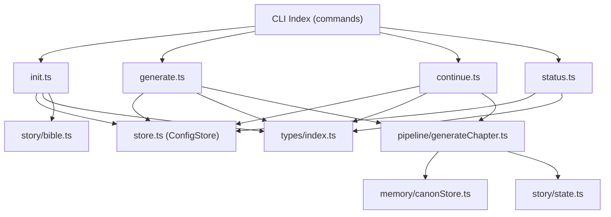
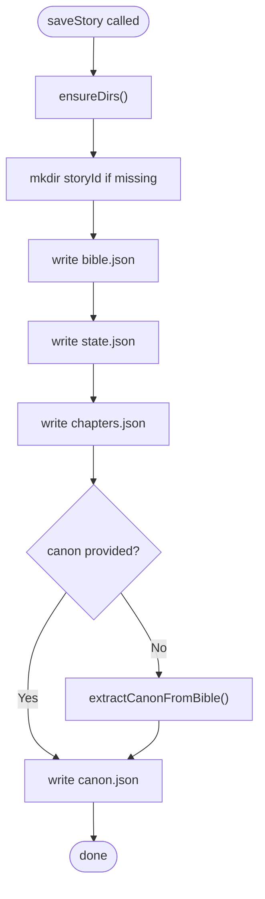
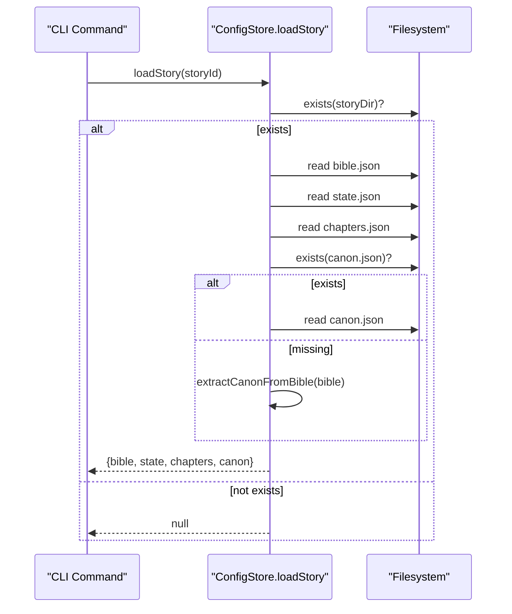
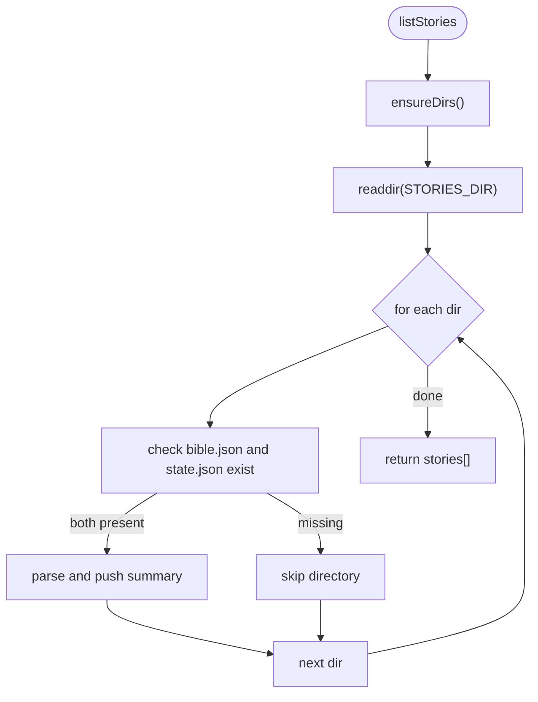
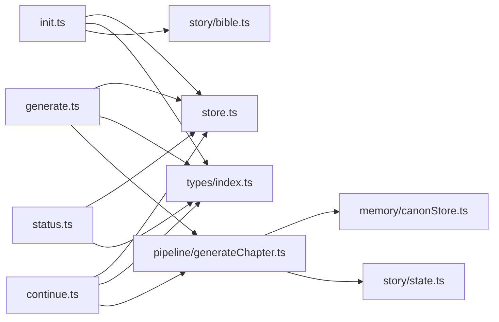
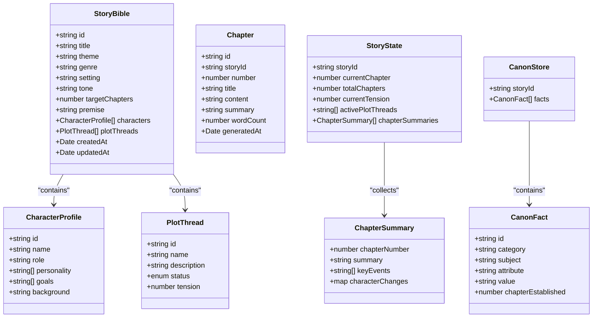

# Local Storage & Persistence

<cite>
**Referenced Files in This Document**
- [store.ts](file://apps/cli/src/config/store.ts)
- [index.ts](file://apps/cli/src/index.ts)
- [init.ts](file://apps/cli/src/commands/init.ts)
- [generate.ts](file://apps/cli/src/commands/generate.ts)
- [continue.ts](file://apps/cli/src/commands/continue.ts)
- [status.ts](file://apps/cli/src/commands/status.ts)
- [config.ts](file://apps/cli/src/commands/config.ts)
- [bible.ts](file://packages/engine/src/story/bible.ts)
- [state.ts](file://packages/engine/src/story/state.ts)
- [canonStore.ts](file://packages/engine/src/memory/canonStore.ts)
- [generateChapter.ts](file://packages/engine/src/pipeline/generateChapter.ts)
- [index.ts](file://packages/engine/src/types/index.ts)
- [package.json](file://package.json)
</cite>

## Table of Contents
1. [Introduction](#introduction)
2. [Project Structure](#project-structure)
3. [Core Components](#core-components)
4. [Architecture Overview](#architecture-overview)
5. [Detailed Component Analysis](#detailed-component-analysis)
6. [Dependency Analysis](#dependency-analysis)
7. [Performance Considerations](#performance-considerations)
8. [Troubleshooting Guide](#troubleshooting-guide)
9. [Conclusion](#conclusion)
10. [Appendices](#appendices)

## Introduction
This document describes the Local Storage and Persistence system used by the Narrative Operating System (NOS). It explains the filesystem organization for story data, including directory structure, file naming conventions, and serialization formats. It documents the ConfigStore interface for reading and writing story configurations, including story metadata, state snapshots, and generated content. It also covers backup and recovery mechanisms, data migration strategies between versions, conflict resolution for concurrent access, examples of story loading workflows, state restoration after application restart, manual backup procedures, storage limits, cleanup policies, performance optimization for large story datasets, and cross-platform compatibility and filesystem permissions handling.

## Project Structure
The persistence layer centers around a local filesystem layout under the user’s home directory. The CLI application orchestrates story lifecycle operations and delegates persistence to a dedicated store module.

- Root data directory: ~/.narrative-os
- Stories directory: ~/.narrative-os/stories
- Per-story directory: ~/.narrative-os/stories/{storyId}
- Files per story:
  - bible.json: serialized StoryBible
  - state.json: serialized StoryState
  - chapters.json: serialized array of Chapter
  - canon.json: serialized CanonStore (optional; auto-extracted if missing)

**Diagram sources**
- [store.ts](file://apps/cli/src/config/store.ts#L7-L26)

**Section sources**
- [store.ts](file://apps/cli/src/config/store.ts#L7-L26)

## Core Components
- ConfigStore interface (implemented in the CLI store module):
  - saveStory(bible, state, chapters, canon?): writes four JSON files per story.
  - loadStory(storyId): reads and parses the four JSON files; extracts canon if missing.
  - listStories(): enumerates stories by scanning the stories directory and validating presence of required files.
- Engine types and state:
  - StoryBible, StoryState, Chapter, CanonStore define the persisted data model.
  - State transitions are handled by state.ts functions.
- CLI commands:
  - init: creates a new story and persists initial state.
  - generate: loads story, generates next chapter, updates state, and saves.
  - continue: loops generation until completion, saving after each chapter.
  - status: displays story metadata and progress.
  - config: manages LLM provider configuration stored separately in config.json.

**Section sources**
- [store.ts](file://apps/cli/src/config/store.ts#L15-L49)
- [index.ts](file://apps/cli/src/index.ts#L1-L54)
- [init.ts](file://apps/cli/src/commands/init.ts#L1-L50)
- [generate.ts](file://apps/cli/src/commands/generate.ts#L1-L55)
- [continue.ts](file://apps/cli/src/commands/continue.ts#L1-L52)
- [status.ts](file://apps/cli/src/commands/status.ts#L1-L55)
- [bible.ts](file://packages/engine/src/story/bible.ts#L1-L73)
- [state.ts](file://packages/engine/src/story/state.ts#L1-L30)
- [canonStore.ts](file://packages/engine/src/memory/canonStore.ts#L1-L134)
- [index.ts](file://packages/engine/src/types/index.ts#L1-L90)

## Architecture Overview
The CLI commands depend on the ConfigStore to manage persistence. The engine provides the data models and state transitions used by the CLI.

**Diagram sources**
- [index.ts](file://apps/cli/src/index.ts#L1-L54)
- [init.ts](file://apps/cli/src/commands/init.ts#L1-L50)
- [generate.ts](file://apps/cli/src/commands/generate.ts#L1-L55)
- [continue.ts](file://apps/cli/src/commands/continue.ts#L1-L52)
- [status.ts](file://apps/cli/src/commands/status.ts#L1-L55)
- [store.ts](file://apps/cli/src/config/store.ts#L1-L78)
- [index.ts](file://packages/engine/src/types/index.ts#L1-L90)
- [bible.ts](file://packages/engine/src/story/bible.ts#L1-L73)
- [state.ts](file://packages/engine/src/story/state.ts#L1-L30)
- [canonStore.ts](file://packages/engine/src/memory/canonStore.ts#L1-L134)
- [generateChapter.ts](file://packages/engine/src/pipeline/generateChapter.ts#L1-L76)

## Detailed Component Analysis

### ConfigStore Interface and Filesystem Organization
- Purpose: Provide a simple, deterministic filesystem layout for story data.
- Directory structure:
  - DATA_DIR: ~/.narrative-os
  - STORIES_DIR: ~/.narrative-os/stories
  - STORY_DIR: ~/.narrative-os/stories/{storyId}
- File naming and serialization:
  - bible.json: StoryBible
  - state.json: StoryState
  - chapters.json: Chapter[]
  - canon.json: CanonStore (optional; auto-extracted if absent)
- Atomicity and safety:
  - Writes occur after ensuring directories exist.
  - No explicit transaction mechanism; writes are synchronous and overwrite existing files.

**Diagram sources**
- [store.ts](file://apps/cli/src/config/store.ts#L15-L26)

**Section sources**
- [store.ts](file://apps/cli/src/config/store.ts#L15-L26)

### Story Loading Workflow
- loadStory(storyId):
  - Validates story directory exists.
  - Reads and parses bible.json, state.json, chapters.json.
  - If canon.json exists, parses it; otherwise, extracts CanonStore from StoryBible.
  - Returns structured data or null on failure.

**Diagram sources**
- [store.ts](file://apps/cli/src/config/store.ts#L28-L49)

**Section sources**
- [store.ts](file://apps/cli/src/config/store.ts#L28-L49)

### State Restoration After Application Restart
- listStories():
  - Ensures directories exist.
  - Iterates story directories and checks for required files (bible.json and state.json).
  - Parses and returns a compact summary for each valid story.
- This enables the CLI to display all stories and their progress without loading full content.

**Diagram sources**
- [store.ts](file://apps/cli/src/config/store.ts#L51-L75)

**Section sources**
- [store.ts](file://apps/cli/src/config/store.ts#L51-L75)

### Data Serialization Formats
- All persisted data is serialized as JSON:
  - StoryBible: includes identifiers, metadata, characters, plot threads, timestamps.
  - StoryState: includes story progress, tension, and summaries.
  - Chapter[]: array of generated chapters with content, titles, counts, and timestamps.
  - CanonStore: extracted from StoryBible or persisted separately.

**Section sources**
- [index.ts](file://packages/engine/src/types/index.ts#L1-L90)
- [bible.ts](file://packages/engine/src/story/bible.ts#L1-L73)
- [state.ts](file://packages/engine/src/story/state.ts#L1-L30)
- [canonStore.ts](file://packages/engine/src/memory/canonStore.ts#L1-L134)
- [store.ts](file://apps/cli/src/config/store.ts#L20-L25)

### Backup and Recovery Mechanisms
- Automatic backup:
  - Not implemented in the current codebase.
- Manual backup procedure:
  - Copy the entire ~/.narrative-os directory to a safe location.
  - To back up a single story, copy its directory under ~/.narrative-os/stories/{storyId}.
- Recovery:
  - Restore the copied directory tree into ~/.narrative-os.
  - Verify story integrity by running status for each story ID.

**Section sources**
- [store.ts](file://apps/cli/src/config/store.ts#L7-L26)
- [status.ts](file://apps/cli/src/commands/status.ts#L1-L55)

### Data Migration Strategies Between Versions
- Current state:
  - No formal migration scripts exist.
- Recommended approach:
  - Version the DATA_DIR (e.g., ~/.narrative-os/v1, ~/.narrative-os/v2) and migrate on first launch of a new major version.
  - Implement a migration function that:
    - Reads old-format files.
    - Translates field names or structures as needed.
    - Writes new-format files.
    - Removes or archives old files.
  - Provide a dry-run mode and rollback capability.

[No sources needed since this section provides general guidance]

### Conflict Resolution for Concurrent Access
- Current behavior:
  - No explicit locking or concurrency control.
  - Writes are synchronous and overwrite files.
- Risk:
  - Concurrent writes from multiple processes may interleave or overwrite each other.
- Mitigation strategies:
  - Add advisory file locks (e.g., lock files) during write operations.
  - Implement optimistic concurrency with ETags or last-modified timestamps.
  - Use atomic file replacement (write to temp file, rename) to avoid partial reads.

**Section sources**
- [store.ts](file://apps/cli/src/config/store.ts#L15-L26)

### Examples of Story Workflows

#### Initialize a New Story
- Steps:
  - Create StoryBible via engine APIs.
  - Add characters and optional plot threads.
  - Create initial StoryState.
  - Persist with saveStory.
- Outcome:
  - A new directory under ~/.narrative-os/stories/{storyId} with bible.json, state.json, chapters.json, and canon.json.

**Section sources**
- [init.ts](file://apps/cli/src/commands/init.ts#L1-L50)
- [bible.ts](file://packages/engine/src/story/bible.ts#L1-L73)
- [state.ts](file://packages/engine/src/story/state.ts#L1-L30)
- [store.ts](file://apps/cli/src/config/store.ts#L15-L26)

#### Generate the Next Chapter
- Steps:
  - Load story with loadStory.
  - Build GenerationContext with current state and chapter number.
  - Call generateChapter from the engine pipeline.
  - Append new chapter to chapters and update state.
  - Save with saveStory.
- Outcome:
  - Updated chapters.json and state.json reflect the new chapter and progress.

**Section sources**
- [generate.ts](file://apps/cli/src/commands/generate.ts#L1-L55)
- [generateChapter.ts](file://packages/engine/src/pipeline/generateChapter.ts#L1-L76)
- [state.ts](file://packages/engine/src/story/state.ts#L14-L24)
- [store.ts](file://apps/cli/src/config/store.ts#L15-L26)

#### Continue Until Completion
- Steps:
  - Loop while currentChapter < totalChapters.
  - For each iteration, generate, append chapter, update state, and save.
- Outcome:
  - Full story dataset persisted incrementally.

**Section sources**
- [continue.ts](file://apps/cli/src/commands/continue.ts#L1-L52)
- [generateChapter.ts](file://packages/engine/src/pipeline/generateChapter.ts#L1-L76)
- [state.ts](file://packages/engine/src/story/state.ts#L14-L24)
- [store.ts](file://apps/cli/src/config/store.ts#L15-L26)

#### List Stories and Show Status
- Steps:
  - listStories to enumerate stories.
  - loadStory to fetch details for a specific story.
- Outcome:
  - Displays progress, titles, and recent summaries.

**Section sources**
- [status.ts](file://apps/cli/src/commands/status.ts#L1-L55)
- [store.ts](file://apps/cli/src/config/store.ts#L51-L75)

### Cross-Platform Compatibility and Permissions
- Platform-specific paths:
  - Uses os.homedir() to resolve the user’s home directory.
- Permissions:
  - Default filesystem permissions apply to created directories and files.
  - Ensure the user account has read/write permissions to the home directory.
- Portable configuration:
  - LLM provider configuration is stored separately in ~/.narrative-os/config.json and applied via environment variables.

**Section sources**
- [store.ts](file://apps/cli/src/config/store.ts#L1-L8)
- [config.ts](file://apps/cli/src/commands/config.ts#L1-L84)
- [package.json](file://package.json#L1-L17)

## Dependency Analysis
- CLI depends on:
  - ConfigStore for persistence.
  - Engine types for data models.
  - Engine pipeline for chapter generation.
- Engine depends on:
  - Types for interfaces.
  - Memory stores for canon extraction and prompt formatting.

**Diagram sources**
- [init.ts](file://apps/cli/src/commands/init.ts#L1-L50)
- [generate.ts](file://apps/cli/src/commands/generate.ts#L1-L55)
- [continue.ts](file://apps/cli/src/commands/continue.ts#L1-L52)
- [status.ts](file://apps/cli/src/commands/status.ts#L1-L55)
- [store.ts](file://apps/cli/src/config/store.ts#L1-L78)
- [index.ts](file://packages/engine/src/types/index.ts#L1-L90)
- [generateChapter.ts](file://packages/engine/src/pipeline/generateChapter.ts#L1-L76)
- [canonStore.ts](file://packages/engine/src/memory/canonStore.ts#L1-L134)
- [state.ts](file://packages/engine/src/story/state.ts#L1-L30)
- [bible.ts](file://packages/engine/src/story/bible.ts#L1-L73)

**Section sources**
- [index.ts](file://apps/cli/src/index.ts#L1-L54)
- [store.ts](file://apps/cli/src/config/store.ts#L1-L78)
- [index.ts](file://packages/engine/src/types/index.ts#L1-L90)

## Performance Considerations
- File sizes:
  - Each story includes a JSON file per component; large chapter arrays increase file sizes.
- I/O patterns:
  - Frequent small writes during generation; consider batching saves for very large datasets.
- Memory usage:
  - Entire chapter arrays are loaded into memory; for very large stories, consider streaming or paginated reads.
- Disk space:
  - No built-in cleanup policy; implement retention policies (e.g., keep only the last N chapters or summaries).
- Parallelism:
  - No concurrency control; avoid running multiple CLI instances against the same story concurrently.
- Recommendations:
  - Use atomic write/rename for critical files.
  - Implement periodic compaction of chapter arrays if needed.
  - Add compression for extremely large stories (e.g., gzip) if acceptable.

[No sources needed since this section provides general guidance]

## Troubleshooting Guide
- Story not found:
  - Ensure the storyId matches a directory under ~/.narrative-os/stories.
  - Verify bible.json and state.json exist in the directory.
- Partial or corrupted files:
  - Re-generate chapters or restore from backup.
  - Validate JSON syntax using a JSON linter.
- Permission errors:
  - Confirm the user has read/write access to ~/.narrative-os.
- Configuration issues:
  - Check ~/.narrative-os/config.json for provider and model settings.
  - Apply configuration via the CLI config command.

**Section sources**
- [store.ts](file://apps/cli/src/config/store.ts#L28-L49)
- [status.ts](file://apps/cli/src/commands/status.ts#L1-L55)
- [config.ts](file://apps/cli/src/commands/config.ts#L1-L84)

## Conclusion
The Local Storage and Persistence system uses a straightforward, JSON-based filesystem layout under ~/.narrative-os. The ConfigStore interface centralizes persistence operations, while the CLI orchestrates story lifecycle tasks. While the current implementation lacks automatic backup, migration, and concurrency control, it provides a solid foundation that can be extended with atomic writes, versioned directories, and conflict resolution to support larger-scale usage.

## Appendices

### Appendix A: Data Model Overview

**Diagram sources**
- [index.ts](file://packages/engine/src/types/index.ts#L1-L90)
- [canonStore.ts](file://packages/engine/src/memory/canonStore.ts#L1-L134)