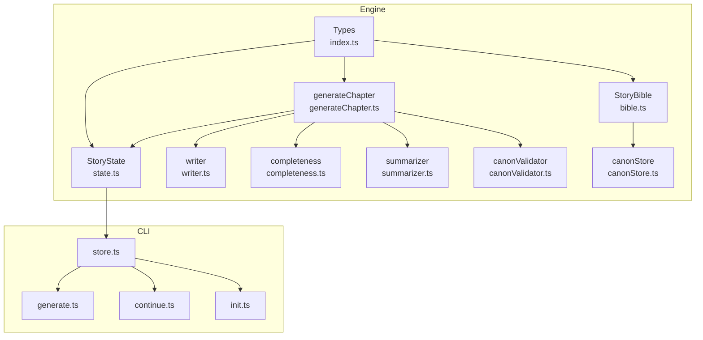
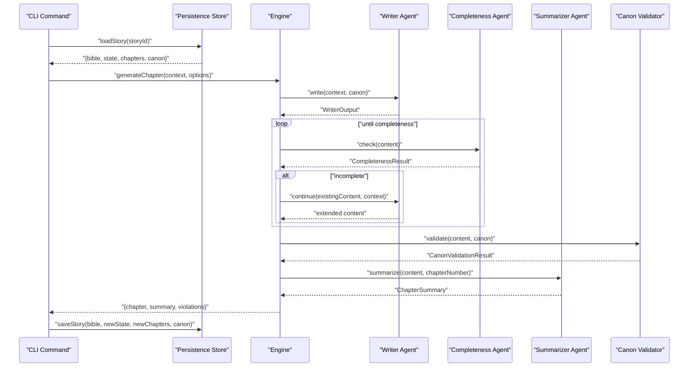
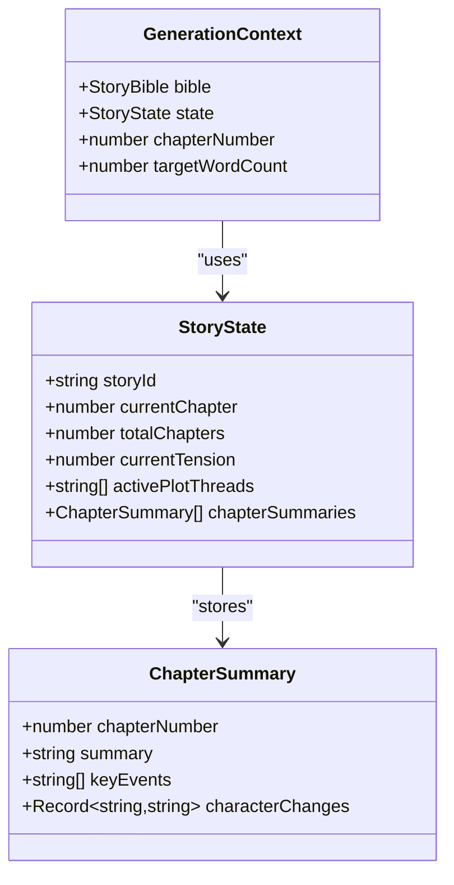
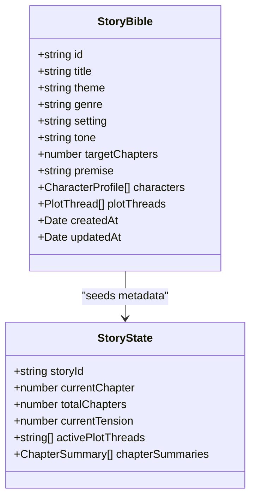
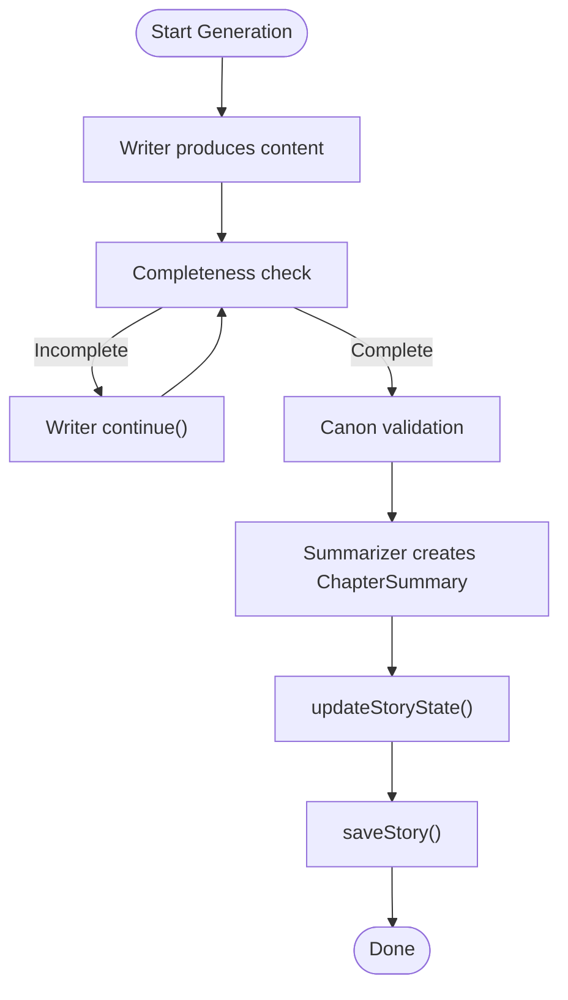
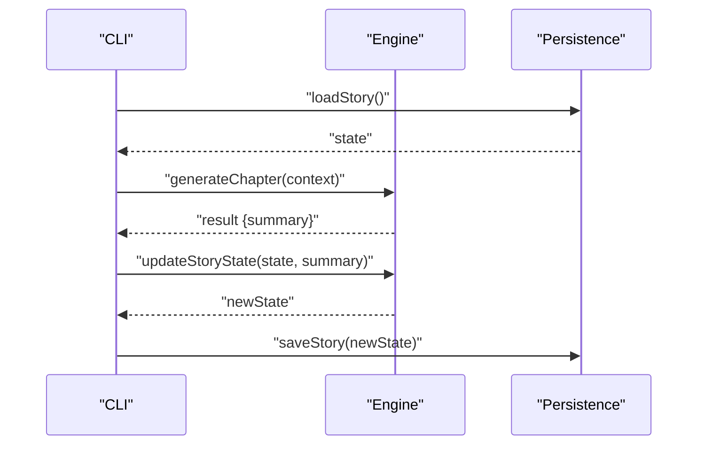
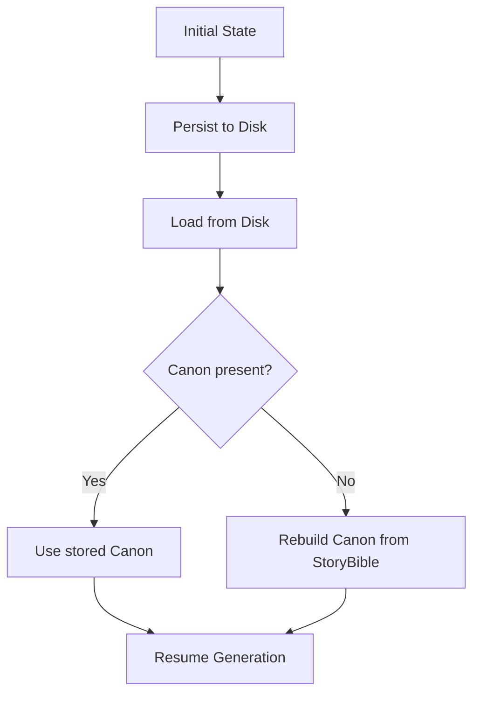
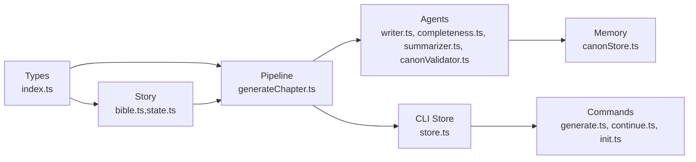

# Runtime Story State

<cite>
**Referenced Files in This Document**
- [state.ts](file://packages/engine/src/story/state.ts)
- [bible.ts](file://packages/engine/src/story/bible.ts)
- [index.ts](file://packages/engine/src/types/index.ts)
- [generateChapter.ts](file://packages/engine/src/pipeline/generateChapter.ts)
- [writer.ts](file://packages/engine/src/agents/writer.ts)
- [completeness.ts](file://packages/engine/src/agents/completeness.ts)
- [summarizer.ts](file://packages/engine/src/agents/summarizer.ts)
- [canonValidator.ts](file://packages/engine/src/agents/canonValidator.ts)
- [canonStore.ts](file://packages/engine/src/memory/canonStore.ts)
- [store.ts](file://apps/cli/src/config/store.ts)
- [generate.ts](file://apps/cli/src/commands/generate.ts)
- [continue.ts](file://apps/cli/src/commands/continue.ts)
- [init.ts](file://apps/cli/src/commands/init.ts)
- [simple.test.ts](file://packages/engine/src/test/simple.test.ts)
</cite>

## Table of Contents
1. [Introduction](#introduction)
2. [Project Structure](#project-structure)
3. [Core Components](#core-components)
4. [Architecture Overview](#architecture-overview)
5. [Detailed Component Analysis](#detailed-component-analysis)
6. [Dependency Analysis](#dependency-analysis)
7. [Performance Considerations](#performance-considerations)
8. [Troubleshooting Guide](#troubleshooting-guide)
9. [Conclusion](#conclusion)
10. [Appendices](#appendices)

## Introduction
This document describes the Runtime Story State management system that tracks story progress, manages chapter generation, and maintains canonical continuity. It covers the StoryState data model, state mutation patterns, immutable updates, validation mechanisms, and the relationship between StoryBible and StoryState. It also documents state persistence and restoration, examples of state transitions during chapter generation, and performance considerations for large stories.

## Project Structure
The Runtime Story State spans several modules:
- Story model and state: story creation, state initialization, and state updates
- Generation pipeline: orchestration of chapter generation, validation, and summarization
- Agents: writers, completeness checks, summarization, and canon validation
- Memory: canonical facts storage and extraction from the StoryBible
- CLI persistence: saving/loading stories and restoring state after interruptions

**Diagram sources**
- [index.ts](file://packages/engine/src/types/index.ts#L1-L90)
- [bible.ts](file://packages/engine/src/story/bible.ts#L1-L73)
- [state.ts](file://packages/engine/src/story/state.ts#L1-L30)
- [generateChapter.ts](file://packages/engine/src/pipeline/generateChapter.ts#L1-L76)
- [writer.ts](file://packages/engine/src/agents/writer.ts#L1-L146)
- [completeness.ts](file://packages/engine/src/agents/completeness.ts#L1-L56)
- [summarizer.ts](file://packages/engine/src/agents/summarizer.ts#L1-L64)
- [canonValidator.ts](file://packages/engine/src/agents/canonValidator.ts#L1-L59)
- [canonStore.ts](file://packages/engine/src/memory/canonStore.ts#L1-L134)
- [store.ts](file://apps/cli/src/config/store.ts#L1-L77)
- [generate.ts](file://apps/cli/src/commands/generate.ts#L1-L55)
- [continue.ts](file://apps/cli/src/commands/continue.ts#L1-L52)
- [init.ts](file://apps/cli/src/commands/init.ts#L1-L50)

**Section sources**
- [index.ts](file://packages/engine/src/types/index.ts#L1-L90)
- [bible.ts](file://packages/engine/src/story/bible.ts#L1-L73)
- [state.ts](file://packages/engine/src/story/state.ts#L1-L30)
- [generateChapter.ts](file://packages/engine/src/pipeline/generateChapter.ts#L1-L76)
- [writer.ts](file://packages/engine/src/agents/writer.ts#L1-L146)
- [completeness.ts](file://packages/engine/src/agents/completeness.ts#L1-L56)
- [summarizer.ts](file://packages/engine/src/agents/summarizer.ts#L1-L64)
- [canonValidator.ts](file://packages/engine/src/agents/canonValidator.ts#L1-L59)
- [canonStore.ts](file://packages/engine/src/memory/canonStore.ts#L1-L134)
- [store.ts](file://apps/cli/src/config/store.ts#L1-L77)
- [generate.ts](file://apps/cli/src/commands/generate.ts#L1-L55)
- [continue.ts](file://apps/cli/src/commands/continue.ts#L1-L52)
- [init.ts](file://apps/cli/src/commands/init.ts#L1-L50)

## Core Components
- StoryBible: Immutable story blueprint containing metadata, target chapter count, characters, and plot threads. Creation and mutation functions produce new objects immutably.
- StoryState: Runtime state tracking current chapter, total chapters, current tension, active plot threads, and chapter summaries. Creation initializes baseline values; updates are immutable.
- GenerationContext: Binds a StoryBible, StoryState, and chapter number for generation runs.
- Generation pipeline: Orchestrates writing, optional continuation until completeness, optional canon validation, summarization, and produces a Chapter and ChapterSummary.
- Agents: Writer, Completeness Checker, Summarizer, and Canon Validator provide modular capabilities.
- CanonStore: Stores canonical facts derived from the StoryBible and supports extraction, addition, lookup, and formatting for prompts.
- Persistence: CLI store saves and loads StoryBible, StoryState, Chapter list, and CanonStore to disk for resuming interrupted generations.

**Section sources**
- [index.ts](file://packages/engine/src/types/index.ts#L1-L90)
- [bible.ts](file://packages/engine/src/story/bible.ts#L1-L73)
- [state.ts](file://packages/engine/src/story/state.ts#L1-L30)
- [generateChapter.ts](file://packages/engine/src/pipeline/generateChapter.ts#L1-L76)
- [writer.ts](file://packages/engine/src/agents/writer.ts#L1-L146)
- [completeness.ts](file://packages/engine/src/agents/completeness.ts#L1-L56)
- [summarizer.ts](file://packages/engine/src/agents/summarizer.ts#L1-L64)
- [canonValidator.ts](file://packages/engine/src/agents/canonValidator.ts#L1-L59)
- [canonStore.ts](file://packages/engine/src/memory/canonStore.ts#L1-L134)
- [store.ts](file://apps/cli/src/config/store.ts#L1-L77)

## Architecture Overview
The runtime state is initialized from a StoryBible and evolves through chapter generation cycles. Each cycle updates StoryState immutably, persists the new state, and continues until completion.

**Diagram sources**
- [generate.ts](file://apps/cli/src/commands/generate.ts#L1-L55)
- [store.ts](file://apps/cli/src/config/store.ts#L28-L49)
- [generateChapter.ts](file://packages/engine/src/pipeline/generateChapter.ts#L20-L71)
- [writer.ts](file://packages/engine/src/agents/writer.ts#L55-L94)
- [completeness.ts](file://packages/engine/src/agents/completeness.ts#L37-L52)
- [summarizer.ts](file://packages/engine/src/agents/summarizer.ts#L24-L38)
- [canonValidator.ts](file://packages/engine/src/agents/canonValidator.ts#L32-L55)

## Detailed Component Analysis

### StoryState Data Model
StoryState captures runtime progress and contextual signals:
- storyId: Identifies the associated StoryBible
- currentChapter: 0-based index of the latest completed chapter
- totalChapters: Target number of chapters
- currentTension: Derived metric indicating narrative tension based on progress
- activePlotThreads: Thread identifiers currently considered active
- chapterSummaries: History of ChapterSummary entries

Creation and updates:
- createStoryState initializes baseline values
- updateStoryState returns a new StoryState with:
  - currentChapter set to the incoming summary’s chapter number
  - chapterSummaries appended with the summary
  - currentTension recalculated via a progress-aware formula

**Diagram sources**
- [index.ts](file://packages/engine/src/types/index.ts#L44-L65)

**Section sources**
- [index.ts](file://packages/engine/src/types/index.ts#L44-L65)
- [state.ts](file://packages/engine/src/story/state.ts#L3-L29)

### StoryBible and StoryState Relationship
StoryBible serves as the immutable source of truth for story metadata and structure. StoryState reflects runtime progress derived from StoryBible:
- totalChapters mirrors targetChapters from StoryBible
- currentChapter advances as chapters complete
- currentTension is computed from currentChapter and totalChapters
- activePlotThreads can be seeded from StoryBible’s plotThreads

**Diagram sources**
- [index.ts](file://packages/engine/src/types/index.ts#L1-L51)
- [bible.ts](file://packages/engine/src/story/bible.ts#L3-L26)
- [state.ts](file://packages/engine/src/story/state.ts#L3-L11)

**Section sources**
- [index.ts](file://packages/engine/src/types/index.ts#L1-L51)
- [bible.ts](file://packages/engine/src/story/bible.ts#L1-L73)
- [state.ts](file://packages/engine/src/story/state.ts#L1-L30)

### State Mutation Patterns and Immutability
- StoryBible mutations (addCharacter, addPlotThread) return new StoryBible instances
- StoryState updates (updateStoryState) return new StoryState instances
- CanonStore mutations (addFact, updateFact) return new CanonStore instances
- Generation pipeline returns new Chapter and ChapterSummary without mutating inputs

Immutability ensures safe concurrent access and simplifies persistence/recovery.

**Section sources**
- [bible.ts](file://packages/engine/src/story/bible.ts#L28-L68)
- [state.ts](file://packages/engine/src/story/state.ts#L14-L24)
- [canonStore.ts](file://packages/engine/src/memory/canonStore.ts#L60-L99)
- [generateChapter.ts](file://packages/engine/src/pipeline/generateChapter.ts#L57-L71)

### State Validation Mechanisms
- Completeness validation: Ensures chapters end at natural stopping points
- Canon validation: Detects contradictions against Story Canon
- Summarization: Produces structured ChapterSummary for downstream use
- Writer inference: Guides chapter content toward narrative goals based on progress

**Diagram sources**
- [generateChapter.ts](file://packages/engine/src/pipeline/generateChapter.ts#L20-L71)
- [writer.ts](file://packages/engine/src/agents/writer.ts#L96-L117)
- [completeness.ts](file://packages/engine/src/agents/completeness.ts#L30-L52)
- [canonValidator.ts](file://packages/engine/src/agents/canonValidator.ts#L31-L55)
- [summarizer.ts](file://packages/engine/src/agents/summarizer.ts#L17-L38)
- [state.ts](file://packages/engine/src/story/state.ts#L14-L24)
- [store.ts](file://apps/cli/src/config/store.ts#L15-L26)

**Section sources**
- [generateChapter.ts](file://packages/engine/src/pipeline/generateChapter.ts#L1-L76)
- [completeness.ts](file://packages/engine/src/agents/completeness.ts#L1-L56)
- [canonValidator.ts](file://packages/engine/src/agents/canonValidator.ts#L1-L59)
- [summarizer.ts](file://packages/engine/src/agents/summarizer.ts#L1-L64)
- [writer.ts](file://packages/engine/src/agents/writer.ts#L1-L146)

### Examples of State Transitions During Chapter Generation
- Initialization: createStoryState sets currentChapter to 0 and totalChapters from StoryBible
- First chapter: generateChapter produces ChapterSummary; updateStoryState sets currentChapter to 1, appends summary, and recalculates currentTension
- Subsequent chapters: repeat until currentChapter equals totalChapters
- Progress monitoring: CLI commands display currentChapter/totalChapters and accumulated word counts

**Diagram sources**
- [generate.ts](file://apps/cli/src/commands/generate.ts#L4-L34)
- [state.ts](file://packages/engine/src/story/state.ts#L14-L24)
- [store.ts](file://apps/cli/src/config/store.ts#L15-L26)

**Section sources**
- [generate.ts](file://apps/cli/src/commands/generate.ts#L1-L55)
- [continue.ts](file://apps/cli/src/commands/continue.ts#L1-L52)
- [simple.test.ts](file://packages/engine/src/test/simple.test.ts#L24-L73)

### State Persistence and Restoration
- Save: CLI writes StoryBible, StoryState, Chapter array, and CanonStore to disk
- Load: CLI reads persisted files; if CanonStore is missing, it is reconstructed from StoryBible
- Restoration: On restart, loadStory provides the last known state to resume generation

**Diagram sources**
- [store.ts](file://apps/cli/src/config/store.ts#L15-L49)
- [canonStore.ts](file://packages/engine/src/memory/canonStore.ts#L24-L58)

**Section sources**
- [store.ts](file://apps/cli/src/config/store.ts#L1-L77)
- [canonStore.ts](file://packages/engine/src/memory/canonStore.ts#L1-L134)

### State Validation for Corrupted Data
- JSON parsing errors during loadStory are caught and treated as missing data; defaults are applied (e.g., reconstructing CanonStore)
- If a file is missing or malformed, the system returns null and CLI commands handle the absence gracefully

**Section sources**
- [store.ts](file://apps/cli/src/config/store.ts#L32-L48)

### Performance Considerations for Large Stories
- Immutable updates: Prefer spreading arrays/maps for small histories; for very large chapterSummaries, consider bounded history (e.g., keep only the last N summaries)
- Prompt construction: Writer composes prompts using recent summaries; limit slice size to reduce token overhead
- Canonical formatting: CanonStore.formatCanonForPrompt batches facts by category; ensure categories remain manageable
- Persistence: Batch writes to disk; avoid frequent small writes during long continuations

[No sources needed since this section provides general guidance]

## Dependency Analysis
The runtime state depends on:
- Types define contracts for StoryBible, StoryState, Chapter, and ChapterSummary
- Story module constructs immutable blueprints and runtime state
- Pipeline orchestrates generation using agents
- Memory module provides canonical continuity
- CLI module persists and restores state

**Diagram sources**
- [index.ts](file://packages/engine/src/types/index.ts#L1-L90)
- [bible.ts](file://packages/engine/src/story/bible.ts#L1-L73)
- [state.ts](file://packages/engine/src/story/state.ts#L1-L30)
- [generateChapter.ts](file://packages/engine/src/pipeline/generateChapter.ts#L1-L76)
- [writer.ts](file://packages/engine/src/agents/writer.ts#L1-L146)
- [completeness.ts](file://packages/engine/src/agents/completeness.ts#L1-L56)
- [summarizer.ts](file://packages/engine/src/agents/summarizer.ts#L1-L64)
- [canonValidator.ts](file://packages/engine/src/agents/canonValidator.ts#L1-L59)
- [canonStore.ts](file://packages/engine/src/memory/canonStore.ts#L1-L134)
- [store.ts](file://apps/cli/src/config/store.ts#L1-L77)
- [generate.ts](file://apps/cli/src/commands/generate.ts#L1-L55)
- [continue.ts](file://apps/cli/src/commands/continue.ts#L1-L52)
- [init.ts](file://apps/cli/src/commands/init.ts#L1-L50)

**Section sources**
- [index.ts](file://packages/engine/src/types/index.ts#L1-L90)
- [bible.ts](file://packages/engine/src/story/bible.ts#L1-L73)
- [state.ts](file://packages/engine/src/story/state.ts#L1-L30)
- [generateChapter.ts](file://packages/engine/src/pipeline/generateChapter.ts#L1-L76)
- [writer.ts](file://packages/engine/src/agents/writer.ts#L1-L146)
- [completeness.ts](file://packages/engine/src/agents/completeness.ts#L1-L56)
- [summarizer.ts](file://packages/engine/src/agents/summarizer.ts#L1-L64)
- [canonValidator.ts](file://packages/engine/src/agents/canonValidator.ts#L1-L59)
- [canonStore.ts](file://packages/engine/src/memory/canonStore.ts#L1-L134)
- [store.ts](file://apps/cli/src/config/store.ts#L1-L77)
- [generate.ts](file://apps/cli/src/commands/generate.ts#L1-L55)
- [continue.ts](file://apps/cli/src/commands/continue.ts#L1-L52)
- [init.ts](file://apps/cli/src/commands/init.ts#L1-L50)

## Performance Considerations
- Limit recent summaries used in prompts to reduce token usage
- Cap chapterSummaries growth to maintain fast updates and serialization
- Use bounded concurrency for generation retries to avoid resource spikes
- Persist periodically during long runs to minimize work lost on interruption

[No sources needed since this section provides general guidance]

## Troubleshooting Guide
Common issues and remedies:
- Generation stuck on incompleteness: The pipeline retries continuation up to a configured maximum; verify targetWordCount and chapter goals
- Canon violations: Review violations reported by the validator and adjust content or update CanonStore accordingly
- Persistence failures: If loadStory fails, the CLI handles missing or malformed files; re-run init or restore from backup
- State drift: Ensure updateStoryState is called after each chapter; otherwise, currentChapter and currentTension may be inconsistent

**Section sources**
- [generateChapter.ts](file://packages/engine/src/pipeline/generateChapter.ts#L32-L43)
- [canonValidator.ts](file://packages/engine/src/agents/canonValidator.ts#L32-L55)
- [store.ts](file://apps/cli/src/config/store.ts#L32-L48)
- [state.ts](file://packages/engine/src/story/state.ts#L14-L24)

## Conclusion
The Runtime Story State system combines immutable StoryBible and StoryState with a robust generation pipeline and canonical memory. It supports reliable progress tracking, validation, and persistence, enabling resilient story creation with clear state transitions and recovery after interruptions.

[No sources needed since this section summarizes without analyzing specific files]

## Appendices

### API Surface for State Management
- StoryBible: createStoryBible, addCharacter, addPlotThread
- StoryState: createStoryState, updateStoryState
- GenerationContext: binds StoryBible, StoryState, chapterNumber
- Pipeline: generateChapter
- Memory: createCanonStore, extractCanonFromBible, addFact, updateFact, formatCanonForPrompt
- CLI persistence: saveStory, loadStory, listStories

**Section sources**
- [index.ts](file://packages/engine/src/index.ts#L1-L23)
- [bible.ts](file://packages/engine/src/story/bible.ts#L1-L73)
- [state.ts](file://packages/engine/src/story/state.ts#L1-L30)
- [generateChapter.ts](file://packages/engine/src/pipeline/generateChapter.ts#L1-L76)
- [canonStore.ts](file://packages/engine/src/memory/canonStore.ts#L1-L134)
- [store.ts](file://apps/cli/src/config/store.ts#L1-L77)