# Story Bible Management

<cite>
**Referenced Files in This Document**
- [bible.ts](file://packages/engine/src/story/bible.ts)
- [state.ts](file://packages/engine/src/story/state.ts)
- [index.ts](file://packages/engine/src/types/index.ts)
- [canonStore.ts](file://packages/engine/src/memory/canonStore.ts)
- [generateChapter.ts](file://packages/engine/src/pipeline/generateChapter.ts)
- [writer.ts](file://packages/engine/src/agents/writer.ts)
- [summarizer.ts](file://packages/engine/src/agents/summarizer.ts)
- [completeness.ts](file://packages/engine/src/agents/completeness.ts)
- [client.ts](file://packages/engine/src/llm/client.ts)
- [characterStrategy.ts](file://packages/engine/src/agents/characterStrategy.ts)
- [index.ts](file://packages/engine/src/index.ts)
- [simple.test.ts](file://packages/engine/src/test/simple.test.ts)
- [character-generation.test.ts](file://packages/engine/src/test/character-generation.test.ts)
- [init.ts](file://apps/cli/src/commands/init.ts)
</cite>

## Update Summary
**Changes Made**
- Enhanced character generation system with AI-powered protagonist creation for Chapter 1
- Streamlined from multi-character to single protagonist generation for improved focus
- Comprehensive JSON parsing with automatic recovery from malformed responses
- Integration with new CharacterStrategyAnalyzer system for character arc management
- Added robust error handling and retry mechanisms for character generation
- Enhanced automatic character creation workflow during story initialization

## Table of Contents
1. [Introduction](#introduction)
2. [Project Structure](#project-structure)
3. [Core Components](#core-components)
4. [Architecture Overview](#architecture-overview)
5. [Detailed Component Analysis](#detailed-component-analysis)
6. [Dependency Analysis](#dependency-analysis)
7. [Performance Considerations](#performance-considerations)
8. [Troubleshooting Guide](#troubleshooting-guide)
9. [Conclusion](#conclusion)
10. [Appendices](#appendices)

## Introduction
This document describes the Story Bible Management system that powers narrative worldbuilding, character profiles, and plot thread orchestration within the engine. It explains the StoryBible data structure, immutable update patterns, ID generation strategies, and the lifecycle of plot threads. It documents the primary APIs for initializing a story, adding characters, and managing plot threads, and shows how these integrate with the chapter generation pipeline, including tension mechanics and canonical fact storage.

**Updated** The system now features an AI-powered protagonist generation system that creates single, culturally appropriate protagonists for Chapter 1, comprehensive JSON parsing with automatic recovery from malformed responses, integration with the CharacterStrategyAnalyzer for dynamic character arc management, and robust retry mechanisms for production reliability.

## Project Structure
The Story Bible Management lives in the engine package and integrates with agents, memory, and pipeline modules to produce chapters guided by a story's canonical blueprint. The system now includes advanced AI-powered character generation, automatic character creation capabilities, and sophisticated character strategy analysis.

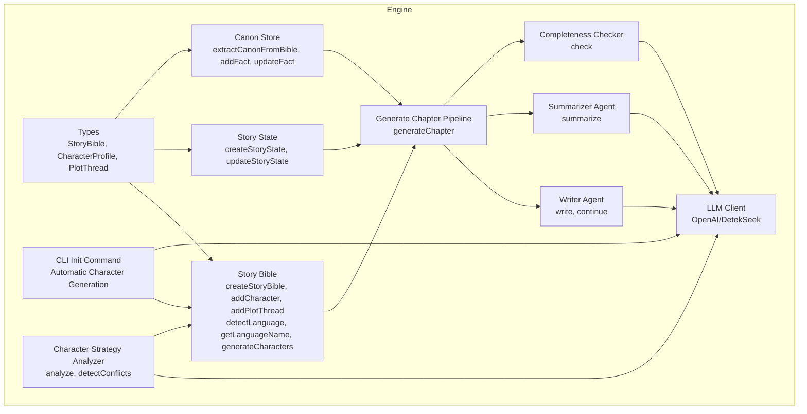

**Diagram sources**
- [index.ts:1-152](file://packages/engine/src/types/index.ts#L1-L152)
- [bible.ts:1-279](file://packages/engine/src/story/bible.ts#L1-L279)
- [state.ts:1-30](file://packages/engine/src/story/state.ts#L1-L30)
- [canonStore.ts:1-134](file://packages/engine/src/memory/canonStore.ts#L1-L134)
- [writer.ts:1-146](file://packages/engine/src/agents/writer.ts#L1-L146)
- [summarizer.ts:1-64](file://packages/engine/src/agents/summarizer.ts#L1-L64)
- [completeness.ts:1-56](file://packages/engine/src/agents/completeness.ts#L1-L56)
- [client.ts:1-106](file://packages/engine/src/llm/client.ts#L1-L106)
- [generateChapter.ts:1-76](file://packages/engine/src/pipeline/generateChapter.ts#L1-L76)
- [init.ts:1-228](file://apps/cli/src/commands/init.ts#L1-L228)
- [characterStrategy.ts:1-218](file://packages/engine/src/agents/characterStrategy.ts#L1-L218)

**Section sources**
- [index.ts:1-123](file://packages/engine/src/index.ts#L1-L123)
- [index.ts:1-152](file://packages/engine/src/types/index.ts#L1-L152)

## Core Components
- StoryBible: Immutable narrative blueprint containing metadata, characters, plot threads, and language information.
- CharacterProfile: Defines roles, personality traits, and goals for characters with automatic language-appropriate naming.
- PlotThread: Represents a narrative thread with lifecycle status and tension mechanics.
- StoryState: Tracks chapter progression, current tension, and summaries.
- CanonStore: Extracts and maintains canonical facts derived from the StoryBible for consistency checks.
- Language Detection: Automatic language identification from story title and premise text with comprehensive Unicode range support.
- AI Character Generation: LLM-powered protagonist creation with cultural authenticity and comprehensive error recovery.
- Character Strategy Analyzer: Dynamic character analysis system for managing character arcs and conflicts.

Key immutable update patterns:
- All mutation functions return a new object with spread operator and updated arrays/dates.
- ID generation uses deterministic yet unique identifiers combining timestamp and random suffix.
- Language detection automatically determines appropriate language based on text content.
- Character generation integrates seamlessly with story initialization workflow and includes robust retry mechanisms.

**Section sources**
- [index.ts:1-152](file://packages/engine/src/types/index.ts#L1-L152)
- [bible.ts:1-279](file://packages/engine/src/story/bible.ts#L1-L279)
- [state.ts:1-30](file://packages/engine/src/story/state.ts#L1-L30)
- [canonStore.ts:1-134](file://packages/engine/src/memory/canonStore.ts#L1-L134)
- [characterStrategy.ts:1-218](file://packages/engine/src/agents/characterStrategy.ts#L1-L218)

## Architecture Overview
The system orchestrates chapter generation around a StoryBible with automatic language detection and AI-powered protagonist generation. The pipeline writes, validates canonical adherence, summarizes, and updates state. Tension increases monotonically with story progress and influences narrative pacing. Language detection ensures appropriate cultural and linguistic context for character names and story elements, while AI character generation creates culturally authentic protagonists during story initialization with comprehensive error recovery and retry mechanisms.

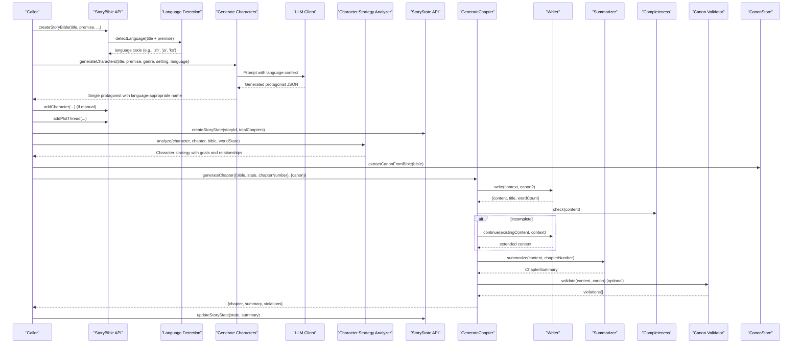

**Diagram sources**
- [bible.ts:83-84](file://packages/engine/src/story/bible.ts#L83-L84)
- [bible.ts:3-50](file://packages/engine/src/story/bible.ts#L3-L50)
- [bible.ts:153-279](file://packages/engine/src/story/bible.ts#L153-L279)
- [characterStrategy.ts:71-105](file://packages/engine/src/agents/characterStrategy.ts#L71-L105)
- [state.ts:3-29](file://packages/engine/src/story/state.ts#L3-L29)
- [generateChapter.ts:20-71](file://packages/engine/src/pipeline/generateChapter.ts#L20-L71)
- [writer.ts:55-131](file://packages/engine/src/agents/writer.ts#L55-L131)
- [summarizer.ts:24-38](file://packages/engine/src/agents/summarizer.ts#L24-L38)
- [completeness.ts:37-52](file://packages/engine/src/agents/completeness.ts#L37-L52)
- [canonStore.ts:24-58](file://packages/engine/src/memory/canonStore.ts#L24-L58)

## Detailed Component Analysis

### StoryBible Data Model and Lifecycle
- Metadata fields: id, title, theme, genre, setting, tone, targetChapters, premise, language, createdAt, updatedAt.
- Characters: array of CharacterProfile entries with id, name, role, personality traits, goals, optional background.
- Plot threads: array of PlotThread entries with id, name, description, status, tension.
- Language property: automatically detected from story title and premise text using comprehensive Unicode range analysis.
- Immutable updates: new StoryBible instances are returned with spread operator and updated arrays/dates.

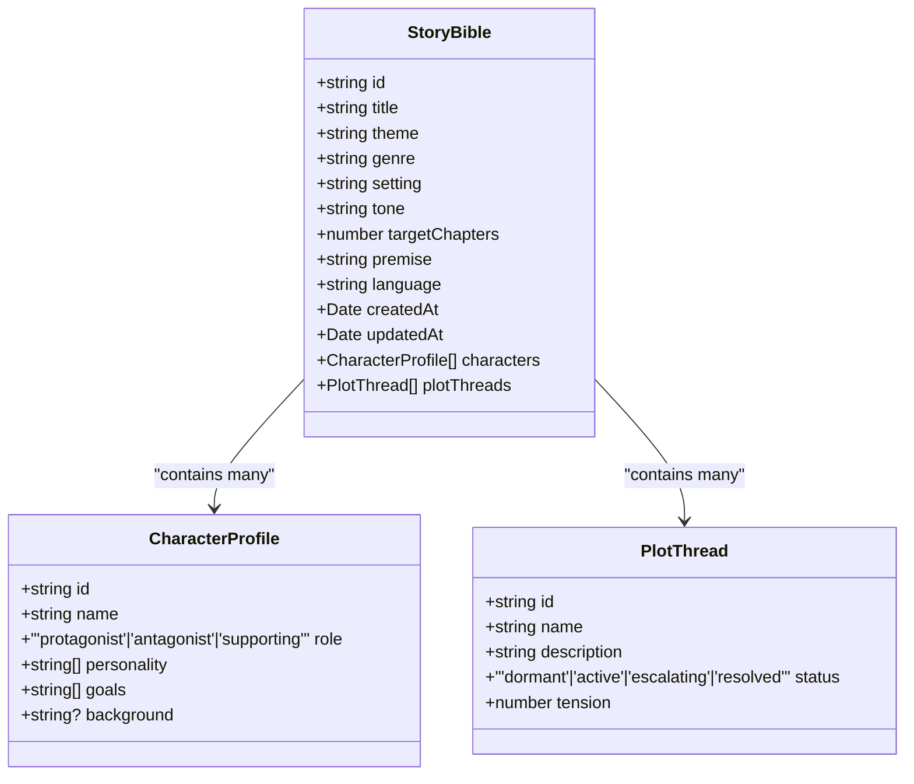

**Diagram sources**
- [index.ts:1-152](file://packages/engine/src/types/index.ts#L1-L152)

**Section sources**
- [index.ts:1-152](file://packages/engine/src/types/index.ts#L1-L152)
- [bible.ts:74-101](file://packages/engine/src/story/bible.ts#L74-L101)
- [bible.ts:103-143](file://packages/engine/src/story/bible.ts#L103-L143)
- [bible.ts:125-143](file://packages/engine/src/story/bible.ts#L125-L143)

### Enhanced Language Detection and Multilingual Support
- Automatic language detection from story title and premise text using comprehensive Unicode character ranges.
- Supported languages: English, Chinese, Japanese, Korean, Arabic, Russian, Thai, Hindi, Spanish, French, German, Portuguese, Italian.
- Language name mapping for human-readable display.
- Character generation adapts names based on detected language with culturally appropriate naming conventions.
- Automatic character creation during story initialization based on detected language.

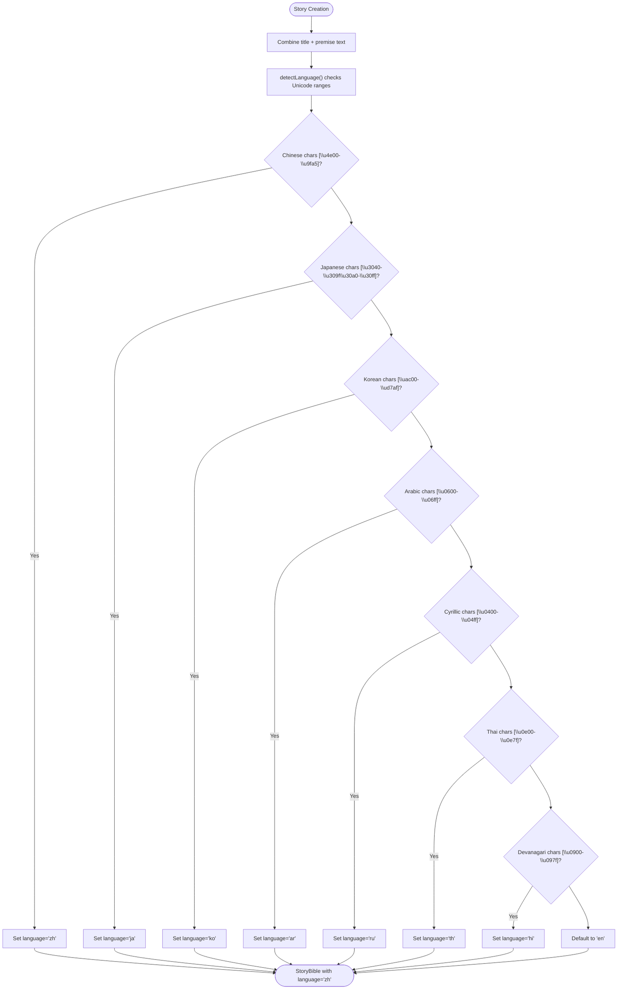

**Diagram sources**
- [bible.ts:8-50](file://packages/engine/src/story/bible.ts#L8-L50)
- [bible.ts:55-72](file://packages/engine/src/story/bible.ts#L55-L72)
- [bible.ts:153-279](file://packages/engine/src/story/bible.ts#L153-L279)

**Section sources**
- [bible.ts:8-50](file://packages/engine/src/story/bible.ts#L8-L50)
- [bible.ts:55-72](file://packages/engine/src/story/bible.ts#L55-L72)
- [bible.ts:74-101](file://packages/engine/src/story/bible.ts#L74-L101)
- [bible.ts:153-279](file://packages/engine/src/story/bible.ts#L153-L279)

### AI-Powered Protagonist Generation System
- **generateCharacters**: Async function that uses LLM to create a single, culturally appropriate protagonist for Chapter 1 based on story context and detected language.
- **Single Protagonist Focus**: Streamlined from multi-character to single protagonist generation for improved narrative focus and Chapter 1 effectiveness.
- **Comprehensive JSON Parsing**: Robust error recovery with automatic cleanup of malformed responses, markdown code blocks, and truncated JSON.
- **Automatic Character Creation**: Protagonists are automatically generated during story initialization with retry logic and fallback mechanisms.
- **Cultural Authenticity**: Character names and traits are adapted to match the detected language and story setting.
- **Error Recovery**: Advanced parsing with brace counting, string escaping, and bracket balancing to recover from malformed LLM responses.

**Updated** The system now focuses on creating a single, compelling protagonist for Chapter 1 rather than multiple characters, with comprehensive error handling for production reliability.

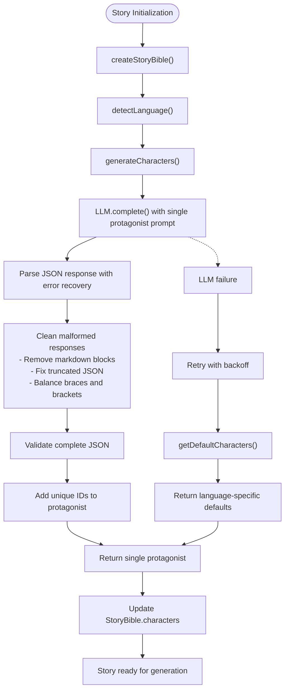

**Diagram sources**
- [bible.ts:153-279](file://packages/engine/src/story/bible.ts#L153-L279)
- [init.ts:165-202](file://apps/cli/src/commands/init.ts#L165-L202)

**Section sources**
- [bible.ts:153-279](file://packages/engine/src/story/bible.ts#L153-L279)
- [init.ts:165-202](file://apps/cli/src/commands/init.ts#L165-L202)

### Character Strategy Analyzer System
- **CharacterStrategyAnalyzer**: Advanced system for analyzing character arcs, goals, and relationships throughout the story.
- **Dynamic Analysis**: Analyzes character current goals, long-term objectives, motivations, obstacles, and relationships with other characters.
- **Conflict Detection**: Identifies potential conflicts between character strategies and relationship dynamics.
- **Integration**: Seamlessly integrates with the chapter generation pipeline to inform narrative direction and character development.
- **Emotional Arc Tracking**: Monitors character emotional states (rising, falling, stable) and adjusts strategies accordingly.

**New** This system provides sophisticated character management beyond basic profile creation, enabling dynamic story adaptation based on character development.

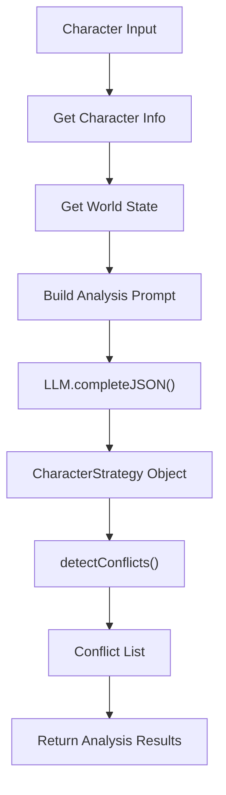

**Diagram sources**
- [characterStrategy.ts:71-105](file://packages/engine/src/agents/characterStrategy.ts#L71-L105)
- [characterStrategy.ts:166-201](file://packages/engine/src/agents/characterStrategy.ts#L166-L201)

**Section sources**
- [characterStrategy.ts:1-218](file://packages/engine/src/agents/characterStrategy.ts#L1-L218)

### Immutable Update Pattern and ID Generation
- ID generation: Timestamp plus short random string to ensure uniqueness across calls.
- Updates: Functions return new objects with spread operator; arrays are shallow-copied and appended to; updatedAt is refreshed on mutations.
- Language detection occurs during StoryBible creation to ensure consistent language throughout the story lifecycle.
- Character generation integrates seamlessly with immutable update patterns and includes comprehensive error recovery.


**Diagram sources**
- [bible.ts:118-122](file://packages/engine/src/story/bible.ts#L118-L122)
- [bible.ts:138-142](file://packages/engine/src/story/bible.ts#L138-L142)
- [canonStore.ts:131-133](file://packages/engine/src/memory/canonStore.ts#L131-L133)
- [generateChapter.ts:73-75](file://packages/engine/src/pipeline/generateChapter.ts#L73-L75)

**Section sources**
- [bible.ts:74-101](file://packages/engine/src/story/bible.ts#L74-L101)
- [bible.ts:103-143](file://packages/engine/src/story/bible.ts#L103-L143)
- [state.ts:14-24](file://packages/engine/src/story/state.ts#L14-L24)
- [canonStore.ts:60-69](file://packages/engine/src/memory/canonStore.ts#L60-L69)
- [generateChapter.ts:57-66](file://packages/engine/src/pipeline/generateChapter.ts#L57-L66)

### Plot Thread Lifecycle and Tension Mechanics
- Status lifecycle: dormant → active → escalating → resolved.
- Initial tension: small positive value to encourage early escalation.
- Tension calculation: nonlinear function increasing toward midpoint, then decreasing, ensuring narrative arc shaping.

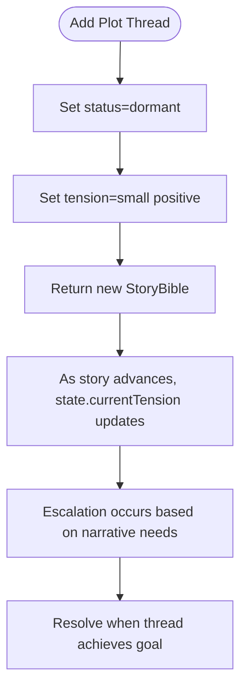

**Diagram sources**
- [bible.ts:125-143](file://packages/engine/src/story/bible.ts#L125-L143)
- [state.ts:26-29](file://packages/engine/src/story/state.ts#L26-L29)

**Section sources**
- [index.ts:26-32](file://packages/engine/src/types/index.ts#L26-L32)
- [bible.ts:125-143](file://packages/engine/src/story/bible.ts#L125-L143)
- [state.ts:26-29](file://packages/engine/src/story/state.ts#L26-L29)

### StoryBible Creation Workflow
- createStoryBible initializes a new StoryBible with metadata, automatic language detection, empty arrays, and timestamps.
- Language detection analyzes title and premise text to determine appropriate language code.
- Automatic character generation creates culturally appropriate protagonists during story initialization.
- Practical example path: see [simple.test.ts:26-34](file://packages/engine/src/test/simple.test.ts#L26-L34).

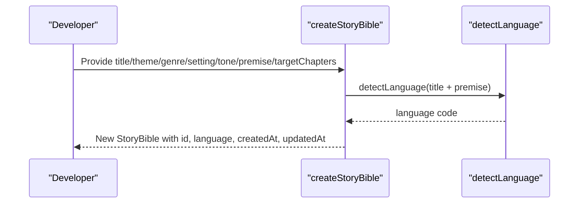

**Diagram sources**
- [bible.ts:74-101](file://packages/engine/src/story/bible.ts#L74-L101)
- [bible.ts:8-50](file://packages/engine/src/story/bible.ts#L8-L50)
- [simple.test.ts:26-34](file://packages/engine/src/test/simple.test.ts#L26-L34)

**Section sources**
- [bible.ts:74-101](file://packages/engine/src/story/bible.ts#L74-L101)
- [simple.test.ts:26-34](file://packages/engine/src/test/simple.test.ts#L26-L34)

### Enhanced Character Profile Management
- addCharacter creates a CharacterProfile with personality traits and goals, assigns an ID, and appends to the StoryBible.
- **generateCharacters**: Uses LLM to create a single, culturally appropriate protagonist based on detected language and story context.
- **Comprehensive Error Recovery**: Advanced JSON parsing with automatic recovery from malformed responses, markdown code blocks, and truncated JSON.
- **Automatic Character Creation**: Protagonists are automatically generated during story initialization via CLI command with retry logic.
- Practical example path: see [simple.test.ts:36-42](file://packages/engine/src/test/simple.test.ts#L36-L42).

**Updated** The system now focuses on single protagonist generation with comprehensive error recovery mechanisms.

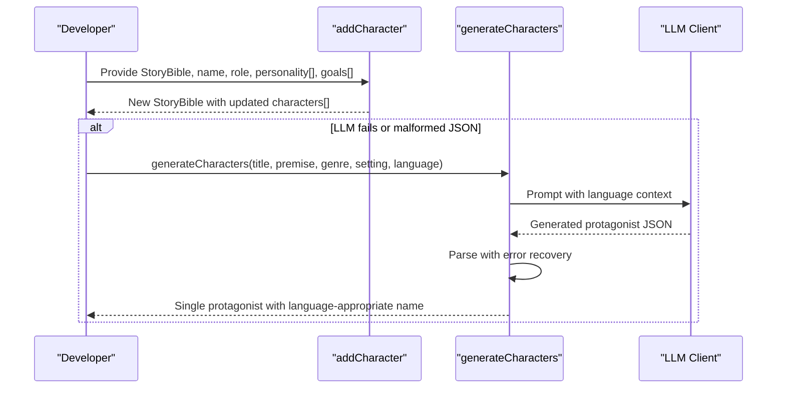

**Diagram sources**
- [bible.ts:103-123](file://packages/engine/src/story/bible.ts#L103-L123)
- [bible.ts:153-279](file://packages/engine/src/story/bible.ts#L153-L279)
- [simple.test.ts:36-42](file://packages/engine/src/test/simple.test.ts#L36-L42)

**Section sources**
- [bible.ts:103-123](file://packages/engine/src/story/bible.ts#L103-L123)
- [bible.ts:153-279](file://packages/engine/src/story/bible.ts#L153-L279)
- [simple.test.ts:36-42](file://packages/engine/src/test/simple.test.ts#L36-L42)

### Plot Thread Management
- addPlotThread creates a PlotThread with status dormant and small initial tension, then appends to the StoryBible.
- Practical example path: see [simple.test.ts:26-34](file://packages/engine/src/test/simple.test.ts#L26-L34) for adding threads after story creation.

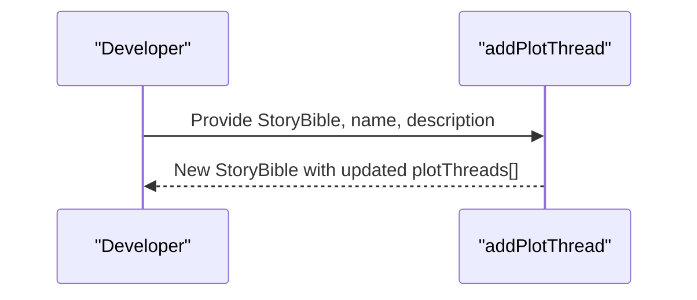

**Diagram sources**
- [bible.ts:125-143](file://packages/engine/src/story/bible.ts#L125-L143)
- [simple.test.ts:26-34](file://packages/engine/src/test/simple.test.ts#L26-L34)

**Section sources**
- [bible.ts:125-143](file://packages/engine/src/story/bible.ts#L125-L143)
- [simple.test.ts:26-34](file://packages/engine/src/test/simple.test.ts#L26-L34)

### Story State and Tension Evolution
- createStoryState initializes currentChapter, totalChapters, currentTension, and empty chapter summaries.
- updateStoryState advances currentChapter, appends summary, and recalculates currentTension based on progress.


**Diagram sources**
- [state.ts:3-24](file://packages/engine/src/story/state.ts#L3-L24)

**Section sources**
- [state.ts:3-24](file://packages/engine/src/story/state.ts#L3-L24)

### Canonical Fact Extraction and Validation
- extractCanonFromBible builds a CanonStore from StoryBible characters and plot threads.
- addFact and updateFact manage canonical facts with chapter-establishment tracking.
- formatCanonForPrompt renders facts for LLM consumption.

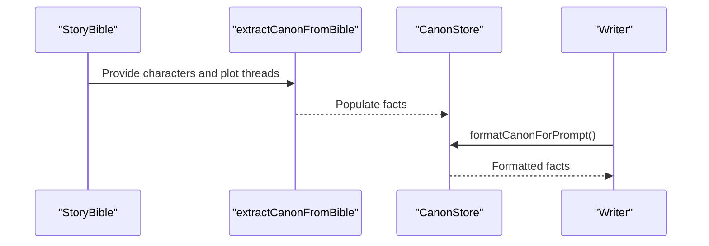

**Diagram sources**
- [canonStore.ts:24-58](file://packages/engine/src/memory/canonStore.ts#L24-L58)
- [canonStore.ts:101-129](file://packages/engine/src/memory/canonStore.ts#L101-L129)
- [writer.ts:58-83](file://packages/engine/src/agents/writer.ts#L58-L83)

**Section sources**
- [canonStore.ts:1-134](file://packages/engine/src/memory/canonStore.ts#L1-L134)
- [writer.ts:55-94](file://packages/engine/src/agents/writer.ts#L55-L94)

### Chapter Generation Pipeline Integration
- generateChapter coordinates writing, completeness checking, optional canon validation, and summarization.
- Writer infers chapter goals based on target chapters and current position.
- Summarizer extracts key events and produces concise summaries.

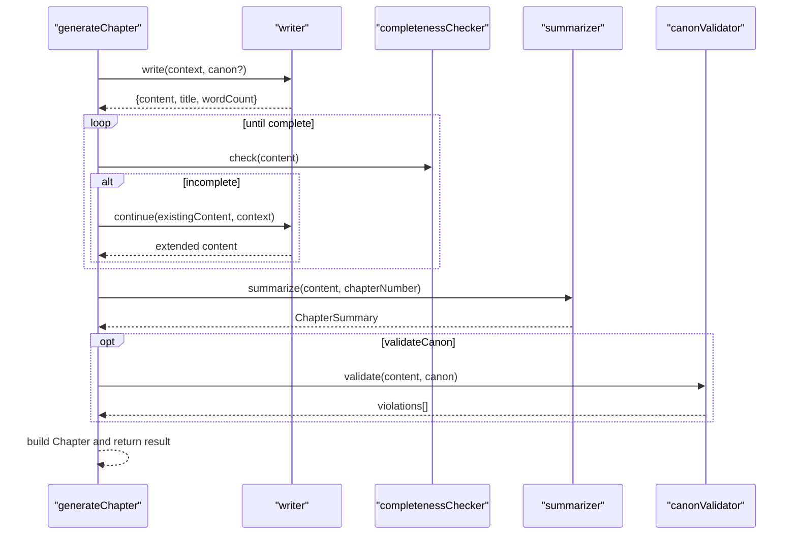

**Diagram sources**
- [generateChapter.ts:20-71](file://packages/engine/src/pipeline/generateChapter.ts#L20-L71)
- [writer.ts:96-131](file://packages/engine/src/agents/writer.ts#L96-L131)
- [summarizer.ts:24-38](file://packages/engine/src/agents/summarizer.ts#L24-L38)
- [completeness.ts:37-52](file://packages/engine/src/agents/completeness.ts#L37-L52)

**Section sources**
- [generateChapter.ts:1-76](file://packages/engine/src/pipeline/generateChapter.ts#L1-L76)
- [writer.ts:1-146](file://packages/engine/src/agents/writer.ts#L1-L146)
- [summarizer.ts:1-64](file://packages/engine/src/agents/summarizer.ts#L1-L64)
- [completeness.ts:1-56](file://packages/engine/src/agents/completeness.ts#L1-L56)

### Automatic Protagonist Creation During Story Initialization
- **CLI Integration**: The init command automatically generates protagonists during story creation using generateCharacters function with comprehensive retry logic.
- **Language-Aware Generation**: Protagonists are generated based on detected language and story context.
- **Cultural Authenticity**: Character names and traits are adapted to match the detected language and story setting.
- **Robust Error Handling**: Multiple retry attempts with user feedback and graceful fallback to manual character creation.
- **Single Protagonist Focus**: Streamlined approach focusing on creating one compelling protagonist for Chapter 1.

**Updated** The system now focuses on single protagonist generation with comprehensive error recovery and retry mechanisms.

```mermaid
sequenceDiagram
participant CLI as "CLI Init Command"
participant SB as "StoryBible API"
participant GC as "generateCharacters"
participant LLM as "LLM Client"
CLI->>SB : createStoryBible(title, theme, genre, setting, tone, premise, targetChapters)
SB-->>CLI : StoryBible with language code
loop 1..3
CLI->>GC : generateCharacters(title, premise, genre, setting, language)
GC->>LLM : Prompt with language context
LLM-->>GC : Generated protagonist JSON
alt malformed or incomplete JSON
GC->>GC : Parse with error recovery
GC-->>CLI : Error (retry)
else success
GC-->>CLI : Single protagonist with language-appropriate name
break
end
end
CLI->>SB : Update StoryBible.characters
CLI-->>CLI : Story ready with automatic protagonist
```

**Diagram sources**
- [init.ts:165-202](file://apps/cli/src/commands/init.ts#L165-L202)
- [bible.ts:153-279](file://packages/engine/src/story/bible.ts#L153-L279)

**Section sources**
- [init.ts:165-202](file://apps/cli/src/commands/init.ts#L165-L202)
- [bible.ts:153-279](file://packages/engine/src/story/bible.ts#L153-L279)

## Dependency Analysis
- StoryBible depends on CharacterProfile and PlotThread types.
- StoryState depends on ChapterSummary type.
- CanonStore depends on StoryBible for extraction.
- Language detection utilities are integrated into StoryBible creation workflow.
- **AI Character Generation**: generateCharacters function depends on LLM client with comprehensive error recovery and getDefaultCharacters fallback.
- **Character Strategy Analyzer**: Depends on LLM client and integrates with StoryBible for dynamic character analysis.
- Pipeline depends on Writer, Summarizer, Completeness, and optional Canon Validator.
- **CLI Integration**: init command depends on generateCharacters for automatic character creation with retry logic.
- All modules depend on LLMClient for inference.

**Updated** The system now includes CharacterStrategyAnalyzer as a key dependency for dynamic character management.

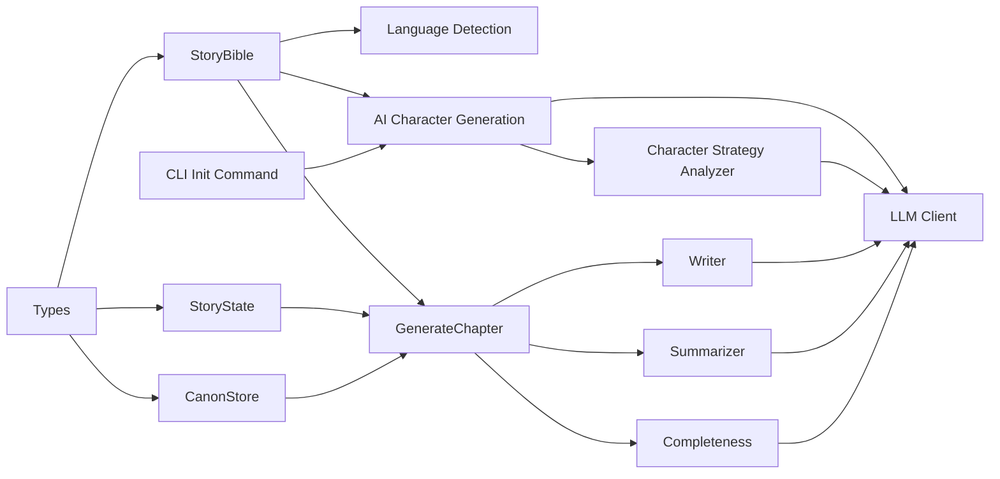

**Diagram sources**
- [index.ts:1-152](file://packages/engine/src/types/index.ts#L1-L152)
- [bible.ts:1-279](file://packages/engine/src/story/bible.ts#L1-L279)
- [state.ts:1-30](file://packages/engine/src/story/state.ts#L1-L30)
- [canonStore.ts:1-134](file://packages/engine/src/memory/canonStore.ts#L1-L134)
- [generateChapter.ts:1-76](file://packages/engine/src/pipeline/generateChapter.ts#L1-L76)
- [writer.ts:1-146](file://packages/engine/src/agents/writer.ts#L1-L146)
- [summarizer.ts:1-64](file://packages/engine/src/agents/summarizer.ts#L1-L64)
- [completeness.ts:1-56](file://packages/engine/src/agents/completeness.ts#L1-L56)
- [client.ts:1-106](file://packages/engine/src/llm/client.ts#L1-L106)
- [init.ts:1-228](file://apps/cli/src/commands/init.ts#L1-L228)
- [characterStrategy.ts:1-218](file://packages/engine/src/agents/characterStrategy.ts#L1-L218)

**Section sources**
- [index.ts:1-123](file://packages/engine/src/index.ts#L1-L123)

## Performance Considerations
- Immutable updates avoid shared mutable state but create new arrays/objects; acceptable for typical story sizes.
- Tension calculation is constant-time per chapter.
- Language detection is O(n) where n is the length of combined title and premise text.
- **AI Character Generation**: LLM calls dominate runtime; tuned with temperature=0.8 and no maxTokens limit for complete JSON responses.
- **Error Recovery**: Comprehensive JSON parsing with brace counting and bracket balancing adds minimal overhead for malformed responses.
- **Retry Logic**: Up to 3 retry attempts with exponential backoff for production reliability.
- **Character Strategy Analysis**: LLM calls with temperature=0.4 for analytical precision, limited to 1500 maxTokens.
- Canonical extraction and formatting are linear in the number of characters and plot threads.

**Updated** Performance considerations now include comprehensive error recovery mechanisms and retry logic for production reliability.

## Troubleshooting Guide
- Incomplete chapters: The pipeline retries writing and continues until completion is detected.
- Canon violations: Optional validation reports discrepancies; review extracted facts and adjust content accordingly.
- LLM provider configuration: Ensure provider and API keys are set; otherwise, initialization will fail.
- **Language detection issues**: If language detection fails, the system defaults to English ('en').
- **Character generation failures**: The system implements comprehensive error recovery with automatic JSON cleaning and up to 3 retry attempts.
- **Malformed JSON responses**: Advanced parsing with markdown block removal, brace counting, and bracket balancing recovers from most malformed responses.
- **Truncated LLM responses**: The system detects truncated JSON and throws informative errors with suggestions to increase maxTokens.
- **Single protagonist generation**: Focus on creating one compelling protagonist rather than multiple characters for improved narrative cohesion.
- **Character strategy analysis**: Conflicts between character strategies are automatically detected and reported for narrative coherence.

**Updated** Troubleshooting now includes comprehensive guidance for character generation errors, malformed JSON recovery, and single protagonist generation focus.

**Section sources**
- [generateChapter.ts:32-53](file://packages/engine/src/pipeline/generateChapter.ts#L32-L53)
- [completeness.ts:37-52](file://packages/engine/src/agents/completeness.ts#L37-L52)
- [client.ts:46-81](file://packages/engine/src/llm/client.ts#L46-L81)
- [bible.ts:8-50](file://packages/engine/src/story/bible.ts#L8-L50)
- [bible.ts:212-216](file://packages/engine/src/story/bible.ts#L212-L216)
- [bible.ts:153-279](file://packages/engine/src/story/bible.ts#L153-L279)
- [characterStrategy.ts:166-201](file://packages/engine/src/agents/characterStrategy.ts#L166-L201)

## Conclusion
The Story Bible Management system provides a robust, immutable foundation for narrative construction with enhanced multilingual capabilities and AI-powered protagonist generation. With clear data models, lifecycle-aware plot threads, automatic language detection, AI character creation during story initialization, comprehensive error recovery mechanisms, and tight integration with the chapter generation pipeline, it enables scalable, internationally-aware story creation guided by metadata, character arcs, and canonical consistency. The system now offers comprehensive cultural authenticity through language-aware character generation, reliable fallback mechanisms for production environments, and sophisticated character strategy analysis for dynamic narrative management.

**Updated** The system now features streamlined single protagonist generation, comprehensive error recovery, and dynamic character strategy analysis for enhanced narrative control and production reliability.

## Appendices

### Practical Examples
- Story creation with automatic language detection and single protagonist generation: See [simple.test.ts:26-34](file://packages/engine/src/test/simple.test.ts#L26-L34).
- Character addition with language-appropriate names: See [simple.test.ts:36-42](file://packages/engine/src/test/simple.test.ts#L36-L42).
- Plot thread integration: Add threads after story creation and before generation.
- **CLI automatic protagonist generation**: See [init.ts:165-202](file://apps/cli/src/commands/init.ts#L165-L202).
- **Character strategy analysis**: See [characterStrategy.ts:71-105](file://packages/engine/src/agents/characterStrategy.ts#L71-L105).

**Section sources**
- [simple.test.ts:24-64](file://packages/engine/src/test/simple.test.ts#L24-L64)
- [init.ts:165-202](file://apps/cli/src/commands/init.ts#L165-L202)
- [characterStrategy.ts:71-105](file://packages/engine/src/agents/characterStrategy.ts#L71-L105)

### Language Detection Reference
Supported languages and detection criteria:
- English: Default for Latin script text
- Chinese: Characters in Unicode range U+4E00-U+9FA5
- Japanese: Hiragana (U+3040-U+309F) and Katakana (U+30A0-U+30FF)
- Korean: Hangul Jamo (U+AC00-U+D7AF)
- Arabic: Arabic script (U+0600-U+06FF)
- Russian: Cyrillic script (U+0400-U+04FF)
- Thai: Thai script (U+0E00-U+0E7F)
- Hindi: Devanagari script (U+0900-U+097F)
- **Spanish, French, German, Portuguese, Italian**: Additional languages with comprehensive Unicode support

**Section sources**
- [bible.ts:8-50](file://packages/engine/src/story/bible.ts#L8-L50)
- [bible.ts:55-72](file://packages/engine/src/story/bible.ts#L55-L72)

### AI Character Generation Configuration
- **Prompt Engineering**: Single protagonist focus with cultural context and language-appropriate naming conventions.
- **Error Recovery**: Comprehensive JSON parsing with markdown block removal, brace counting, and bracket balancing.
- **Retry Logic**: Up to 3 retry attempts with user feedback for production reliability.
- **Cultural Authenticity**: Character names and traits adapted to detected language and story setting.
- **Streamlined Approach**: Focus on single protagonist for improved narrative cohesion and Chapter 1 effectiveness.

**Updated** Configuration now emphasizes single protagonist generation with comprehensive error recovery mechanisms.

**Section sources**
- [bible.ts:153-279](file://packages/engine/src/story/bible.ts#L153-L279)
- [init.ts:165-202](file://apps/cli/src/commands/init.ts#L165-L202)

### Character Generation Implementation Details
- **LLM Integration**: Uses LLMClient with task-specific model selection for generation tasks.
- **JSON Parsing**: Robust JSON extraction with markdown code block handling, brace counting, and bracket balancing.
- **ID Generation**: Unique identifiers for generated characters using timestamp and random suffix.
- **Error Recovery**: Comprehensive error handling with fallback to default character sets and retry mechanisms.
- **Single Protagonist Focus**: Streamlined approach creating one compelling protagonist rather than multiple characters.

**Updated** Implementation now focuses on single protagonist generation with comprehensive error recovery and retry logic.

**Section sources**
- [bible.ts:153-279](file://packages/engine/src/story/bible.ts#L153-L279)
- [client.ts:174-219](file://packages/engine/src/llm/client.ts#L174-L219)
- [init.ts:165-202](file://apps/cli/src/commands/init.ts#L165-L202)

### Character Strategy Analyzer Configuration
- **Dynamic Analysis**: Character strategy analysis with temperature=0.4 for analytical precision.
- **Conflict Detection**: Automated identification of character conflicts and relationship issues.
- **Integration**: Seamless integration with chapter generation pipeline for dynamic narrative adaptation.
- **Emotional Arc Tracking**: Monitoring of character emotional states and development patterns.

**New** Configuration details for the new CharacterStrategyAnalyzer system.

**Section sources**
- [characterStrategy.ts:71-105](file://packages/engine/src/agents/characterStrategy.ts#L71-L105)
- [characterStrategy.ts:166-201](file://packages/engine/src/agents/characterStrategy.ts#L166-L201)