# Story Bible Management

<cite>
**Referenced Files in This Document**
- [bible.ts](file://packages/engine/src/story/bible.ts)
- [state.ts](file://packages/engine/src/story/state.ts)
- [index.ts](file://packages/engine/src/types/index.ts)
- [canonStore.ts](file://packages/engine/src/memory/canonStore.ts)
- [generateChapter.ts](file://packages/engine/src/pipeline/generateChapter.ts)
- [writer.ts](file://packages/engine/src/agents/writer.ts)
- [summarizer.ts](file://packages/engine/src/agents/summarizer.ts)
- [completeness.ts](file://packages/engine/src/agents/completeness.ts)
- [client.ts](file://packages/engine/src/llm/client.ts)
- [index.ts](file://packages/engine/src/index.ts)
- [simple.test.ts](file://packages/engine/src/test/simple.test.ts)
</cite>

## Table of Contents
1. [Introduction](#introduction)
2. [Project Structure](#project-structure)
3. [Core Components](#core-components)
4. [Architecture Overview](#architecture-overview)
5. [Detailed Component Analysis](#detailed-component-analysis)
6. [Dependency Analysis](#dependency-analysis)
7. [Performance Considerations](#performance-considerations)
8. [Troubleshooting Guide](#troubleshooting-guide)
9. [Conclusion](#conclusion)
10. [Appendices](#appendices)

## Introduction
This document describes the Story Bible Management system that powers narrative worldbuilding, character profiles, and plot thread orchestration within the engine. It explains the StoryBible data structure, immutable update patterns, ID generation strategies, and the lifecycle of plot threads. It documents the primary APIs for initializing a story, adding characters, and managing plot threads, and shows how these integrate with the chapter generation pipeline, including tension mechanics and canonical fact storage.

## Project Structure
The Story Bible Management lives in the engine package and integrates with agents, memory, and pipeline modules to produce chapters guided by a story’s canonical blueprint.

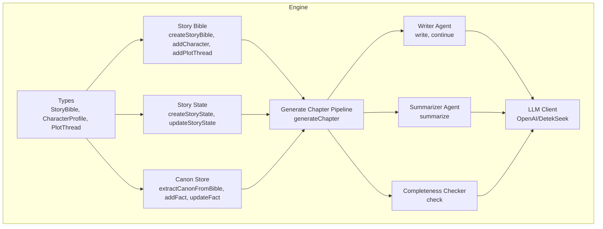

**Diagram sources**
- [index.ts](file://packages/engine/src/types/index.ts#L1-L90)
- [bible.ts](file://packages/engine/src/story/bible.ts#L1-L73)
- [state.ts](file://packages/engine/src/story/state.ts#L1-L30)
- [canonStore.ts](file://packages/engine/src/memory/canonStore.ts#L1-L134)
- [writer.ts](file://packages/engine/src/agents/writer.ts#L1-L146)
- [summarizer.ts](file://packages/engine/src/agents/summarizer.ts#L1-L64)
- [completeness.ts](file://packages/engine/src/agents/completeness.ts#L1-L56)
- [client.ts](file://packages/engine/src/llm/client.ts#L1-L106)
- [generateChapter.ts](file://packages/engine/src/pipeline/generateChapter.ts#L1-L76)

**Section sources**
- [index.ts](file://packages/engine/src/index.ts#L1-L23)
- [index.ts](file://packages/engine/src/types/index.ts#L1-L90)

## Core Components
- StoryBible: Immutable narrative blueprint containing metadata, characters, and plot threads.
- CharacterProfile: Defines roles, personality traits, and goals for characters.
- PlotThread: Represents a narrative thread with lifecycle status and tension mechanics.
- StoryState: Tracks chapter progression, current tension, and summaries.
- CanonStore: Extracts and maintains canonical facts derived from the StoryBible for consistency checks.

Key immutable update patterns:
- All mutation functions return a new object with spread operator and updated arrays/dates.
- ID generation uses deterministic yet unique identifiers combining timestamp and random suffix.

**Section sources**
- [index.ts](file://packages/engine/src/types/index.ts#L1-L90)
- [bible.ts](file://packages/engine/src/story/bible.ts#L1-L73)
- [state.ts](file://packages/engine/src/story/state.ts#L1-L30)
- [canonStore.ts](file://packages/engine/src/memory/canonStore.ts#L1-L134)

## Architecture Overview
The system orchestrates chapter generation around a StoryBible. The pipeline writes, validates canonical adherence, summarizes, and updates state. Tension increases monotonically with story progress and influences narrative pacing.

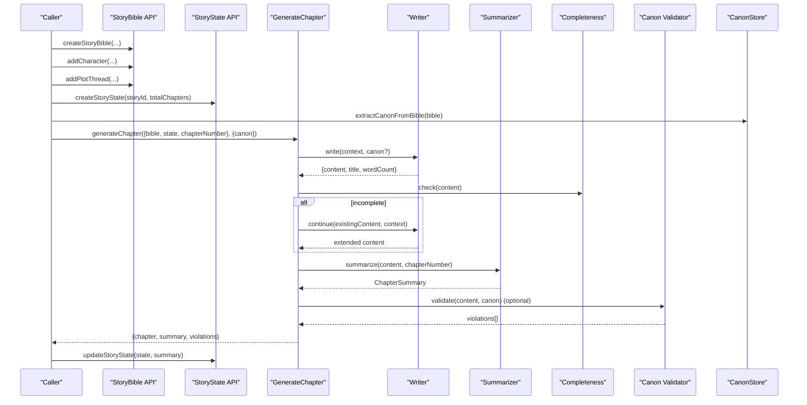

**Diagram sources**
- [bible.ts](file://packages/engine/src/story/bible.ts#L3-L68)
- [state.ts](file://packages/engine/src/story/state.ts#L3-L29)
- [generateChapter.ts](file://packages/engine/src/pipeline/generateChapter.ts#L20-L71)
- [writer.ts](file://packages/engine/src/agents/writer.ts#L55-L131)
- [summarizer.ts](file://packages/engine/src/agents/summarizer.ts#L24-L38)
- [completeness.ts](file://packages/engine/src/agents/completeness.ts#L37-L52)
- [canonStore.ts](file://packages/engine/src/memory/canonStore.ts#L24-L58)

## Detailed Component Analysis

### StoryBible Data Model and Lifecycle
- Metadata fields: id, title, theme, genre, setting, tone, targetChapters, premise, createdAt, updatedAt.
- Characters: array of CharacterProfile entries with id, name, role, personality traits, goals, optional background.
- Plot threads: array of PlotThread entries with id, name, description, status, tension.
- Immutable updates: new StoryBible instances are returned with spread operator and updated arrays/dates.

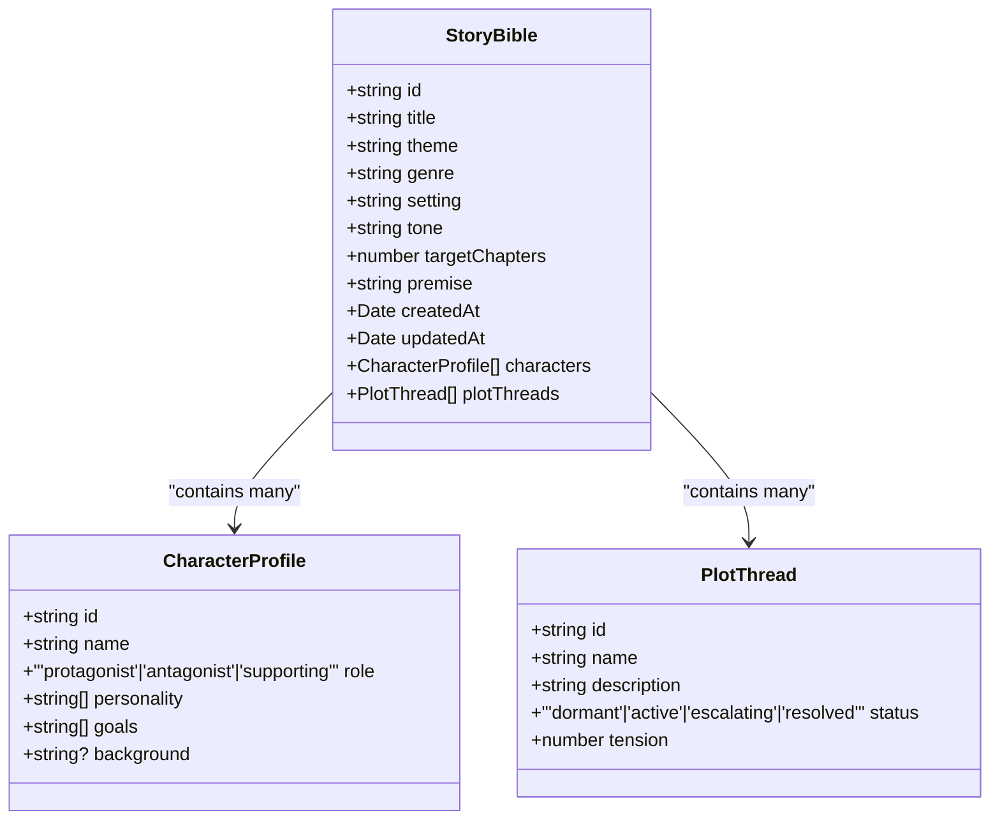

**Diagram sources**
- [index.ts](file://packages/engine/src/types/index.ts#L1-L90)

**Section sources**
- [index.ts](file://packages/engine/src/types/index.ts#L1-L90)
- [bible.ts](file://packages/engine/src/story/bible.ts#L12-L26)
- [bible.ts](file://packages/engine/src/story/bible.ts#L35-L48)
- [bible.ts](file://packages/engine/src/story/bible.ts#L55-L68)

### Immutable Update Pattern and ID Generation
- ID generation: Timestamp plus short random string to ensure uniqueness across calls.
- Updates: Functions return new objects with spread operator; arrays are shallow-copied and appended to; updatedAt is refreshed on mutations.

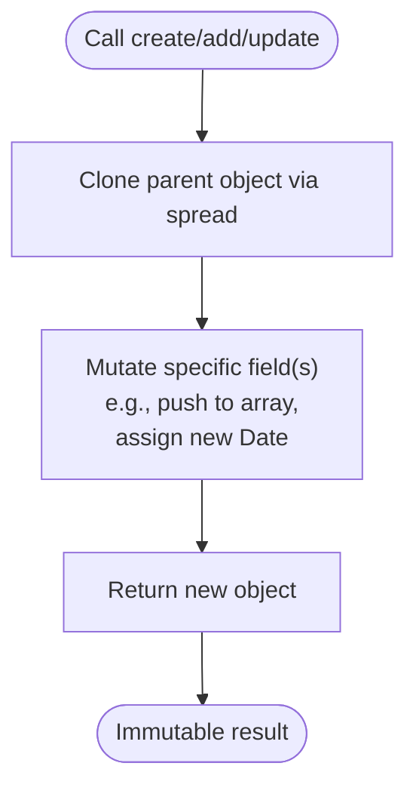

**Diagram sources**
- [bible.ts](file://packages/engine/src/story/bible.ts#L70-L72)
- [canonStore.ts](file://packages/engine/src/memory/canonStore.ts#L131-L133)
- [generateChapter.ts](file://packages/engine/src/pipeline/generateChapter.ts#L73-L75)

**Section sources**
- [bible.ts](file://packages/engine/src/story/bible.ts#L3-L68)
- [state.ts](file://packages/engine/src/story/state.ts#L14-L24)
- [canonStore.ts](file://packages/engine/src/memory/canonStore.ts#L60-L69)
- [generateChapter.ts](file://packages/engine/src/pipeline/generateChapter.ts#L57-L66)

### Plot Thread Lifecycle and Tension Mechanics
- Status lifecycle: dormant → active → escalating → resolved.
- Initial tension: small positive value to encourage early escalation.
- Tension calculation: nonlinear function increasing toward midpoint, then decreasing, ensuring narrative arc shaping.

**Diagram sources**
- [bible.ts](file://packages/engine/src/story/bible.ts#L50-L68)
- [state.ts](file://packages/engine/src/story/state.ts#L26-L29)

**Section sources**
- [index.ts](file://packages/engine/src/types/index.ts#L25-L31)
- [bible.ts](file://packages/engine/src/story/bible.ts#L50-L68)
- [state.ts](file://packages/engine/src/story/state.ts#L26-L29)

### StoryBible Creation Workflow
- createStoryBible initializes a new StoryBible with metadata, empty arrays, and timestamps.
- Practical example path: see [simple.test.ts](file://packages/engine/src/test/simple.test.ts#L27-L35).

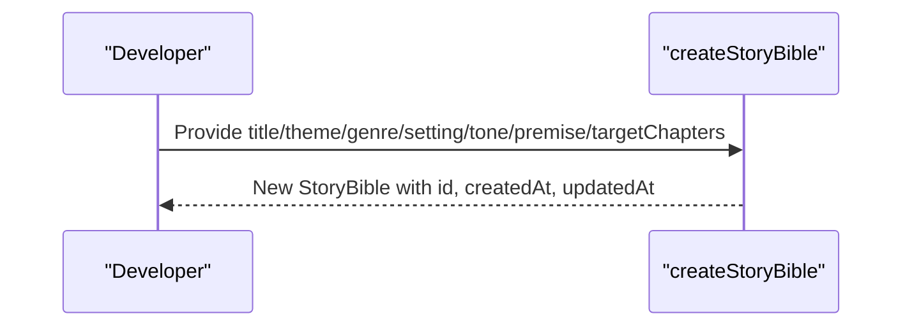

**Diagram sources**
- [bible.ts](file://packages/engine/src/story/bible.ts#L3-L26)
- [simple.test.ts](file://packages/engine/src/test/simple.test.ts#L27-L35)

**Section sources**
- [bible.ts](file://packages/engine/src/story/bible.ts#L3-L26)
- [simple.test.ts](file://packages/engine/src/test/simple.test.ts#L27-L35)

### Character Profile Management
- addCharacter creates a CharacterProfile with personality traits and goals, assigns an ID, and appends to the StoryBible.
- Practical example path: see [simple.test.ts](file://packages/engine/src/test/simple.test.ts#L37-L43).

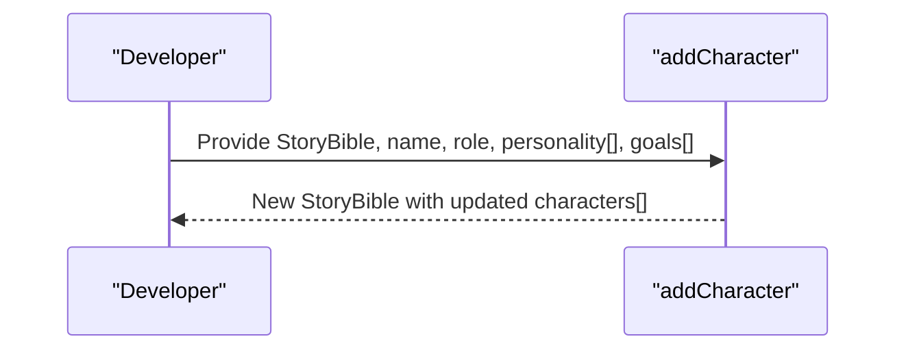

**Diagram sources**
- [bible.ts](file://packages/engine/src/story/bible.ts#L28-L48)
- [simple.test.ts](file://packages/engine/src/test/simple.test.ts#L37-L43)

**Section sources**
- [bible.ts](file://packages/engine/src/story/bible.ts#L28-L48)
- [simple.test.ts](file://packages/engine/src/test/simple.test.ts#L37-L43)

### Plot Thread Management
- addPlotThread creates a PlotThread with status dormant and small initial tension, then appends to the StoryBible.
- Practical example path: see [simple.test.ts](file://packages/engine/src/test/simple.test.ts#L27-L35) for adding threads after story creation.

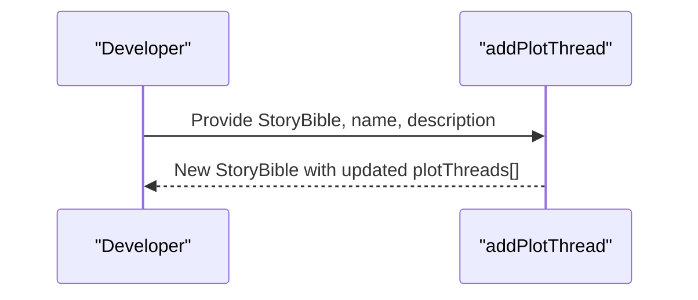

**Diagram sources**
- [bible.ts](file://packages/engine/src/story/bible.ts#L50-L68)
- [simple.test.ts](file://packages/engine/src/test/simple.test.ts#L27-L35)

**Section sources**
- [bible.ts](file://packages/engine/src/story/bible.ts#L50-L68)
- [simple.test.ts](file://packages/engine/src/test/simple.test.ts#L27-L35)

### Story State and Tension Evolution
- createStoryState initializes currentChapter, totalChapters, currentTension, and empty chapter summaries.
- updateStoryState advances currentChapter, appends summary, and recalculates currentTension based on progress.

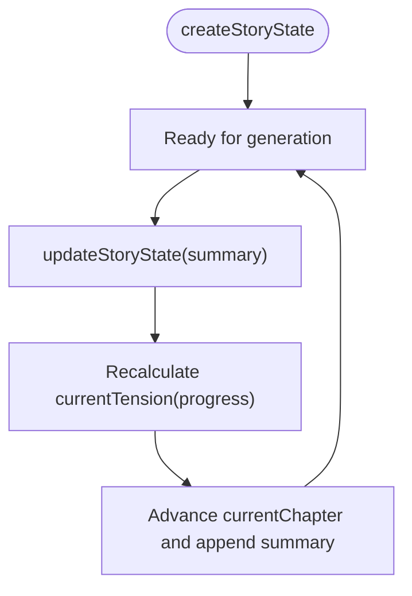

**Diagram sources**
- [state.ts](file://packages/engine/src/story/state.ts#L3-L24)

**Section sources**
- [state.ts](file://packages/engine/src/story/state.ts#L3-L24)

### Canonical Fact Extraction and Validation
- extractCanonFromBible builds a CanonStore from StoryBible characters and plot threads.
- addFact and updateFact manage canonical facts with chapter-establishment tracking.
- formatCanonForPrompt renders facts for LLM consumption.

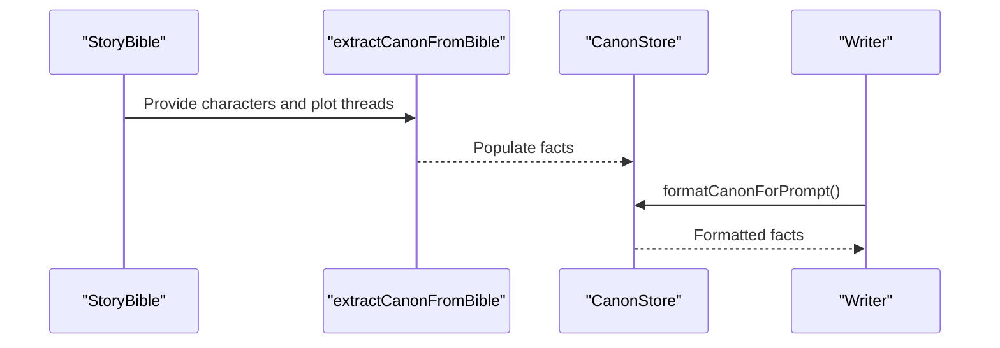

**Diagram sources**
- [canonStore.ts](file://packages/engine/src/memory/canonStore.ts#L24-L58)
- [canonStore.ts](file://packages/engine/src/memory/canonStore.ts#L101-L129)
- [writer.ts](file://packages/engine/src/agents/writer.ts#L58-L83)

**Section sources**
- [canonStore.ts](file://packages/engine/src/memory/canonStore.ts#L1-L134)
- [writer.ts](file://packages/engine/src/agents/writer.ts#L55-L94)

### Chapter Generation Pipeline Integration
- generateChapter coordinates writing, completeness checking, optional canon validation, and summarization.
- Writer infers chapter goals based on target chapters and current position.
- Summarizer extracts key events and produces concise summaries.

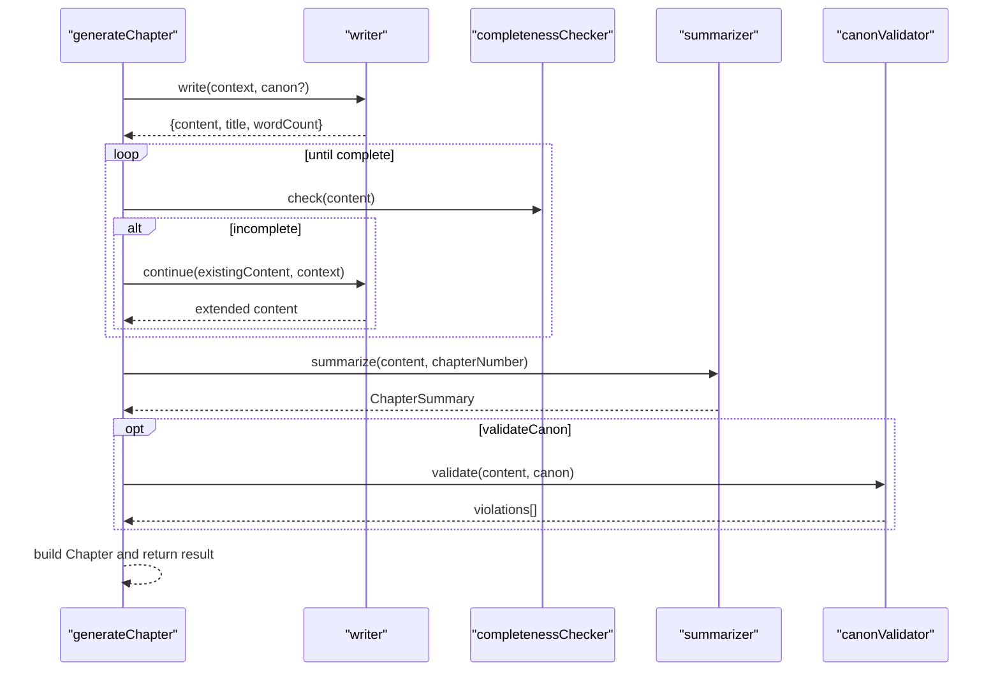

**Diagram sources**
- [generateChapter.ts](file://packages/engine/src/pipeline/generateChapter.ts#L20-L71)
- [writer.ts](file://packages/engine/src/agents/writer.ts#L96-L131)
- [summarizer.ts](file://packages/engine/src/agents/summarizer.ts#L24-L38)
- [completeness.ts](file://packages/engine/src/agents/completeness.ts#L37-L52)

**Section sources**
- [generateChapter.ts](file://packages/engine/src/pipeline/generateChapter.ts#L1-L76)
- [writer.ts](file://packages/engine/src/agents/writer.ts#L1-L146)
- [summarizer.ts](file://packages/engine/src/agents/summarizer.ts#L1-L64)
- [completeness.ts](file://packages/engine/src/agents/completeness.ts#L1-L56)

## Dependency Analysis
- StoryBible depends on CharacterProfile and PlotThread types.
- StoryState depends on ChapterSummary type.
- CanonStore depends on StoryBible for extraction.
- Pipeline depends on Writer, Summarizer, Completeness, and optional Canon Validator.
- All modules depend on LLMClient for inference.

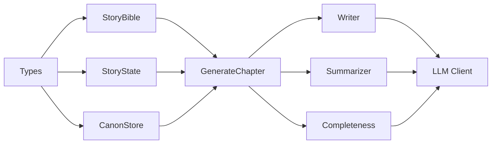

**Diagram sources**
- [index.ts](file://packages/engine/src/types/index.ts#L1-L90)
- [bible.ts](file://packages/engine/src/story/bible.ts#L1-L73)
- [state.ts](file://packages/engine/src/story/state.ts#L1-L30)
- [canonStore.ts](file://packages/engine/src/memory/canonStore.ts#L1-L134)
- [generateChapter.ts](file://packages/engine/src/pipeline/generateChapter.ts#L1-L76)
- [writer.ts](file://packages/engine/src/agents/writer.ts#L1-L146)
- [summarizer.ts](file://packages/engine/src/agents/summarizer.ts#L1-L64)
- [completeness.ts](file://packages/engine/src/agents/completeness.ts#L1-L56)
- [client.ts](file://packages/engine/src/llm/client.ts#L1-L106)

**Section sources**
- [index.ts](file://packages/engine/src/index.ts#L1-L23)

## Performance Considerations
- Immutable updates avoid shared mutable state but create new arrays/objects; acceptable for typical story sizes.
- Tension calculation is constant-time per chapter.
- LLM calls dominate runtime; tune temperature and maxTokens to balance quality and cost.
- Canonical extraction and formatting are linear in the number of characters and plot threads.

## Troubleshooting Guide
- Incomplete chapters: The pipeline retries writing and continues until completion is detected.
- Canon violations: Optional validation reports discrepancies; review extracted facts and adjust content accordingly.
- LLM provider configuration: Ensure provider and API keys are set; otherwise, initialization will fail.

**Section sources**
- [generateChapter.ts](file://packages/engine/src/pipeline/generateChapter.ts#L32-L53)
- [completeness.ts](file://packages/engine/src/agents/completeness.ts#L37-L52)
- [client.ts](file://packages/engine/src/llm/client.ts#L46-L81)

## Conclusion
The Story Bible Management system provides a robust, immutable foundation for narrative construction. With clear data models, lifecycle-aware plot threads, and tight integration with the chapter generation pipeline, it enables scalable story creation guided by metadata, character arcs, and canonical consistency.

## Appendices

### Practical Examples
- Story creation: See [simple.test.ts](file://packages/engine/src/test/simple.test.ts#L27-L35).
- Character addition: See [simple.test.ts](file://packages/engine/src/test/simple.test.ts#L37-L43).
- Plot thread integration: Add threads after story creation and before generation.

**Section sources**
- [simple.test.ts](file://packages/engine/src/test/simple.test.ts#L24-L73)