# Story Management System

<cite>
**Referenced Files in This Document**
- [bible.ts](file://packages/engine/src/story/bible.ts)
- [state.ts](file://packages/engine/src/story/state.ts)
- [structuredState.ts](file://packages/engine/src/story/structuredState.ts)
- [canonStore.ts](file://packages/engine/src/memory/canonStore.ts)
- [vectorStore.ts](file://packages/engine/src/memory/vectorStore.ts)
- [memoryRetriever.ts](file://packages/engine/src/memory/memoryRetriever.ts)
- [memoryExtractor.ts](file://packages/engine/src/agents/memoryExtractor.ts)
- [stateUpdater.ts](file://packages/engine/src/agents/stateUpdater.ts)
- [stateUpdater.ts](file://packages/engine/src/memory/stateUpdater.ts)
- [generateChapter.ts](file://packages/engine/src/pipeline/generateChapter.ts)
- [writer.ts](file://packages/engine/src/agents/writer.ts)
- [completeness.ts](file://packages/engine/src/agents/completeness.ts)
- [summarizer.ts](file://packages/engine/src/agents/summarizer.ts)
- [constraintGraph.ts](file://packages/engine/src/constraints/constraintGraph.ts)
- [validator.ts](file://packages/engine/src/constraints/validator.ts)
- [index.ts](file://packages/engine/src/types/index.ts)
- [index.ts](file://apps/cli/src/index.ts)
- [init.ts](file://apps/cli/src/commands/init.ts)
- [generate.ts](file://apps/cli/src/commands/generate.ts)
- [continue.ts](file://apps/cli/src/commands/continue.ts)
- [status.ts](file://apps/cli/src/commands/status.ts)
- [config.ts](file://apps/cli/src/commands/config.ts)
- [memories.ts](file://apps/cli/src/commands/memories.ts)
- [state.ts](file://apps/cli/src/commands/state.ts)
- [validate.ts](file://apps/cli/src/commands/validate.ts)
- [store.ts](file://apps/cli/src/config/store.ts)
- [use.ts](file://apps/cli/src/commands/use.ts)
- [list.ts](file://apps/cli/src/commands/list.ts)
</cite>

## Update Summary
**Changes Made**
- Added comprehensive documentation for the new active story management functionality with persistent story selection and current story tracking
- Documented the story activation workflow through the `use` command and automatic story ID resolution
- Updated CLI integration to include persistent story selection and streamlined command usage
- Enhanced workflow documentation to reflect the new persistent story context functionality
- Added new sections covering active story management, story activation workflows, and persistent story tracking

## Table of Contents
1. [Introduction](#introduction)
2. [Project Structure](#project-structure)
3. [Core Components](#core-components)
4. [Architecture Overview](#architecture-overview)
5. [Detailed Component Analysis](#detailed-component-analysis)
6. [Enhanced Story Management System](#enhanced-story-management-system)
7. [Active Story Management](#active-story-management)
8. [Memory Integration System](#memory-integration-system)
9. [State Updater Pipeline](#state-updater-pipeline)
10. [Enhanced Validation Pipeline](#enhanced-validation-pipeline)
11. [Dependency Analysis](#dependency-analysis)
12. [Performance Considerations](#performance-considerations)
13. [Troubleshooting Guide](#troubleshooting-guide)
14. [Conclusion](#conclusion)
15. [Appendices](#appendices)

## Introduction
This document describes the Story Management System within the Narrative Operating System (NOS). It explains how stories are modeled and managed, how runtime state tracks progression, and how data is persisted locally. The system now includes an integrated Narrative Constraints Graph, enhanced StoryStructuredState for detailed character management, a comprehensive memory system with vector storage and semantic search capabilities, and persistent active story management functionality. It documents the end-to-end lifecycle from story initialization through chapter generation to completion, along with CLI integration, automated generation pipeline, and streamlined story activation workflows.

## Project Structure
The system is organized into:
- Engine package: story modeling, runtime state, memory/canon, generation pipeline, constraint validation, and agent implementations.
- CLI app: command-line interface for initializing stories, generating chapters, continuing stories, checking status, managing memories, inspecting state, validating stories, configuring LLM providers, and managing active story selection.


```mermaid
graph TB
subgraph "CLI"
CLI_INDEX["apps/cli/src/index.ts"]
CMD_INIT["commands/init.ts"]
CMD_GEN["commands/generate.ts"]
CMD_CONT["commands/continue.ts"]
CMD_STATUS["commands/status.ts"]
CMD_CONFIG["commands/config.ts"]
CMD_MEMORIES["commands/memories.ts"]
CMD_STATE["commands/state.ts"]
CMD_VALIDATE["commands/validate.ts"]
CMD_USE["commands/use.ts"]
CMD_LIST["commands/list.ts"]
STORE["config/store.ts"]
end
subgraph "Engine"
TYPES["types/index.ts"]
BIBLE["story/bible.ts"]
STATE["story/state.ts"]
STRUCT_STATE["story/structuredState.ts"]
CANON["memory/canonStore.ts"]
VECTOR_STORE["memory/vectorStore.ts"]
MEM_RETRIEVER["memory/memoryRetriever.ts"]
MEM_EXTRACTOR["agents/memoryExtractor.ts"]
STATE_UPDATER["memory/stateUpdater.ts"]
CONSTRAINT_GRAPH["constraints/constraintGraph.ts"]
VALIDATOR["constraints/validator.ts"]
PIPE_GEN["pipeline/generateChapter.ts"]
AG_WRT["agents/writer.ts"]
AG_COMP["agents/completeness.ts"]
AG_SUM["agents/summarizer.ts"]
end
CLI_INDEX --> CMD_INIT
CLI_INDEX --> CMD_GEN
CLI_INDEX --> CMD_CONT
CLI_INDEX --> CMD_STATUS
CLI_INDEX --> CMD_CONFIG
CLI_INDEX --> CMD_MEMORIES
CLI_INDEX --> CMD_STATE
CLI_INDEX --> CMD_VALIDATE
CLI_INDEX --> CMD_USE
CLI_INDEX --> CMD_LIST
CMD_INIT --> BIBLE
CMD_INIT --> STATE
CMD_INIT --> STORE
CMD_GEN --> PIPE_GEN
CMD_CONT --> PIPE_GEN
CMD_MEMORIES --> VECTOR_STORE
CMD_STATE --> STRUCT_STATE
CMD_VALIDATE --> VALIDATOR
CMD_USE --> STORE
CMD_LIST --> STORE
PIPE_GEN --> AG_WRT
PIPE_GEN --> AG_COMP
PIPE_GEN --> AG_SUM
PIPE_GEN --> MEM_EXTRACTOR
PIPE_GEN --> VECTOR_STORE
PIPE_GEN --> CONSTRAINT_GRAPH
PIPE_GEN --> VALIDATOR
CMD_STATUS --> STORE
CMD_CONFIG --> STORE
BIBLE --> TYPES
STATE --> TYPES
STRUCT_STATE --> TYPES
CANON --> TYPES
VECTOR_STORE --> TYPES
MEM_RETRIEVER --> TYPES
MEM_EXTRACTOR --> TYPES
STATE_UPDATER --> TYPES
CONSTRAINT_GRAPH --> TYPES
VALIDATOR --> TYPES
PIPE_GEN --> TYPES
AG_WRT --> TYPES
AG_COMP --> TYPES
AG_SUM --> TYPES
```

**Diagram sources**
- [index.ts:1-177](file://apps/cli/src/index.ts#L1-L177)
- [init.ts:1-91](file://apps/cli/src/commands/init.ts#L1-L91)
- [generate.ts:1-81](file://apps/cli/src/commands/generate.ts#L1-L81)
- [continue.ts:1-63](file://apps/cli/src/commands/continue.ts#L1-L63)
- [status.ts:1-58](file://apps/cli/src/commands/status.ts#L1-L58)
- [config.ts:1-84](file://apps/cli/src/commands/config.ts#L1-L84)
- [memories.ts:1-66](file://apps/cli/src/commands/memories.ts#L1-L66)
- [state.ts:1-83](file://apps/cli/src/commands/state.ts#L1-L83)
- [validate.ts:1-107](file://apps/cli/src/commands/validate.ts#L1-L107)
- [use.ts:1-92](file://apps/cli/src/commands/use.ts#L1-L92)
- [list.ts:1-23](file://apps/cli/src/commands/list.ts#L1-L23)
- [store.ts:1-195](file://apps/cli/src/config/store.ts#L1-L195)
- [index.ts:1-116](file://packages/engine/src/types/index.ts#L1-L116)
- [bible.ts:1-73](file://packages/engine/src/story/bible.ts#L1-L73)
- [state.ts:1-30](file://packages/engine/src/story/state.ts#L1-L30)
- [structuredState.ts:1-235](file://packages/engine/src/story/structuredState.ts#L1-L235)
- [canonStore.ts:1-134](file://packages/engine/src/memory/canonStore.ts#L1-L134)
- [vectorStore.ts:1-208](file://packages/engine/src/memory/vectorStore.ts#L1-L208)
- [memoryRetriever.ts:1-174](file://packages/engine/src/memory/memoryRetriever.ts#L1-L174)
- [memoryExtractor.ts:1-97](file://packages/engine/src/agents/memoryExtractor.ts#L1-L97)
- [stateUpdater.ts:1-435](file://packages/engine/src/memory/stateUpdater.ts#L1-L435)
- [constraintGraph.ts:1-471](file://packages/engine/src/constraints/constraintGraph.ts#L1-L471)
- [validator.ts:1-286](file://packages/engine/src/constraints/validator.ts#L1-L286)
- [generateChapter.ts:1-108](file://packages/engine/src/pipeline/generateChapter.ts#L1-L108)
- [writer.ts:1-164](file://packages/engine/src/agents/writer.ts#L1-L164)
- [completeness.ts:1-56](file://packages/engine/src/agents/completeness.ts#L1-L56)
- [summarizer.ts:1-64](file://packages/engine/src/agents/summarizer.ts#L1-L64)

**Section sources**
- [index.ts:1-177](file://apps/cli/src/index.ts#L1-L177)
- [store.ts:1-195](file://apps/cli/src/config/store.ts#L1-L195)
- [index.ts:1-116](file://packages/engine/src/types/index.ts#L1-L116)

## Core Components
- StoryBible: Immutable story metadata container with characters and plot threads, plus timestamps and target chapter count.
- StoryState: Mutable runtime state tracking current chapter, total chapters, current tension, active plot threads, and chapter summaries.
- StoryStructuredState: Enhanced runtime state with detailed character and plot thread information for constraint validation and memory management.
- CanonStore: Persistent, structured knowledge base derived from the StoryBible and updated during generation to maintain continuity.
- VectorStore: High-dimensional vector storage for semantic memory with HNSW indexing and cosine similarity search.
- MemoryRetriever: Context-aware memory retrieval system with category filtering and relevance ranking.
- MemoryExtractor: LLM-powered memory extraction from chapters with automatic categorization.
- StateUpdaterPipeline: Advanced state synchronization pipeline combining LLM extraction, constraint graph updates, and memory management.
- ConstraintGraph: Narrative constraints graph that validates story consistency across multiple dimensions.
- Validator: Dual-mode validation system combining graph-based and LLM-based constraint checking.
- Generation pipeline: Orchestrates writing, completeness checks, optional canon validation, constraint validation, memory extraction, and summarization to produce a chapter and update state.
- CLI commands: Provide user-facing workflows for initialization, incremental generation, bulk continuation, status reporting, memory management, state inspection, validation, configuration, and persistent story selection.
- Active Story Management: Persistent story selection system with current story tracking and automatic story ID resolution.

**Section sources**
- [bible.ts:1-73](file://packages/engine/src/story/bible.ts#L1-L73)
- [state.ts:1-30](file://packages/engine/src/story/state.ts#L1-L30)
- [structuredState.ts:1-235](file://packages/engine/src/story/structuredState.ts#L1-L235)
- [canonStore.ts:1-134](file://packages/engine/src/memory/canonStore.ts#L1-L134)
- [vectorStore.ts:1-208](file://packages/engine/src/memory/vectorStore.ts#L1-L208)
- [memoryRetriever.ts:1-174](file://packages/engine/src/memory/memoryRetriever.ts#L1-L174)
- [memoryExtractor.ts:1-97](file://packages/engine/src/agents/memoryExtractor.ts#L1-L97)
- [stateUpdater.ts:1-435](file://packages/engine/src/memory/stateUpdater.ts#L1-L435)
- [constraintGraph.ts:1-471](file://packages/engine/src/constraints/constraintGraph.ts#L1-L471)
- [validator.ts:1-286](file://packages/engine/src/constraints/validator.ts#L1-L286)
- [generateChapter.ts:1-108](file://packages/engine/src/pipeline/generateChapter.ts#L1-L108)
- [index.ts:1-116](file://packages/engine/src/types/index.ts#L1-L116)
- [init.ts:1-91](file://apps/cli/src/commands/init.ts#L1-L91)
- [generate.ts:1-81](file://apps/cli/src/commands/generate.ts#L1-L81)
- [continue.ts:1-63](file://apps/cli/src/commands/continue.ts#L1-L63)
- [status.ts:1-58](file://apps/cli/src/commands/status.ts#L1-L58)
- [memories.ts:1-66](file://apps/cli/src/commands/memories.ts#L1-L66)
- [state.ts:1-83](file://apps/cli/src/commands/state.ts#L1-L83)
- [validate.ts:1-107](file://apps/cli/src/commands/validate.ts#L1-L107)
- [config.ts:1-84](file://apps/cli/src/commands/config.ts#L1-L84)
- [use.ts:1-92](file://apps/cli/src/commands/use.ts#L1-L92)
- [list.ts:1-23](file://apps/cli/src/commands/list.ts#L1-L23)

## Architecture Overview
The system follows a clean separation of concerns with enhanced narrative consistency checking, comprehensive memory management, and persistent active story functionality:
- Data models live in the engine types.
- StoryBible and StoryState are created and mutated by CLI commands.
- The generation pipeline composes agents to produce chapters, manage continuity via CanonStore, and integrate memory extraction.
- The state updater pipeline synchronizes structured state with constraint graph updates and vector memory management.
- Constraint validation ensures narrative consistency through both graph-based and LLM-based checking.
- Vector memory system provides semantic search and context-aware retrieval for enhanced storytelling.
- Local filesystem persists story artifacts per story ID with persistent active story tracking.
- Active story management provides seamless story switching and automatic story ID resolution across commands.

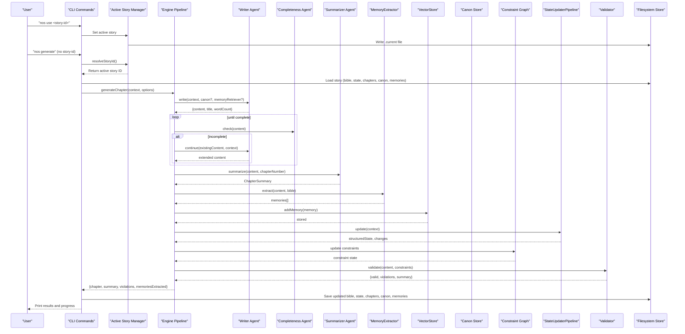
```mermaid
sequenceDiagram
participant User as "User"
participant CLI as "CLI Commands"
participant ActiveStory as "Active Story Manager"
participant Engine as "Engine Pipeline"
participant Writer as "Writer Agent"
participant Checker as "Completeness Agent"
participant Sum as "Summarizer Agent"
participant MemExt as "MemoryExtractor"
participant Vector as "VectorStore"
participant Canon as "Canon Store"
participant Graph as "Constraint Graph"
participant StateUpd as "StateUpdaterPipeline"
participant Validator as "Validator"
participant FS as "Filesystem Store"
User->>CLI : "nos use <story-id>"
CLI->>ActiveStory : Set active story
ActiveStory->>FS : Write .current file
User->>CLI : "nos generate" (no story-id)
CLI->>ActiveStory : resolveStoryId()
ActiveStory-->>CLI : Return active story ID
CLI->>FS : Load story (bible, state, chapters, canon, memories)
CLI->>Engine : generateChapter(context, options)
Engine->>Writer : write(context, canon?, memoryRetriever?)
Writer-->>Engine : {content, title, wordCount}
loop until complete
Engine->>Checker : check(content)
alt incomplete
Engine->>Writer : continue(existingContent, context)
Writer-->>Engine : extended content
end
end
Engine->>Sum : summarize(content, chapterNumber)
Sum-->>Engine : ChapterSummary
Engine->>MemExt : extract(content, bible)
MemExt-->>Engine : memories[]
Engine->>Vector : addMemory(memory)
Vector-->>Engine : stored
Engine->>StateUpd : update(context)
StateUpd-->>Engine : structuredState, changes
Engine->>Graph : update constraints
Graph-->>Engine : constraint state
Engine->>Validator : validate(content, constraints)
Validator-->>Engine : {valid, violations, summary}
Engine-->>CLI : {chapter, summary, violations, memoriesExtracted}
CLI->>FS : Save updated bible, state, chapters, canon, memories
CLI-->>User : Print results and progress
```

**Diagram sources**
- [use.ts:1-92](file://apps/cli/src/commands/use.ts#L1-L92)
- [index.ts:72-167](file://apps/cli/src/index.ts#L72-L167)
- [generate.ts:1-81](file://apps/cli/src/commands/generate.ts#L1-L81)
- [generateChapter.ts:1-108](file://packages/engine/src/pipeline/generateChapter.ts#L1-L108)
- [writer.ts:1-164](file://packages/engine/src/agents/writer.ts#L1-L164)
- [completeness.ts:1-56](file://packages/engine/src/agents/completeness.ts#L1-L56)
- [summarizer.ts:1-64](file://packages/engine/src/agents/summarizer.ts#L1-L64)
- [memoryExtractor.ts:1-97](file://packages/engine/src/agents/memoryExtractor.ts#L1-L97)
- [vectorStore.ts:1-208](file://packages/engine/src/memory/vectorStore.ts#L1-L208)
- [stateUpdater.ts:1-435](file://packages/engine/src/memory/stateUpdater.ts#L1-L435)
- [canonStore.ts:1-134](file://packages/engine/src/memory/canonStore.ts#L1-L134)
- [constraintGraph.ts:1-471](file://packages/engine/src/constraints/constraintGraph.ts#L1-L471)
- [validator.ts:1-286](file://packages/engine/src/constraints/validator.ts#L1-L286)
- [store.ts:1-195](file://apps/cli/src/config/store.ts#L1-L195)

## Detailed Component Analysis

### StoryBible: Story Metadata and Character Profiles
StoryBible encapsulates the story's identity, thematic elements, and initial creative assets. It supports adding characters and plot threads, and maintains creation/update timestamps.

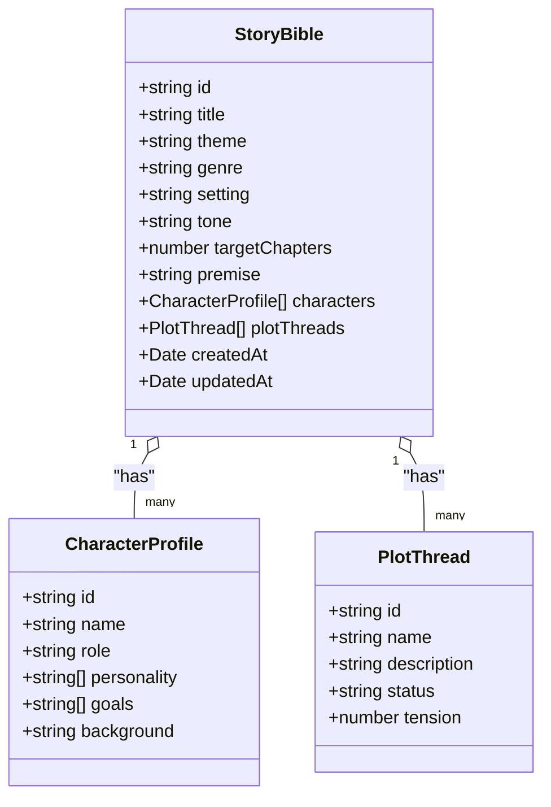
```mermaid
classDiagram
class StoryBible {
+string id
+string title
+string theme
+string genre
+string setting
+string tone
+number targetChapters
+string premise
+CharacterProfile[] characters
+PlotThread[] plotThreads
+Date createdAt
+Date updatedAt
}
class CharacterProfile {
+string id
+string name
+string role
+string[] personality
+string[] goals
+string background
}
class PlotThread {
+string id
+string name
+string description
+string status
+number tension
}
StoryBible "1" o-- "many" CharacterProfile : "has"
StoryBible "1" o-- "many" PlotThread : "has"
```

- Creation: Initializes with metadata and empty collections; adds characters and plot threads with stable identifiers.
- Mutation: Returns new instances to preserve immutability of the story model.

**Diagram sources**
- [bible.ts:1-73](file://packages/engine/src/story/bible.ts#L1-L73)
- [index.ts:1-116](file://packages/engine/src/types/index.ts#L1-L116)

**Section sources**
- [bible.ts:1-73](file://packages/engine/src/story/bible.ts#L1-L73)
- [index.ts:1-116](file://packages/engine/src/types/index.ts#L1-L116)

### StoryState: Runtime Progression Tracking
StoryState tracks the current chapter, total chapters, dynamic tension, active plot threads, and a rolling history of chapter summaries.

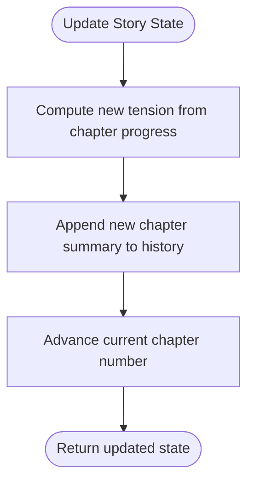
```mermaid
flowchart TD
Start(["Update Story State"]) --> Compute["Compute new tension from chapter progress"]
Compute --> Append["Append new chapter summary to history"]
Append --> Advance["Advance current chapter number"]
Advance --> Done(["Return updated state"])
```

- Tension calculation: Nonlinear curve peaking near midpoint to simulate dramatic arc.
- State updates: Deterministic and immutable; returns a new state object.

**Diagram sources**
- [state.ts:1-30](file://packages/engine/src/story/state.ts#L1-L30)

**Section sources**
- [state.ts:1-30](file://packages/engine/src/story/state.ts#L1-L30)
- [index.ts:44-65](file://packages/engine/src/types/index.ts#L44-L65)

### StoryStructuredState: Enhanced Runtime State
StoryStructuredState provides detailed runtime state information for constraint validation, including character states, plot thread details, and recent events. This is the core enhancement that enables advanced story management.

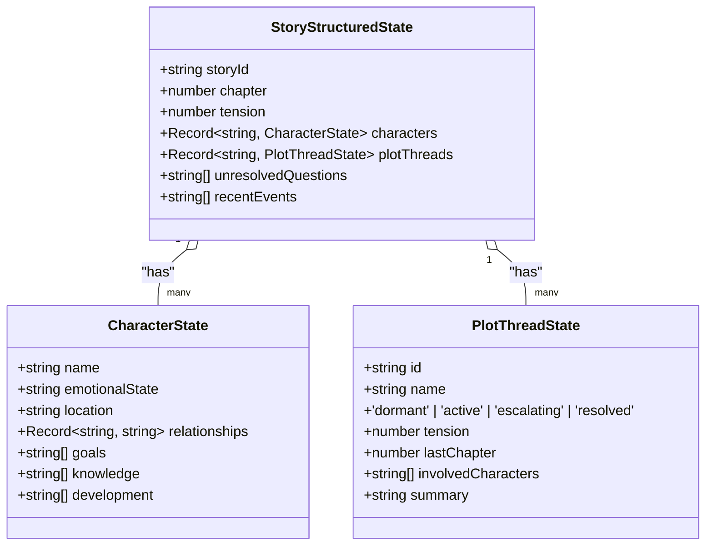
```mermaid
classDiagram
class StoryStructuredState {
+string storyId
+number chapter
+number tension
+Record~string, CharacterState~ characters
+Record~string, PlotThreadState~ plotThreads
+string[] unresolvedQuestions
+string[] recentEvents
}
class CharacterState {
+string name
+string emotionalState
+string location
+Record~string, string~ relationships
+string[] goals
+string[] knowledge
+string[] development
}
class PlotThreadState {
+string id
+string name
+'dormant' | 'active' | 'escalating' | 'resolved'
+number tension
+number lastChapter
+string[] involvedCharacters
+string summary
}
StoryStructuredState "1" o-- "many" CharacterState : "has"
StoryStructuredState "1" o-- "many" PlotThreadState : "has"
```

- Character management: Tracks emotional state, location, relationships, goals, knowledge, and development arcs.
- Plot thread management: Manages status, tension, involvement, and summaries with automatic last-chapter tracking.
- Question management: Maintains unresolved questions and recent events for narrative coherence.
- Tension calculation: Uses parabolic curve for realistic story tension progression with smoothing.

**Diagram sources**
- [structuredState.ts:1-235](file://packages/engine/src/story/structuredState.ts#L1-L235)
- [index.ts:1-116](file://packages/engine/src/types/index.ts#L1-L116)

**Section sources**
- [structuredState.ts:1-235](file://packages/engine/src/story/structuredState.ts#L1-L235)
- [index.ts:1-116](file://packages/engine/src/types/index.ts#L1-L116)

### CanonStore: Continuity Knowledge Base
CanonStore captures immutable facts about characters, world, plot, and timeline. It supports extraction from StoryBible, adding/updating facts, and formatting for prompts.

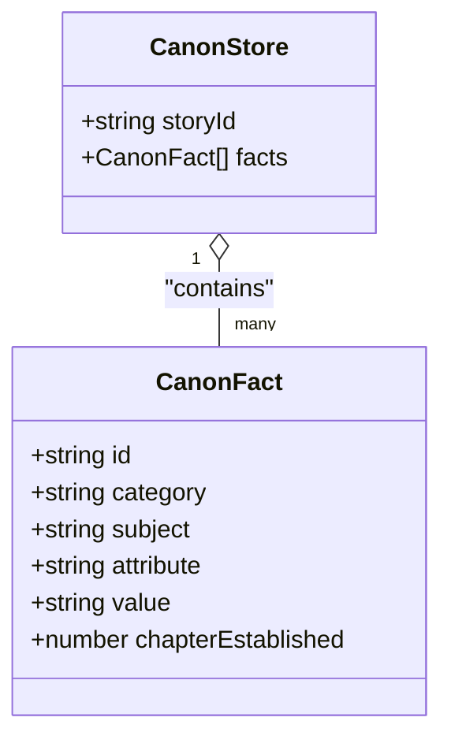
```mermaid
classDiagram
class CanonStore {
+string storyId
+CanonFact[] facts
}
class CanonFact {
+string id
+string category
+string subject
+string attribute
+string value
+number chapterEstablished
}
CanonStore "1" o-- "many" CanonFact : "contains"
```

- Extraction: Converts StoryBible into canonical facts for baseline continuity.
- Prompt formatting: Renders structured knowledge for LLM context.

**Diagram sources**
- [canonStore.ts:1-134](file://packages/engine/src/memory/canonStore.ts#L1-L134)
- [index.ts:1-116](file://packages/engine/src/types/index.ts#L1-L116)

**Section sources**
- [canonStore.ts:1-134](file://packages/engine/src/memory/canonStore.ts#L1-L134)
- [index.ts:1-116](file://packages/engine/src/types/index.ts#L1-L116)

### VectorStore: Semantic Memory Storage
VectorStore provides high-dimensional vector storage with HNSW indexing for efficient semantic search and memory management.

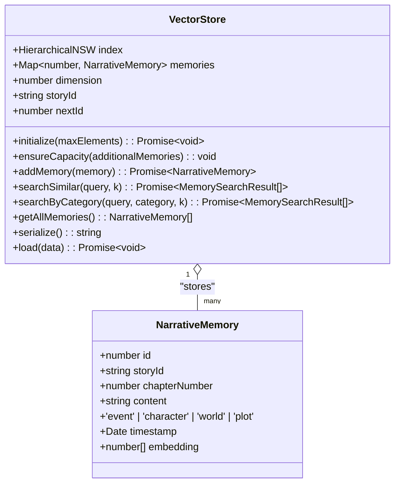
```mermaid
classDiagram
class VectorStore {
+HierarchicalNSW index
+Map~number, NarrativeMemory~ memories
+number dimension
+string storyId
+number nextId
+initialize(maxElements) : Promise~void~
+ensureCapacity(additionalMemories) : void
+addMemory(memory) : Promise~NarrativeMemory~
+searchSimilar(query, k) : Promise~MemorySearchResult[]~
+searchByCategory(query, category, k) : Promise~MemorySearchResult[]~
+getAllMemories() : NarrativeMemory[]
+serialize() : string
+load(data) : Promise~void~
}
class NarrativeMemory {
+number id
+string storyId
+number chapterNumber
+string content
+'event' | 'character' | 'world' | 'plot'
+Date timestamp
+number[] embedding
}
VectorStore "1" o-- "many" NarrativeMemory : "stores"
```

- Embedding generation: Uses OpenAI text-embedding-3-small with fallback to mock embeddings.
- Index management: HierarchicalNSW (HNSW) algorithm for efficient nearest neighbor search.
- Memory categories: Structured categorization for event, character, world, and plot memories.
- Capacity management: Automatic resizing and capacity planning for growing memory stores.

**Diagram sources**
- [vectorStore.ts:1-208](file://packages/engine/src/memory/vectorStore.ts#L1-L208)
- [index.ts:1-116](file://packages/engine/src/types/index.ts#L1-L116)

**Section sources**
- [vectorStore.ts:1-208](file://packages/engine/src/memory/vectorStore.ts#L1-L208)
- [index.ts:1-116](file://packages/engine/src/types/index.ts#L1-L116)

### MemoryRetriever: Context-Aware Memory Retrieval
MemoryRetriever provides intelligent memory retrieval with contextual queries and category filtering.

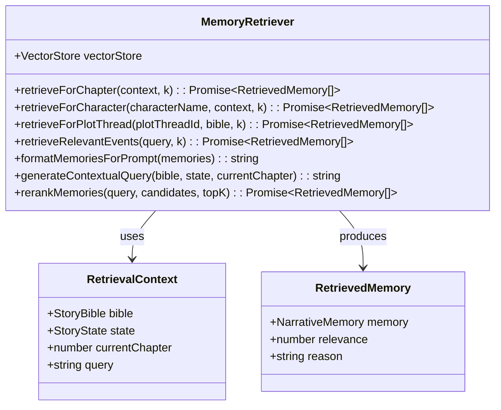
```mermaid
classDiagram
class MemoryRetriever {
+VectorStore vectorStore
+retrieveForChapter(context, k) : Promise~RetrievedMemory[]~
+retrieveForCharacter(characterName, context, k) : Promise~RetrievedMemory[]~
+retrieveForPlotThread(plotThreadId, bible, k) : Promise~RetrievedMemory[]~
+retrieveRelevantEvents(query, k) : Promise~RetrievedMemory[]~
+formatMemoriesForPrompt(memories) : string
+generateContextualQuery(bible, state, currentChapter) : string
+rerankMemories(query, candidates, topK) : Promise~RetrievedMemory[]~
}
class RetrievalContext {
+StoryBible bible
+StoryState state
+number currentChapter
+string query
}
class RetrievedMemory {
+NarrativeMemory memory
+number relevance
+string reason
}
MemoryRetriever --> RetrievalContext : uses
MemoryRetriever --> RetrievedMemory : produces
```

- Contextual search: Generates queries based on story progress and active plot threads.
- Category filtering: Specialized retrieval for characters, plot threads, and event types.
- Re-ranking: Improves relevance by filtering and ranking retrieved memories.
- Prompt formatting: Converts memories into structured format for LLM context.

**Diagram sources**
- [memoryRetriever.ts:1-174](file://packages/engine/src/memory/memoryRetriever.ts#L1-L174)
- [index.ts:1-116](file://packages/engine/src/types/index.ts#L1-L116)

**Section sources**
- [memoryRetriever.ts:1-174](file://packages/engine/src/memory/memoryRetriever.ts#L1-L174)
- [index.ts:1-116](file://packages/engine/src/types/index.ts#L1-L116)

### MemoryExtractor: LLM-Powered Memory Extraction
MemoryExtractor analyzes chapters to extract important narrative memories with automatic categorization.

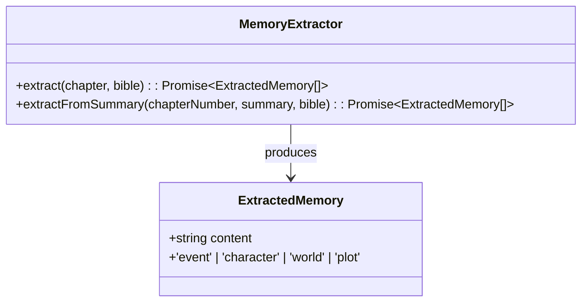
```mermaid
classDiagram
class MemoryExtractor {
+extract(chapter, bible) : Promise~ExtractedMemory[]~
+extractFromSummary(chapterNumber, summary, bible) : Promise~ExtractedMemory[]~
}
class ExtractedMemory {
+string content
+'event' | 'character' | 'world' | 'plot'
}
MemoryExtractor --> ExtractedMemory : produces
```

- Content analysis: Identifies significant events, character moments, world details, and plot developments.
- Categorization: Automatic classification of extracted memories into appropriate categories.
- Quality control: Focuses on specific, useful facts for maintaining narrative continuity.

**Diagram sources**
- [memoryExtractor.ts:1-97](file://packages/engine/src/agents/memoryExtractor.ts#L1-L97)
- [index.ts:1-116](file://packages/engine/src/types/index.ts#L1-L116)

**Section sources**
- [memoryExtractor.ts:1-97](file://packages/engine/src/agents/memoryExtractor.ts#L1-L97)
- [index.ts:1-116](file://packages/engine/src/types/index.ts#L1-L116)

## Enhanced Story Management System

### StateUpdaterPipeline: Advanced State Synchronization
The StateUpdaterPipeline provides comprehensive state synchronization combining LLM extraction, constraint graph updates, and memory management.

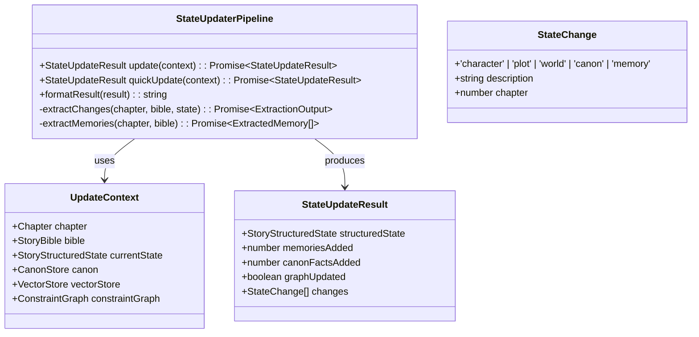
```mermaid
classDiagram
class StateUpdaterPipeline {
+StateUpdateResult update(context) : Promise~StateUpdateResult~
+StateUpdateResult quickUpdate(context) : Promise~StateUpdateResult~
+formatResult(result) : string
-extractChanges(chapter, bible, state) : Promise~ExtractionOutput~
-extractMemories(chapter, bible) : Promise~ExtractedMemory[]~
}
class UpdateContext {
+Chapter chapter
+StoryBible bible
+StoryStructuredState currentState
+CanonStore canon
+VectorStore vectorStore
+ConstraintGraph constraintGraph
}
class StateUpdateResult {
+StoryStructuredState structuredState
+number memoriesAdded
+number canonFactsAdded
+boolean graphUpdated
+StateChange[] changes
}
class StateChange {
+'character' | 'plot' | 'world' | 'canon' | 'memory'
+string description
+number chapter
}
StateUpdaterPipeline --> UpdateContext : uses
StateUpdaterPipeline --> StateUpdateResult : produces
```

**Update Process:**
1. **LLM Extraction**: Analyzes chapter content to extract state changes
2. **State Application**: Updates character states, plot threads, and unresolved questions
3. **Memory Integration**: Extracts and stores narrative memories in vector store
4. **Constraint Graph Update**: Synchronizes constraint graph with new knowledge and locations
5. **Event Tracking**: Adds chapter events to recent events list

**Quick Update Mode**: Provides fallback without LLM for testing and debugging scenarios.

**Section sources**
- [stateUpdater.ts:1-435](file://packages/engine/src/memory/stateUpdater.ts#L1-L435)
- [structuredState.ts:1-235](file://packages/engine/src/story/structuredState.ts#L1-L235)
- [vectorStore.ts:1-208](file://packages/engine/src/memory/vectorStore.ts#L1-L208)
- [constraintGraph.ts:1-471](file://packages/engine/src/constraints/constraintGraph.ts#L1-L471)

### StateUpdater Agent: Individual State Management
The StateUpdater agent provides focused state management for individual chapters without full pipeline integration.

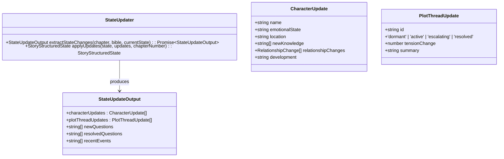
```mermaid
classDiagram
class StateUpdater {
+StateUpdateOutput extractStateChanges(chapter, bible, currentState) : Promise~StateUpdateOutput~
+StoryStructuredState applyUpdates(state, updates, chapterNumber) : StoryStructuredState
}
class StateUpdateOutput {
+characterUpdates : CharacterUpdate[]
+plotThreadUpdates : PlotThreadUpdate[]
+string[] newQuestions
+string[] resolvedQuestions
+string[] recentEvents
}
class CharacterUpdate {
+string name
+string emotionalState
+string location
+string[] newKnowledge
+RelationshipChange[] relationshipChanges
+string development
}
class PlotThreadUpdate {
+string id
+'dormant' | 'active' | 'escalating' | 'resolved'
+number tensionChange
+string summary
}
StateUpdater --> StateUpdateOutput : produces
```

**Section sources**
- [stateUpdater.ts:1-193](file://packages/engine/src/agents/stateUpdater.ts#L1-L193)
- [structuredState.ts:1-235](file://packages/engine/src/story/structuredState.ts#L1-L235)

## Active Story Management

### Persistent Story Selection System
The active story management system provides persistent story selection with automatic story ID resolution across all CLI commands.

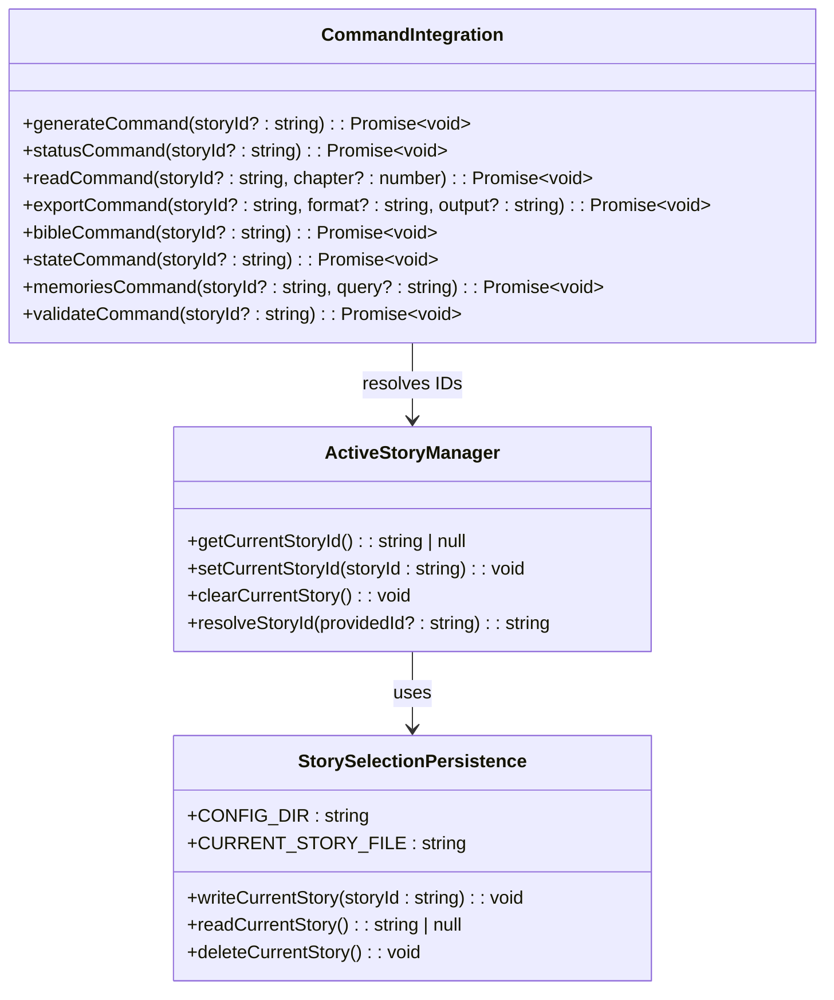
```mermaid
classDiagram
class ActiveStoryManager {
+getCurrentStoryId() : string | null
+setCurrentStoryId(storyId : string) : void
+clearCurrentStory() : void
+resolveStoryId(providedId? : string) : string
}
class StorySelectionPersistence {
+CONFIG_DIR : string
+CURRENT_STORY_FILE : string
+writeCurrentStory(storyId : string) : void
+readCurrentStory() : string | null
+deleteCurrentStory() : void
}
class CommandIntegration {
+generateCommand(storyId? : string) : Promise~void~
+statusCommand(storyId? : string) : Promise~void~
+readCommand(storyId? : string, chapter? : number) : Promise~void~
+exportCommand(storyId? : string, format? : string, output? : string) : Promise~void~
+bibleCommand(storyId? : string) : Promise~void~
+stateCommand(storyId? : string) : Promise~void~
+memoriesCommand(storyId? : string, query? : string) : Promise~void~
+validateCommand(storyId? : string) : Promise~void~
}
ActiveStoryManager --> StorySelectionPersistence : uses
CommandIntegration --> ActiveStoryManager : resolves IDs
```

**Persistent Storage:**
- **Storage Location**: User home directory under `.narrative-os/.current`
- **File Format**: Plain text containing story ID
- **Automatic Cleanup**: Safe handling of missing or corrupted files

**Story Resolution Workflow:**
1. **Explicit ID Provided**: Use the provided story ID
2. **No ID Provided**: Check for active story file
3. **Active Story Found**: Use stored story ID
4. **No Active Story**: Error with guidance for setup

**Command Integration:**
- All story-related commands automatically resolve story IDs
- Streamlined usage: `nos generate` instead of `nos generate <story-id>`
- Consistent behavior across all CLI operations

**Section sources**
- [use.ts:1-92](file://apps/cli/src/commands/use.ts#L1-L92)
- [index.ts:72-167](file://apps/cli/src/index.ts#L72-L167)

### Story Activation Workflow
The story activation workflow enables seamless switching between stories and persistent context management.

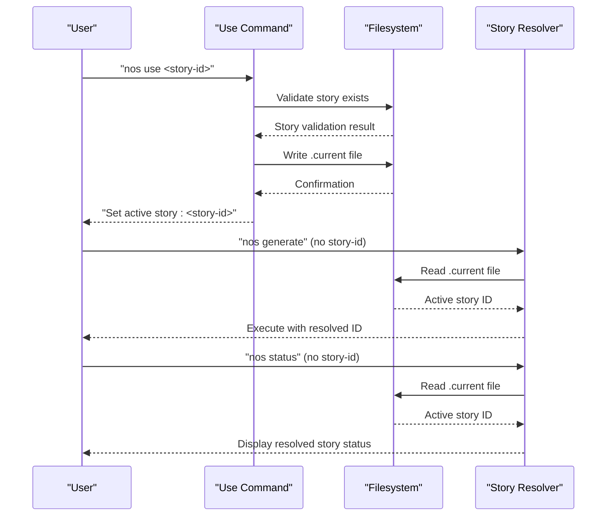
```mermaid
sequenceDiagram
participant User as "User"
participant UseCmd as "Use Command"
participant Store as "Filesystem"
participant Resolver as "Story Resolver"
User->>UseCmd : "nos use <story-id>"
UseCmd->>Store : Validate story exists
Store-->>UseCmd : Story validation result
UseCmd->>Store : Write .current file
Store-->>UseCmd : Confirmation
UseCmd-->>User : "Set active story : <story-id>"
User->>Resolver : "nos generate" (no story-id)
Resolver->>Store : Read .current file
Store-->>Resolver : Active story ID
Resolver-->>User : Execute with resolved ID
User->>Resolver : "nos status" (no story-id)
Resolver->>Store : Read .current file
Store-->>Resolver : Active story ID
Resolver-->>User : Display resolved story status
```

**Activation Features:**
- **Story Validation**: Ensures target story exists before activation
- **Error Handling**: Graceful handling of invalid or missing stories
- **Confirmation Feedback**: Clear success/error messages
- **Automatic Resolution**: Transparent story ID resolution for all commands

**Section sources**
- [use.ts:45-72](file://apps/cli/src/commands/use.ts#L45-L72)
- [index.ts:72-167](file://apps/cli/src/index.ts#L72-L167)

### Streamlined CLI Usage
The active story system enables simplified CLI workflows with automatic story context.

**Before Activation:**
```bash
nos generate story-123
nos status story-123
nos read story-123 5
nos export story-123
```

**After Activation:**
```bash
nos use story-123
nos generate                    # Uses active story
nos status                      # Uses active story
nos read 5                      # Uses active story
nos export                      # Uses active story
```

**Benefits:**
- Reduced command verbosity
- Seamless story switching
- Consistent context across operations
- Improved user experience for multi-story workflows

**Section sources**
- [use.ts:45-72](file://apps/cli/src/commands/use.ts#L45-L72)
- [index.ts:63-74](file://apps/cli/src/index.ts#L63-L74)
- [index.ts:91-167](file://apps/cli/src/index.ts#L91-L167)

## Memory Integration System

### Vector Memory Architecture
The memory system provides comprehensive semantic storage and retrieval for narrative elements.

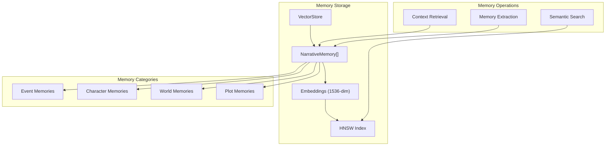
```mermaid
graph TB
subgraph "Memory Storage"
VECTOR_STORE["VectorStore"]
MEMORY["NarrativeMemory[]"]
EMBEDDINGS["Embeddings (1536-dim)"]
INDEX["HNSW Index"]
end
subgraph "Memory Categories"
EVENTS["Event Memories"]
CHARACTERS["Character Memories"]
WORLD["World Memories"]
PLOT["Plot Memories"]
end
subgraph "Memory Operations"
SEARCH["Semantic Search"]
RETRIEVE["Context Retrieval"]
EXTRACT["Memory Extraction"]
end
VECTOR_STORE --> MEMORY
MEMORY --> EMBEDDINGS
EMBEDDINGS --> INDEX
MEMORY --> EVENTS
MEMORY --> CHARACTERS
MEMORY --> WORLD
MEMORY --> PLOT
SEARCH --> INDEX
RETRIEVE --> MEMORY
EXTRACT --> MEMORY
```

**Memory Categories:**
- **Event**: Significant occurrences and plot points
- **Character**: Character development, traits, and relationships
- **World**: World-building details and setting information
- **Plot**: Plot thread developments and story mechanics

**Search Capabilities:**
- **Semantic Similarity**: Cosine similarity search with vector embeddings
- **Category Filtering**: Targeted retrieval by memory type
- **Context Awareness**: Query generation based on story context
- **Relevance Ranking**: Improved ranking with contextual relevance

**Section sources**
- [vectorStore.ts:1-208](file://packages/engine/src/memory/vectorStore.ts#L1-L208)
- [memoryRetriever.ts:1-174](file://packages/engine/src/memory/memoryRetriever.ts#L1-L174)
- [memoryExtractor.ts:1-97](file://packages/engine/src/agents/memoryExtractor.ts#L1-L97)

### Memory Retrieval Workflows
Memory retrieval provides context-aware access to narrative information for enhanced storytelling.

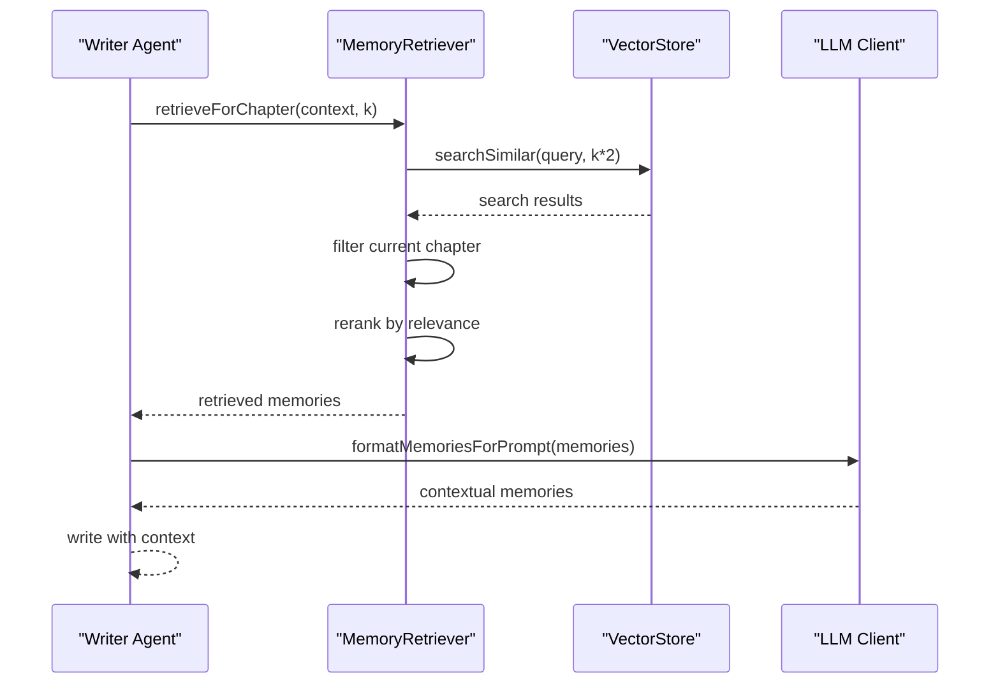
```mermaid
sequenceDiagram
participant Writer as "Writer Agent"
participant Retriever as "MemoryRetriever"
participant Vector as "VectorStore"
participant LLM as "LLM Client"
Writer->>Retriever : retrieveForChapter(context, k)
Retriever->>Vector : searchSimilar(query, k*2)
Vector-->>Retriever : search results
Retriever->>Retriever : filter current chapter
Retriever->>Retriever : rerank by relevance
Retriever-->>Writer : retrieved memories
Writer->>LLM : formatMemoriesForPrompt(memories)
LLM-->>Writer : contextual memories
Writer-->>Writer : write with context
```

**Retrieval Strategies:**
- **Chapter-based**: Retrieves memories relevant to current story progress
- **Character-focused**: Targets memories specifically about named characters
- **Plot-thread**: Focuses on memories related to active plot threads
- **Event-based**: Extracts relevant past events for context

**Section sources**
- [memoryRetriever.ts:1-174](file://packages/engine/src/memory/memoryRetriever.ts#L1-L174)
- [vectorStore.ts:1-208](file://packages/engine/src/memory/vectorStore.ts#L1-L208)

## State Updater Pipeline

### Pipeline Architecture
The state updater pipeline orchestrates comprehensive state synchronization across all system components.

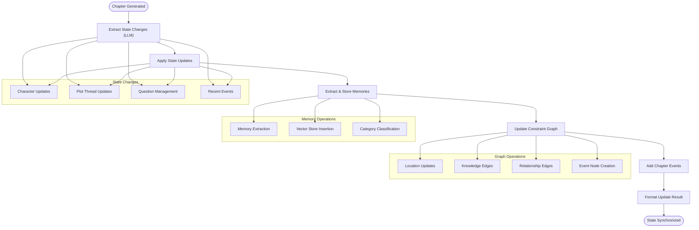
```mermaid
flowchart TD
Start(["Chapter Generated"]) --> Extract["Extract State Changes (LLM)"]
Extract --> Apply["Apply State Updates"]
Apply --> Memories["Extract & Store Memories"]
Memories --> Graph["Update Constraint Graph"]
Graph --> Events["Add Chapter Events"]
Events --> Format["Format Update Result"]
Format --> End(["State Synchronized"])
subgraph "State Changes"
CharUpdate["Character Updates"]
PlotUpdate["Plot Thread Updates"]
QuestUpdate["Question Management"]
EventUpdate["Recent Events"]
end
subgraph "Memory Operations"
MemExtract["Memory Extraction"]
MemStore["Vector Store Insertion"]
MemCat["Category Classification"]
end
subgraph "Graph Operations"
LocUpdate["Location Updates"]
KnowUpdate["Knowledge Edges"]
RelUpdate["Relationship Edges"]
EventNode["Event Node Creation"]
end
Extract --> CharUpdate
Extract --> PlotUpdate
Extract --> QuestUpdate
Extract --> EventUpdate
Apply --> CharUpdate
Apply --> PlotUpdate
Apply --> QuestUpdate
Apply --> EventUpdate
Memories --> MemExtract
Memories --> MemStore
Memories --> MemCat
Graph --> LocUpdate
Graph --> KnowUpdate
Graph --> RelUpdate
Graph --> EventNode
```

**Pipeline Components:**
- **LLM Extraction**: Natural language processing for state change detection
- **State Application**: Direct application of extracted changes to structured state
- **Memory Integration**: Automatic extraction and storage of narrative memories
- **Constraint Synchronization**: Real-time updates to constraint graph
- **Event Tracking**: Comprehensive event logging for narrative coherence

**Section sources**
- [stateUpdater.ts:1-435](file://packages/engine/src/memory/stateUpdater.ts#L1-L435)
- [structuredState.ts:1-235](file://packages/engine/src/story/structuredState.ts#L1-L235)
- [vectorStore.ts:1-208](file://packages/engine/src/memory/vectorStore.ts#L1-L208)
- [constraintGraph.ts:1-471](file://packages/engine/src/constraints/constraintGraph.ts#L1-L471)

### Quick Update Mode
Provides lightweight state synchronization without LLM processing for testing and debugging.

**Quick Update Features:**
- **Basic Memory Extraction**: Minimal memory extraction without LLM
- **Direct State Updates**: Simple state application without complex parsing
- **Graph Synchronization**: Essential constraint graph updates
- **Event Logging**: Basic event tracking for narrative coherence

**Section sources**
- [stateUpdater.ts:341-389](file://packages/engine/src/memory/stateUpdater.ts#L341-L389)

## Enhanced Validation Pipeline

### Validator: Dual-Mode Consistency Checking
The Validator provides comprehensive narrative consistency checking through both graph-based and LLM-based approaches, now integrated with memory and state management.

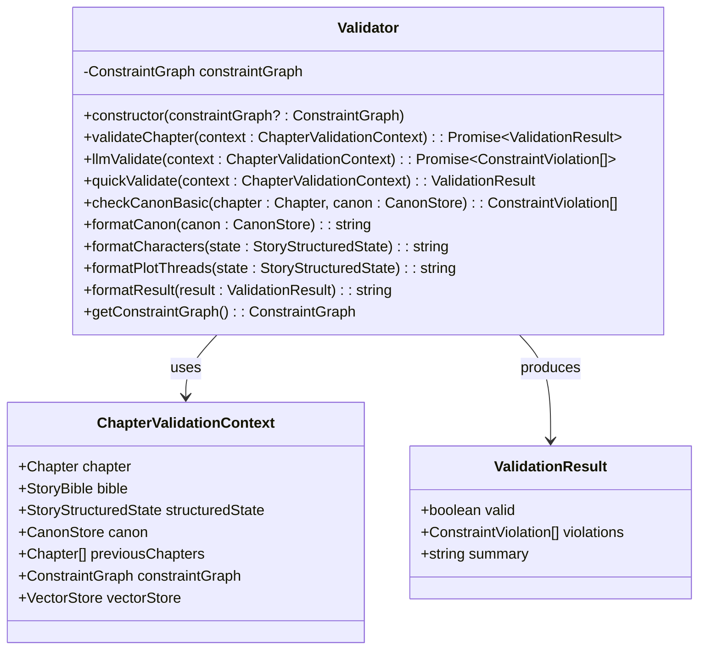
```mermaid
classDiagram
class Validator {
-ConstraintGraph constraintGraph
+constructor(constraintGraph? : ConstraintGraph)
+validateChapter(context : ChapterValidationContext) : Promise~ValidationResult~
+llmValidate(context : ChapterValidationContext) : Promise~ConstraintViolation[]~
+quickValidate(context : ChapterValidationContext) : ValidationResult
+checkCanonBasic(chapter : Chapter, canon : CanonStore) : ConstraintViolation[]
+formatCanon(canon : CanonStore) : string
+formatCharacters(state : StoryStructuredState) : string
+formatPlotThreads(state : StoryStructuredState) : string
+formatResult(result : ValidationResult) : string
+getConstraintGraph() : ConstraintGraph
}
class ChapterValidationContext {
+Chapter chapter
+StoryBible bible
+StoryStructuredState structuredState
+CanonStore canon
+Chapter[] previousChapters
+ConstraintGraph constraintGraph
+VectorStore vectorStore
}
class ValidationResult {
+boolean valid
+ConstraintViolation[] violations
+string summary
}
Validator --> ChapterValidationContext : uses
Validator --> ValidationResult : produces
```

**Enhanced Validation Features:**
- **Graph-Based Validation**: Fast, deterministic checking using the constraint graph
- **LLM-Based Validation**: Comprehensive semantic analysis with natural language processing
- **State Integration**: Validation considers current structured state and recent changes
- **Memory Context**: Incorporates vector memory context for enhanced analysis
- **Quick Validation**: Basic constraint checking without LLM for faster feedback loops

**Section sources**
- [validator.ts:1-286](file://packages/engine/src/constraints/validator.ts#L1-L286)
- [constraintGraph.ts:1-471](file://packages/engine/src/constraints/constraintGraph.ts#L1-L471)
- [structuredState.ts:1-235](file://packages/engine/src/story/structuredState.ts#L1-L235)
- [vectorStore.ts:1-208](file://packages/engine/src/memory/vectorStore.ts#L1-L208)

### Constraint Types and Severity Levels
The validation system categorizes violations by type and severity, now with enhanced integration:

**Violation Types:**
- **Canon**: Contradicts established facts or story bible
- **Location**: Character location inconsistencies or impossible travel
- **Knowledge**: Character knows information before learning it
- **Timeline**: Events in wrong chronological order
- **Logic**: Impossible or contradictory situations

**Severity Levels:**
- **Error**: Critical violations that prevent story acceptance
- **Warning**: Potential issues that may affect narrative quality

**Section sources**
- [validator.ts:1-286](file://packages/engine/src/constraints/validator.ts#L1-L286)
- [constraintGraph.ts:1-471](file://packages/engine/src/constraints/constraintGraph.ts#L1-L471)

## Dependency Analysis
- CLI depends on engine APIs for story creation, generation, state updates, memory management, and validation.
- Engine pipeline depends on agents for writing, completeness, summarization, memory extraction, and constraint validation.
- State updater pipeline depends on LLM services, vector stores, constraint graphs, and memory extraction.
- Memory system depends on vector store infrastructure and embedding generation.
- Constraint validation depends on both the constraint graph and LLM services.
- Persistence layer depends on StoryBible, StoryState, StoryStructuredState, Chapter, CanonStore, VectorStore, and ConstraintGraph types.
- Active story management depends on filesystem operations and story validation.

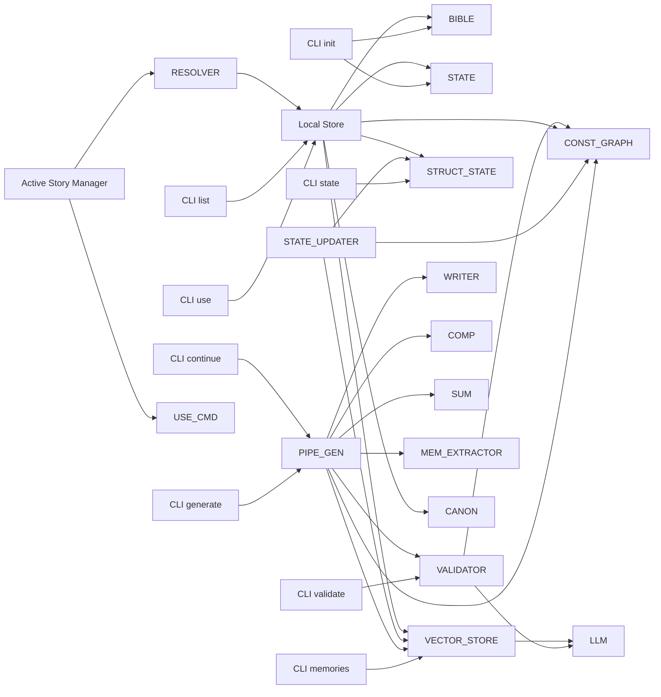
```mermaid
graph LR
CLI_INIT["CLI init"] --> BIBLE
CLI_INIT --> STATE
CLI_GEN["CLI generate"] --> PIPE_GEN
CLI_CONT["CLI continue"] --> PIPE_GEN
CLI_MEMORIES["CLI memories"] --> VECTOR_STORE
CLI_STATE["CLI state"] --> STRUCT_STATE
CLI_VALIDATE["CLI validate"] --> VALIDATOR
CLI_USE["CLI use"] --> STORE
CLI_LIST["CLI list"] --> STORE
ACTIVE_STORY["Active Story Manager"] --> USE_CMD
ACTIVE_STORY --> RESOLVER
RESOLVER --> STORE
PIPE_GEN --> WRITER
PIPE_GEN --> COMP
PIPE_GEN --> SUM
PIPE_GEN --> MEM_EXTRACTOR
PIPE_GEN --> VECTOR_STORE
PIPE_GEN --> CONST_GRAPH
PIPE_GEN --> VALIDATOR
STATE_UPDATER --> STRUCT_STATE
STATE_UPDATER --> VECTOR_STORE
STATE_UPDATER --> CONST_GRAPH
STORE["Local Store"] --> BIBLE
STORE --> STATE
STORE --> STRUCT_STATE
STORE --> CANON
STORE --> VECTOR_STORE
STORE --> CONST_GRAPH
VALIDATOR --> CONST_GRAPH
VALIDATOR --> LLM
VECTOR_STORE --> LLM
```

**Diagram sources**
- [init.ts:1-91](file://apps/cli/src/commands/init.ts#L1-L91)
- [generate.ts:1-81](file://apps/cli/src/commands/generate.ts#L1-L81)
- [continue.ts:1-63](file://apps/cli/src/commands/continue.ts#L1-L63)
- [memories.ts:1-66](file://apps/cli/src/commands/memories.ts#L1-L66)
- [state.ts:1-83](file://apps/cli/src/commands/state.ts#L1-L83)
- [validate.ts:1-107](file://apps/cli/src/commands/validate.ts#L1-L107)
- [use.ts:1-92](file://apps/cli/src/commands/use.ts#L1-L92)
- [list.ts:1-23](file://apps/cli/src/commands/list.ts#L1-L23)
- [generateChapter.ts:1-108](file://packages/engine/src/pipeline/generateChapter.ts#L1-L108)
- [writer.ts:1-164](file://packages/engine/src/agents/writer.ts#L1-L164)
- [completeness.ts:1-56](file://packages/engine/src/agents/completeness.ts#L1-L56)
- [summarizer.ts:1-64](file://packages/engine/src/agents/summarizer.ts#L1-L64)
- [memoryExtractor.ts:1-97](file://packages/engine/src/agents/memoryExtractor.ts#L1-L97)
- [vectorStore.ts:1-208](file://packages/engine/src/memory/vectorStore.ts#L1-L208)
- [stateUpdater.ts:1-435](file://packages/engine/src/memory/stateUpdater.ts#L1-L435)
- [constraintGraph.ts:1-471](file://packages/engine/src/constraints/constraintGraph.ts#L1-L471)
- [validator.ts:1-286](file://packages/engine/src/constraints/validator.ts#L1-L286)
- [store.ts:1-195](file://apps/cli/src/config/store.ts#L1-L195)

**Section sources**
- [index.ts:1-116](file://packages/engine/src/types/index.ts#L1-L116)
- [store.ts:1-195](file://apps/cli/src/config/store.ts#L1-L195)
- [use.ts:1-92](file://apps/cli/src/commands/use.ts#L1-L92)

## Performance Considerations
- Word count estimation: Used to decide continuation attempts; keep targetWordCount aligned with desired chapter length to reduce retries.
- Tension curve: Nonlinear progression helps maintain reader engagement; tune based on genre and pacing needs.
- Prompt sizes: CanonStore formatting, recent summaries, and structured state can grow; limit recent summaries to reduce token overhead.
- Constraint graph complexity: Large stories with many characters and locations may impact validation performance; consider optimizing graph structure.
- LLM validation: Optional but resource-intensive; use quick validation mode for faster feedback loops.
- Vector store performance: HNSW indexing provides efficient search; monitor memory usage and consider capacity planning.
- Embedding generation: Text embeddings require API calls; fallback to mock embeddings for testing scenarios.
- File I/O: Batch saves after each chapter; consider throttling writes in high-throughput scenarios.
- Memory extraction: LLM-based extraction is expensive; use quick update mode for testing and debugging.
- Active story persistence: File operations for current story tracking are minimal and cached in memory for better performance.

## Troubleshooting Guide
- Story not found: Verify story ID and existence in the stories directory.
- Generation failures: Inspect LLM provider configuration and API keys; retry with adjusted continuation attempts.
- Canon violations: Review reported violations and update CanonStore accordingly; regenerate affected chapters.
- Constraint violations: Review validation results for specific constraint types and apply suggested fixes.
- Status inconsistencies: Re-run status to refresh progress; ensure state.json reflects the latest chapter.
- Validation errors: Use quick validation mode to isolate issues; check constraint graph serialization/deserialization.
- Memory extraction failures: Check LLM availability and API keys; verify vector store initialization.
- Vector search issues: Ensure vector store is properly initialized and indexed; check embedding generation.
- State synchronization problems: Verify structured state updates and constraint graph synchronization.
- Memory retrieval failures: Check memory categories and search queries; verify vector store capacity.
- Active story issues: Check `.current` file permissions; verify story directory exists; use `nos list` to debug story availability.
- Story resolution failures: Ensure active story file is readable; check for corrupted or empty files; use `nos use` to reset active story.

**Section sources**
- [generate.ts:1-81](file://apps/cli/src/commands/generate.ts#L1-L81)
- [continue.ts:1-63](file://apps/cli/src/commands/continue.ts#L1-L63)
- [status.ts:1-58](file://apps/cli/src/commands/status.ts#L1-L58)
- [config.ts:1-84](file://apps/cli/src/commands/config.ts#L1-L84)
- [memories.ts:1-66](file://apps/cli/src/commands/memories.ts#L1-L66)
- [state.ts:1-83](file://apps/cli/src/commands/state.ts#L1-L83)
- [validate.ts:1-107](file://apps/cli/src/commands/validate.ts#L1-L107)
- [use.ts:1-92](file://apps/cli/src/commands/use.ts#L1-L92)
- [validator.ts:1-286](file://packages/engine/src/constraints/validator.ts#L1-L286)
- [vectorStore.ts:1-208](file://packages/engine/src/memory/vectorStore.ts#L1-L208)

## Conclusion
The Story Management System provides a robust, modular framework for story creation and iterative generation with enhanced narrative consistency checking, comprehensive memory management, and persistent active story functionality. The integration of the enhanced StoryStructuredState ensures detailed character and plot thread management, while the vector memory system provides semantic search and context-aware retrieval capabilities. The state updater pipeline synchronizes all system components in real-time, and the dual-mode validation (graph-based and LLM-based) enforces comprehensive narrative consistency. The addition of persistent active story management creates seamless multi-story workflows with automatic story ID resolution across all CLI commands. The enhanced system now supports streamlined workflows where users can activate a story once and then use commands without specifying story IDs, significantly improving the user experience for complex storytelling projects. By separating concerns across data models, runtime state, continuity knowledge, memory management, constraint validation, active story management, and a composable generation pipeline, it enables scalable authoring workflows integrated via CLI commands with sophisticated memory and state management capabilities.

## Appendices

### Data Models and Serialization
- StoryBible: JSON persisted with metadata, characters, and plot threads.
- StoryState: JSON persisted with counters, tension, and summaries.
- StoryStructuredState: Enhanced JSON with detailed character and plot thread information, unresolved questions, and recent events.
- Chapters: JSON array of chapter records with titles, content, summaries, and word counts.
- CanonStore: JSON persisted with categorized facts and establishment chapters.
- VectorStore: JSON serialized vector store with memories, embeddings, and HNSW index data.
- ConstraintGraph: JSON serialized graph structure with nodes, edges, and constraint metadata.
- Active Story Tracking: Plain text file containing current story ID for persistent context.

**Section sources**
- [index.ts:1-116](file://packages/engine/src/types/index.ts#L1-L116)
- [store.ts:15-26](file://apps/cli/src/config/store.ts#L15-L26)
- [structuredState.ts:181-235](file://packages/engine/src/story/structuredState.ts#L181-L235)
- [vectorStore.ts:170-192](file://packages/engine/src/memory/vectorStore.ts#L170-L192)
- [constraintGraph.ts:409-435](file://packages/engine/src/constraints/constraintGraph.ts#L409-L435)
- [use.ts:5-6](file://apps/cli/src/commands/use.ts#L5-L6)

### Storage Organization and Backup
- Location: User home directory under a dedicated folder.
- Structure: One directory per story ID containing bible.json, state.json, chapters.json, structured_state.json, canon.json, vector_store.json, and constraint_graph.json.
- Backup: Copy the entire stories directory; restore by placing backups under the same path.
- Memory persistence: Vector store automatically serializes and deserializes with story data.
- State synchronization: Structured state updates are persisted alongside other story data.
- Active story tracking: Persistent `.current` file in the main directory for active story context.

**Section sources**
- [store.ts:7-26](file://apps/cli/src/config/store.ts#L7-L26)
- [use.ts:5-6](file://apps/cli/src/commands/use.ts#L5-L6)

### Migration Between Versions
- Schema evolution: Add new fields to StoryBible, StoryState, StoryStructuredState, or CanonStore with safe defaults.
- Backward compatibility: Ensure loaders handle missing optional fields gracefully.
- Canon migration: Extract CanonStore from StoryBible when missing; re-save to normalize schema.
- Vector store migration: Support both legacy and new vector store formats; auto-migrate as needed.
- Constraint graph migration: Support both legacy and new constraint graph formats; auto-migrate as needed.
- State updater migration: Handle both LLM-based and quick update modes for backward compatibility.
- Active story migration: New feature requires no migration; existing installations gain automatic story context support.

**Section sources**
- [store.ts:37-48](file://apps/cli/src/config/store.ts#L37-L48)
- [canonStore.ts:24-58](file://packages/engine/src/memory/canonStore.ts#L24-L58)
- [vectorStore.ts:179-192](file://packages/engine/src/memory/vectorStore.ts#L179-L192)
- [constraintGraph.ts:419-435](file://packages/engine/src/constraints/constraintGraph.ts#L419-L435)
- [stateUpdater.ts:429-431](file://packages/engine/src/memory/stateUpdater.ts#L429-L431)
- [use.ts:1-92](file://apps/cli/src/commands/use.ts#L1-L92)

### Practical Workflows
- Initialize a story: Provide metadata and target chapters; seed characters and plot threads; establish constraint graph foundation and structured state.
- Incremental generation: Generate the next chapter; extract memories; update state; validate against constraints; review summary and word count; address violations.
- Bulk continuation: Generate remaining chapters automatically; monitor progress and totals; validate final story consistency; manage memory growth.
- Character development: Add or refine character facts in CanonStore; update constraint graph; regenerate chapters to reflect changes; track character development arcs.
- Plot thread management: Activate or escalate threads; track status and tension in StoryState; validate logical consistency; manage unresolved questions.
- Memory management: Extract and store narrative memories; search for relevant context; manage memory categories; optimize vector store performance.
- Constraint validation: Use both graph-based and LLM-based validation modes; apply suggested fixes for violations; monitor constraint graph health.
- State synchronization: Run state updater pipeline to synchronize structured state with constraint graph and memories; verify updates; maintain narrative coherence.
- Story completion: Run comprehensive validation across all chapters; ensure narrative consistency; prepare for publication; archive memories and state data.
- Active story management: Set active story with `nos use <story-id>`; use commands without specifying story IDs; switch between stories seamlessly; manage multiple concurrent projects.

**Section sources**
- [init.ts:1-91](file://apps/cli/src/commands/init.ts#L1-L91)
- [generate.ts:1-81](file://apps/cli/src/commands/generate.ts#L1-L81)
- [continue.ts:1-63](file://apps/cli/src/commands/continue.ts#L1-L63)
- [memories.ts:1-66](file://apps/cli/src/commands/memories.ts#L1-L66)
- [state.ts:1-83](file://apps/cli/src/commands/state.ts#L1-L83)
- [validate.ts:1-107](file://apps/cli/src/commands/validate.ts#L1-L107)
- [use.ts:1-92](file://apps/cli/src/commands/use.ts#L1-L92)
- [canonStore.ts:79-99](file://packages/engine/src/memory/canonStore.ts#L79-L99)
- [memoryExtractor.ts:52-93](file://packages/engine/src/agents/memoryExtractor.ts#L52-L93)
- [stateUpdater.ts:94-248](file://packages/engine/src/memory/stateUpdater.ts#L94-L248)
- [validator.ts:83-124](file://packages/engine/src/constraints/validator.ts#L83-L124)
- [constraintGraph.ts:229-245](file://packages/engine/src/constraints/constraintGraph.ts#L229-L245)