# Structured Story State System

<cite>
**Referenced Files in This Document**
- [structuredState.ts](file://packages/engine/src/story/structuredState.ts)
- [state.ts](file://packages/engine/src/story/state.ts)
- [bible.ts](file://packages/engine/src/story/bible.ts)
- [index.ts](file://packages/engine/src/index.ts)
- [stateUpdater.ts](file://packages/engine/src/agents/stateUpdater.ts)
- [chapterPlanner.ts](file://packages/engine/src/agents/chapterPlanner.ts)
- [storyDirector.ts](file://packages/engine/src/agents/storyDirector.ts)
- [generateChapter.ts](file://packages/engine/src/pipeline/generateChapter.ts)
- [structured-state.test.ts](file://packages/engine/src/test/structured-state.test.ts)
- [chapter-planner.test.ts](file://packages/engine/src/test/chapter-planner.test.ts)
- [simple.test.ts](file://packages/engine/src/test/simple.test.ts)
</cite>

## Table of Contents
1. [Introduction](#introduction)
2. [System Architecture](#system-architecture)
3. [Core Data Structures](#core-data-structures)
4. [State Management Functions](#state-management-functions)
5. [Integration with Story Engine](#integration-with-story-engine)
6. [Agent System Integration](#agent-system-integration)
7. [Testing Framework](#testing-framework)
8. [Performance Considerations](#performance-considerations)
9. [Troubleshooting Guide](#troubleshooting-guide)
10. [Conclusion](#conclusion)

## Introduction

The Structured Story State System is a comprehensive narrative state management framework designed to track and maintain story progression, character development, and plot thread advancement throughout an AI-generated narrative. This system provides a structured approach to maintaining story coherence, tension management, and character relationship tracking while integrating seamlessly with the broader narrative AI engine.

The system operates on three fundamental pillars: character state tracking, plot thread management, and dynamic tension calculation. It serves as the central nervous system for the narrative AI, ensuring that generated content remains coherent, emotionally engaging, and structurally sound throughout the entire story arc.

## System Architecture

The Structured Story State System is built as a modular component within the larger narrative AI engine, designed to integrate with various agents and processes while maintaining data integrity and consistency.

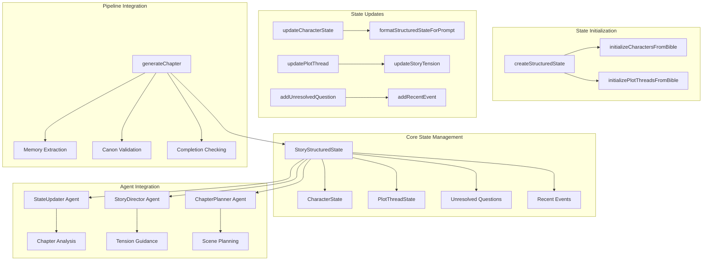

**Diagram sources**
- [structuredState.ts](file://packages/engine/src/story/structuredState.ts#L23-L31)
- [stateUpdater.ts](file://packages/engine/src/agents/stateUpdater.ts#L85-L193)
- [generateChapter.ts](file://packages/engine/src/pipeline/generateChapter.ts#L26-L103)

The architecture follows a unidirectional data flow pattern where state is created, maintained, and consumed by various agents and processes. The system ensures immutability through functional updates, preventing accidental state corruption while maintaining performance.

## Core Data Structures

The Structured Story State System defines several key data structures that form the foundation of narrative state management:

### StoryStructuredState Interface

The central state container that maintains the complete narrative state across all story elements:

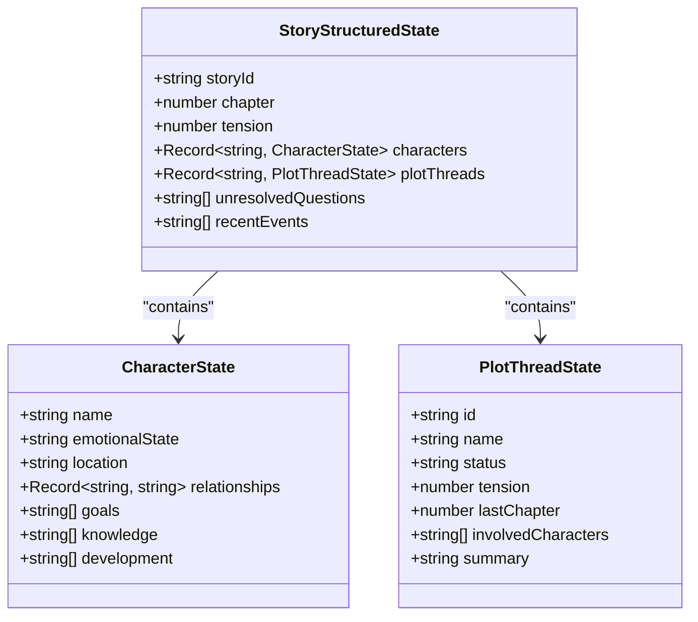

**Diagram sources**
- [structuredState.ts](file://packages/engine/src/story/structuredState.ts#L3-L31)

### State Creation and Initialization

The system provides factory functions for creating and initializing story states from narrative blueprints:

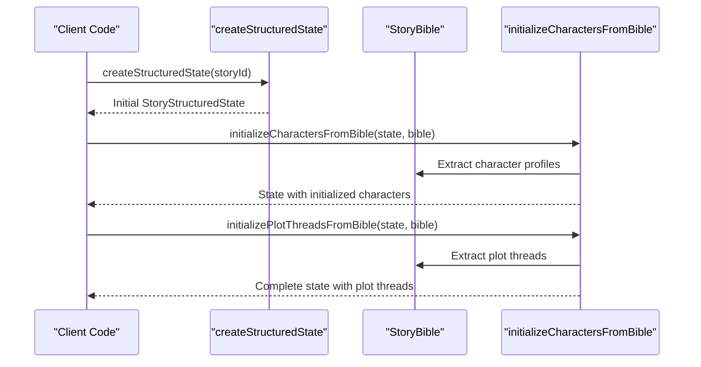

**Diagram sources**
- [structuredState.ts](file://packages/engine/src/story/structuredState.ts#L33-L85)

**Section sources**
- [structuredState.ts](file://packages/engine/src/story/structuredState.ts#L1-L235)

## State Management Functions

The system provides a comprehensive set of functions for managing and manipulating story state:

### Character State Management

Character state updates are handled through immutable update patterns that preserve existing state while applying changes:

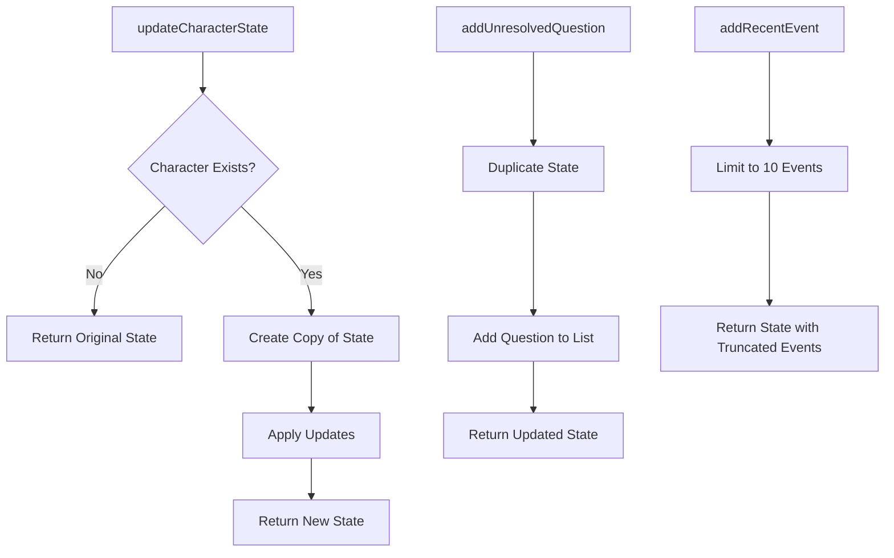

**Diagram sources**
- [structuredState.ts](file://packages/engine/src/story/structuredState.ts#L87-L153)

### Plot Thread Management

Plot thread state management supports dynamic tension adjustment and status tracking:

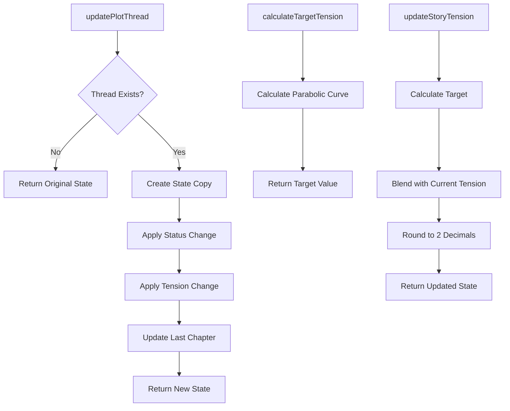

**Diagram sources**
- [structuredState.ts](file://packages/engine/src/story/structuredState.ts#L104-L179)

**Section sources**
- [structuredState.ts](file://packages/engine/src/story/structuredState.ts#L87-L179)

## Integration with Story Engine

The Structured Story State System integrates deeply with the broader narrative AI engine through multiple touchpoints:

### Pipeline Integration

The state system participates in the chapter generation pipeline, providing contextual information for content creation:

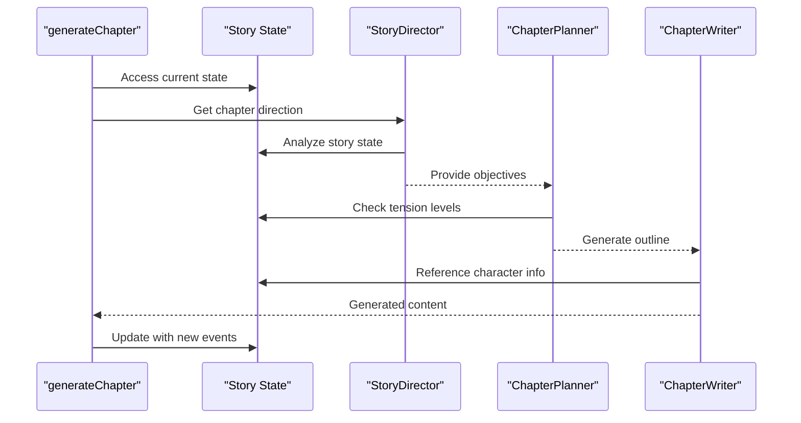

**Diagram sources**
- [generateChapter.ts](file://packages/engine/src/pipeline/generateChapter.ts#L26-L103)
- [storyDirector.ts](file://packages/engine/src/agents/storyDirector.ts#L100-L112)
- [chapterPlanner.ts](file://packages/engine/src/agents/chapterPlanner.ts#L110-L122)

### Memory System Integration

The state system coordinates with the memory management system to maintain narrative consistency:

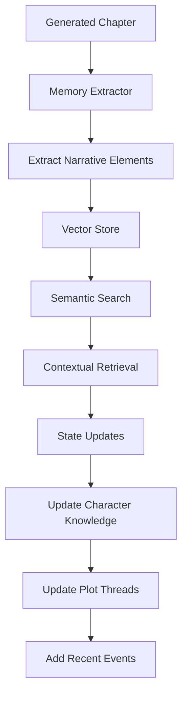

**Diagram sources**
- [generateChapter.ts](file://packages/engine/src/pipeline/generateChapter.ts#L81-L98)
- [stateUpdater.ts](file://packages/engine/src/agents/stateUpdater.ts#L121-L189)

**Section sources**
- [generateChapter.ts](file://packages/engine/src/pipeline/generateChapter.ts#L1-L108)
- [index.ts](file://packages/engine/src/index.ts#L66-L91)

## Agent System Integration

The Structured Story State System serves as the central coordination point for all narrative agents:

### StateUpdater Agent

The StateUpdater agent performs automated analysis of generated content to extract meaningful state changes:

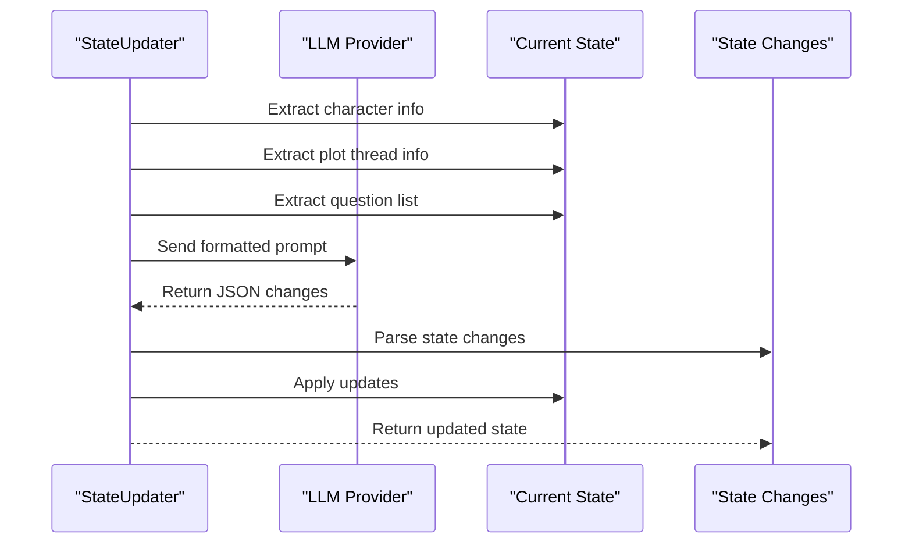

**Diagram sources**
- [stateUpdater.ts](file://packages/engine/src/agents/stateUpdater.ts#L85-L119)

### StoryDirector Agent

The StoryDirector agent uses structured state information to make informed creative decisions:

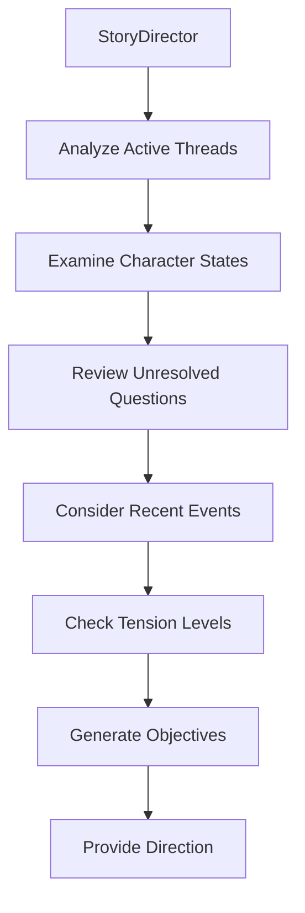

**Diagram sources**
- [storyDirector.ts](file://packages/engine/src/agents/storyDirector.ts#L100-L173)

### ChapterPlanner Agent

The ChapterPlanner agent translates high-level objectives into detailed scene-by-scene outlines using structured state context:

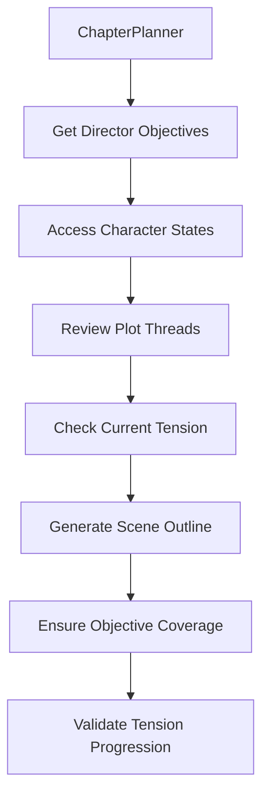

**Diagram sources**
- [chapterPlanner.ts](file://packages/engine/src/agents/chapterPlanner.ts#L110-L175)

**Section sources**
- [stateUpdater.ts](file://packages/engine/src/agents/stateUpdater.ts#L1-L193)
- [storyDirector.ts](file://packages/engine/src/agents/storyDirector.ts#L1-L200)
- [chapterPlanner.ts](file://packages/engine/src/agents/chapterPlanner.ts#L1-L200)

## Testing Framework

The Structured Story State System includes comprehensive testing to ensure reliability and correctness:

### Unit Tests

The testing framework validates individual state management functions and their interactions:

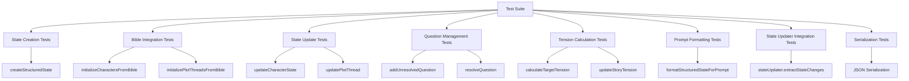

**Diagram sources**
- [structured-state.test.ts](file://packages/engine/src/test/structured-state.test.ts#L40-L202)

### Integration Tests

End-to-end testing validates the complete state management workflow:

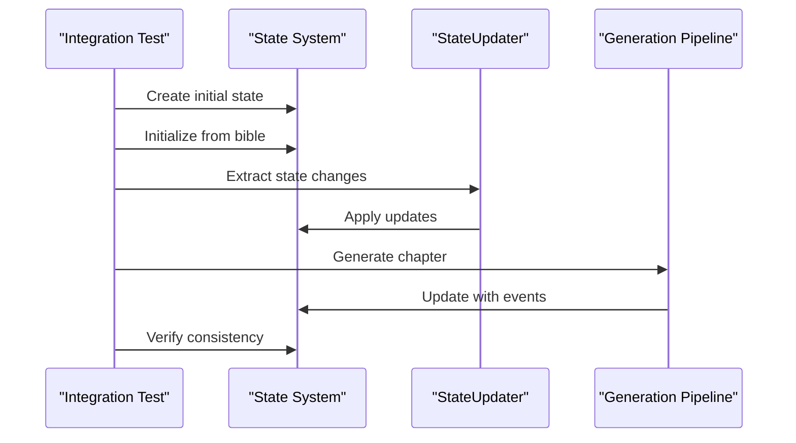

**Diagram sources**
- [chapter-planner.test.ts](file://packages/engine/src/test/chapter-planner.test.ts#L156-L197)

**Section sources**
- [structured-state.test.ts](file://packages/engine/src/test/structured-state.test.ts#L1-L203)
- [chapter-planner.test.ts](file://packages/engine/src/test/chapter-planner.test.ts#L1-L216)
- [simple.test.ts](file://packages/engine/src/test/simple.test.ts#L1-L73)

## Performance Considerations

The Structured Story State System is designed with performance and scalability in mind:

### Memory Efficiency

- Immutable state updates prevent memory leaks through proper object copying
- Event history is capped at 10 recent events to control memory usage
- Character relationship dictionaries remain compact and efficient
- Plot thread tracking minimizes computational overhead

### Computational Optimization

- Tension calculations use optimized mathematical formulas
- State serialization supports efficient persistence
- Prompt formatting leverages pre-computed string templates
- Integration points minimize redundant state computations

### Scalability Features

- Modular design allows selective state tracking
- Asynchronous processing for LLM interactions
- Vector store integration for scalable memory management
- Configurable limits for large-scale story generation

## Troubleshooting Guide

Common issues and their solutions when working with the Structured Story State System:

### State Corruption Prevention

**Issue**: State mutations causing unexpected behavior
**Solution**: Ensure all state updates use the provided immutable functions rather than direct property modifications

**Issue**: Memory leaks from excessive state retention
**Solution**: Monitor recent events array length and character relationship dictionary sizes

### Integration Problems

**Issue**: StateUpdater not recognizing character changes
**Solution**: Verify character names match exactly between state and content analysis

**Issue**: Tension calculations not matching expectations
**Solution**: Check that total chapter count is correctly set and chapter numbers start from 1

### Performance Issues

**Issue**: Slow state updates
**Solution**: Review the number of active plot threads and character relationships; reduce complexity if needed

**Issue**: Memory usage increasing over time
**Solution**: Implement periodic cleanup of old state data and unused plot threads

**Section sources**
- [structuredState.ts](file://packages/engine/src/story/structuredState.ts#L147-L153)
- [stateUpdater.ts](file://packages/engine/src/agents/stateUpdater.ts#L121-L189)

## Conclusion

The Structured Story State System represents a sophisticated approach to narrative state management, providing the foundation for coherent, engaging AI-generated stories. Through its comprehensive data structures, robust state management functions, and seamless integration with the broader narrative AI engine, it enables complex storytelling capabilities while maintaining performance and reliability.

The system's modular design, extensive testing framework, and thoughtful integration points make it a cornerstone of the narrative AI platform. Its ability to track character development, manage plot threads, and control narrative tension positions it as an essential component for advanced story generation systems.

Future enhancements could include expanded state persistence options, enhanced conflict resolution mechanisms, and additional integration points with external narrative analysis tools. The current implementation provides a solid foundation for these potential improvements while maintaining backward compatibility and system stability.